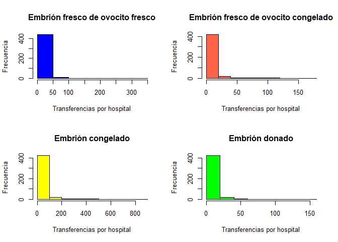
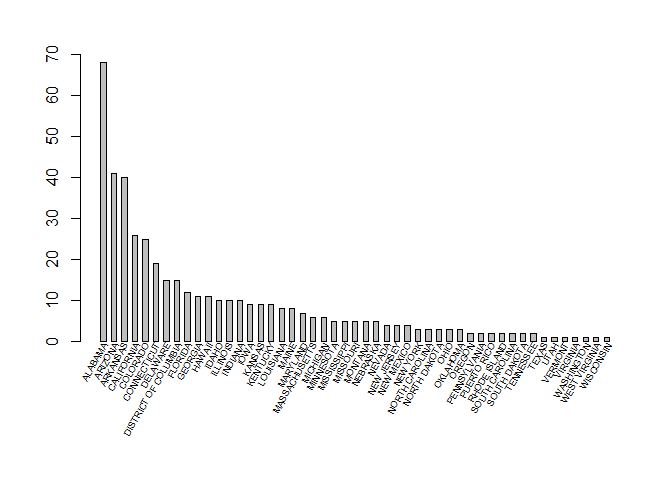
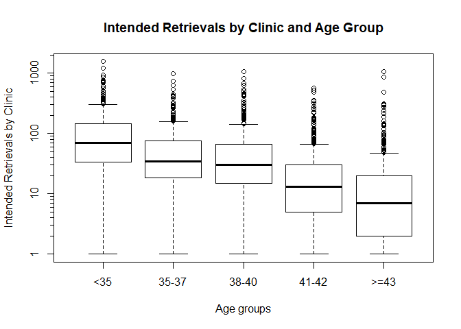
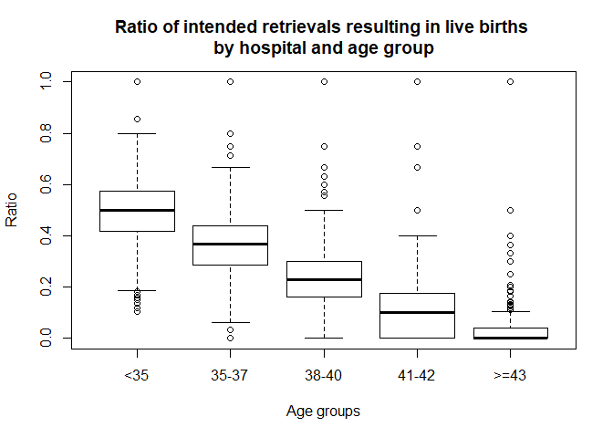
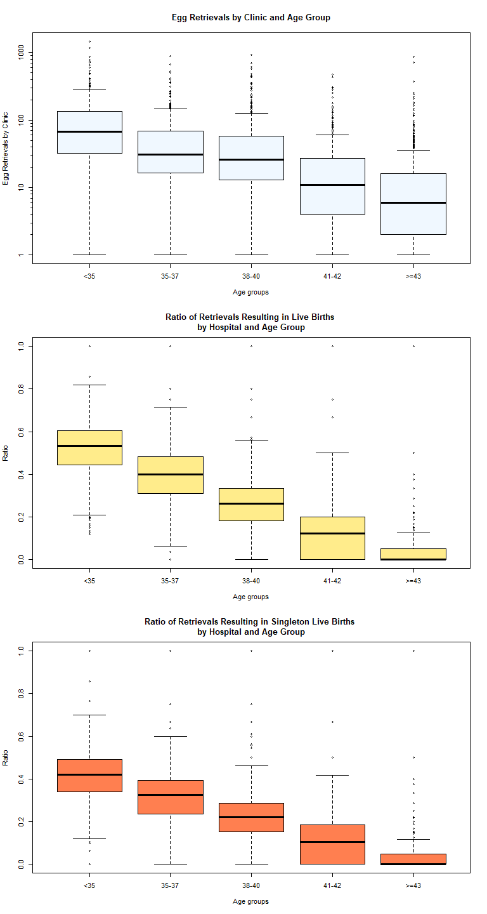
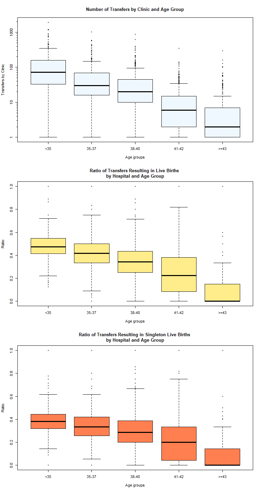

# PEC 3 - Instrucciones

Para este trabajo se debe utilizar MARKDOWN y entregarlo en Word o Pdf usando Knitr en RStudio.

También se debe entregar el fichero de código en R.

## Enunciado

Caso práctico lo más ajustado a la realidad que sea posible y que permita poner en práctica los conceptos principales del curso.

A partir de una colección de datos, realizar un estudio estadístico con R. Se pueden seguir los siguientes puntos:

### 1. Buscar un conjunto de datos relacionados con la Bioestadística o la Bioinformática (ver enlaces).
Tienen que ser datos públicos.
Hay que explicar la procedencia de los datos e incluir las referencias que correspondan, y justificar por qué se han elegido esos datos.

### 2. Mostrar los datos.
Utilizando R, mostrar y explicar qué tipo de fichero hemos importado, las variables que forman parte de él (tipo, clasificación,...) y todo aquello que parezca relevante.
Incluir capturas de pantalla y las instrucciones en R que habéis utilizado para importar y mostrar los datos.

### 3. Preguntas objetivo.
Realizar un mínimo de seis preguntas objetivo que den una idea de la información contenida en el conjunto de datos.
Pueden estar basadas en el tipo de consultas realizadas en la Sección 2 de la PEC 1.
También utilizando las definiciones de funciones como se trabaja en el LAB3.

### 4. Análisis descriptivo de los datos.
Este estudio debe incluir, como se vio en la Sección 3 de la PEC1, un resumen paramétrico de los datos y diversas representaciones gráficas de los mismos basadas en determinados criterios.
Gráficos y criterios a elección.

### 5. Probabilidad y simulación.
Basándoos en los conceptos trabajados en el LAB4 y PEC2, realizad un mínimo de tres cuestiones que respondan a una cuestión de probabilidad y un mínimo de una cuestión que corresponda a un breve modelo de simulación.

### 6. Análisis de regresión
Realizad un breve análisis de regresión a partir de las variables que disponéis y utilizando el criterio que responda a alguna pregunta de interés que os hayáis planteado.

### 7. Valoración final
A partir de los datos de origen y el estudio realizado, haced una valoración final:
¿Disponemos de conclusiones finales?
¿Sería necesario hacer un análisis más avanzado?
¿Faltan datos para obtener otro tipo de información como...?

## Sección 2

Hasta ahora se han usado datos que correspondían a archivos de tipo texto u hojas de cálculo.
En este ejercicio hay que realizar un breve estudio acerca de cómo gestionar la información a partir de una base de datos (script SQL,...):
 * Seleccionar una base de datos de libre acceso e importad, desde RStudio, estos datos. Mostrad el código utilizado y el resultado obtenido por pantalla.
 
 * Realizad un par de consultas, desde RStudio, a partir de estos datos y mostrad el código utilizado y resultado obtenido por pantalla.
 
# 1. Conjunto de datos

[Querría hacer algo con datos de reproducción asistida humana]

Finalmente me he decidido por los datos de reproducción asistida de los Estados Unidos publicados en abierto por el CDC:
https://www.cdc.gov/art/artdata/index.html

Los datos de años anteriores también se pueden descargar/consultar:
https://www.cdc.gov/art/reports/archive.html

# Descarga de los datos de interés


```r
# The code option eval = FALSE prevents this chunk to run. In this way, data WON'T
# be downloaded each time the .Rmd file is knitted to produce a report.
# For allowing this chunk to run, change eval to TRUE.

source_url <- "https://www.cdc.gov/art/artdata/docs/excel/FINAL-2017-Clinic-Table-Dataset.xlsx"

download.file(source_url, destfile = "../datos/FINAL-2017-Clinic-Table-Dataset.xlsx", method = "curl")
```

También podríamos querer los datos de años anteriores para hacer estudios a lo largo del tiempo:


```r
# The code option eval = FALSE prevents this chunk to run. In this way, data WON'T
# be downloaded each time the .Rmd file is knitted to produce a report.
# For allowing this chunk to run, change eval to TRUE.

years <- c(1995:2015)

url_start1 <- "https://www.cdc.gov/art/excelfiles/clinic_tables_data_"
url_start2 <- "https://www.cdc.gov/art/excelfiles/"
url_start3 <- "https://www.cdc.gov/art/artdata/docs/excel/FINAL-"

file_start1 <- "clinic_tables_data_"
file_start2 <- ""
file_start3 <- "FINAL-"

url_end1 <- ".xls"
url_end2 <- "-clinic-tables-dataset.xls"
url_end3 <- "-clinic-table-dataset.xls"

# This code is rough on the edges, it doesn't take into account when a file
# fails to download.

for (year in years){
  if (year <= 2012){
    url <- paste0(url_start1, year, url_end1)
    destfile <- paste0(file_start1, year, url_end1)
  }
  else if (year == 2013){
    url <- paste0(url_start2, year, url_end2)
    destfile <- paste0(file_start2, year, url_end2)
  }
    else if (year == 2014){
    url <- "https://www.cdc.gov/art/artdata/docs/excel/2014-Clinic-Tables-Data-Dictionary.xls"
    destfile <- "2014-Clinic-Tables-Data-Dictionary.xls"
  }
  else {
    url <- paste0(url_start3, year, url_end3)
    destfile <- paste0(file_start3, year, url_end3)
  }
  
  #cat(url, "\n", destfile, "\n\n") # Cheks that the names of url and files are rightly constructed.
  download.file(url, destfile, method = "curl")
}
```

# 2. Mostrar los datos

The downloaded file _FINAL-2017-Clinic-Table-Dataset.xlsx_ contiene datos de tratamientos de reproducción in vitro procedentes de 448 clínicas de Estados Unidos recogidos durante el año 2017. It is an Excel workbook containing four sheets:

**National Summary Data**. Datos agregados de todas las clínicas incluidas en el informe.
**National Table Dictionary**. Tabla-diccionario con la explicación de cada variable presente en la tabla anterior.
**Clinic Table Data Records**. Tabla con los datos desglosados de cada clínica.
**Clinic Table Dictionary**.  Tabla-diccionario con la explicación de cada variable presente en la tabla de clínicas.

Los datos que me interesan son los desglosados por clínica, así que importaré los datos de las hojas **Clinic Table Dictionary** y **Clinic Table Data Records**.


```r
require("xlsx")
```

```
## Loading required package: xlsx
```

```r
clinic_dictionary <- read.xlsx("../datos/FINAL-2017-Clinic-Table-Dataset.xlsx", 4,
                               endRow = 165, encoding = "UTF-8")
# Everything is NA after row 166; row 166 is a comment.

View(clinic_dictionary)

# En el visor, en la columna Age los símbolos '>=' aparecen como '=',
# pero si pedimos que nos imprima la columna en pantalla sí muestra los
# símbolos adecuados.

clinic_data <- read.xlsx("../datos/FINAL-2017-Clinic-Table-Dataset.xlsx", 3
                         , encoding = "UTF-8", stringsAsFactors=FALSE)
View(clinic_data)
```

Veamos cómo ha quedado codificada cada variable:


```r
str(clinic_data, list.len = length(clinic_data))
```

```
## 'data.frame':	448 obs. of  164 variables:
##  $ OrderID                 : num  1 2 3 4 5 6 7 8 9 10 ...
##  $ CurrentClinicName1      : chr  "ALABAMA FERTILITY SPECIALISTS" "ART FERTILITY PROGRAM OF ALABAMA" "UNIVERSITY OF ALABAMA AT BIRMINGHAM" "CENTER FOR REPRODUCTIVE MEDICINE" ...
##  $ CurrentClinicName2      : chr  "" "" "REPRODUCTIVE ENDOCRINOLOGY AND INFERTILITY" "" ...
##  $ CurrentClinicCity       : chr  "BIRMINGHAM" "BIRMINGHAM" "BIRMINGHAM" "MOBILE" ...
##  $ CurrentClinicState      : chr  "ALABAMA" "ALABAMA" "ALABAMA" "ALABAMA" ...
##  $ MedicalDirector         : chr  "Janet M. Bouknight, MD" "Virginia L. Houserman, MD" "Deidre D. Gunn, MD" "George T. Koulianos, MD" ...
##  $ ND_NumIntentRet1        : chr  "30" "110" "76" "82" ...
##  $ ND_NumIntentRet2        : chr  "11" "49" "29" "34" ...
##  $ ND_NumIntentRet3        : chr  "12" "31" "23" "26" ...
##  $ ND_NumIntentRet4        : chr  "1" "6" "5" "16" ...
##  $ ND_NumIntentRet5        : chr  "0" "4" "2" "5" ...
##  $ ND_IntentRetLB1         : chr  "33.3%" "39.1%" "56.6%" "59.8%" ...
##  $ ND_IntentRetLB2         : chr  "2 / 11" "32.7%" "34.5%" "35.3%" ...
##  $ ND_IntentRetLB3         : chr  "4 / 12" "19.4%" "26.1%" "38.5%" ...
##  $ ND_IntentRetLB4         : chr  "0 / 1" "0 / 6" "0 / 5" "0 / 16" ...
##  $ ND_IntentRetLB5         : chr  "" "0 / 4" "0 / 2" "1 / 5" ...
##  $ ND_IntentRetSingleLB1   : chr  "20.0%" "24.5%" "51.3%" "43.9%" ...
##  $ ND_IntentRetSingleLB2   : chr  "2 / 11" "16.3%" "34.5%" "23.5%" ...
##  $ ND_IntentRetSingleLB3   : chr  "3 / 12" "19.4%" "21.7%" "23.1%" ...
##  $ ND_IntentRetSingleLB4   : chr  "0 / 1" "0 / 6" "0 / 5" "0 / 16" ...
##  $ ND_IntentRetSingleLB5   : chr  "" "0 / 4" "0 / 2" "1 / 5" ...
##  $ ND_NumRetrieve1         : chr  "24" "105" "70" "78" ...
##  $ ND_NumRetrieve2         : chr  "5" "42" "29" "26" ...
##  $ ND_NumRetrieve3         : chr  "9" "22" "21" "25" ...
##  $ ND_NumRetrieve4         : chr  "1" "6" "3" "11" ...
##  $ ND_NumRetrieve5         : chr  "0" "1" "1" "5" ...
##  $ ND_RetrieveLB1          : chr  "41.7%" "41.0%" "61.4%" "62.8%" ...
##  $ ND_RetrieveLB2          : chr  "2 / 5" "38.1%" "34.5%" "46.2%" ...
##  $ ND_RetrieveLB3          : chr  "4 / 9" "27.3%" "28.6%" "40.0%" ...
##  $ ND_RetrieveLB4          : chr  "0 / 1" "0 / 6" "0 / 3" "0 / 11" ...
##  $ ND_RetrieveLB5          : chr  "" "0 / 1" "0 / 1" "1 / 5" ...
##  $ ND_RetrieveSingleLB1    : chr  "25.0%" "25.7%" "55.7%" "46.2%" ...
##  $ ND_RetrieveSingleLB2    : chr  "2 / 5" "19.0%" "34.5%" "30.8%" ...
##  $ ND_RetrieveSingleLB3    : chr  "3 / 9" "27.3%" "23.8%" "24.0%" ...
##  $ ND_RetrieveSingleLB4    : chr  "0 / 1" "0 / 6" "0 / 3" "0 / 11" ...
##  $ ND_RetrieveSingleLB5    : chr  "" "0 / 1" "0 / 1" "1 / 5" ...
##  $ ND_NumTrans1            : chr  "30" "105" "72" "105" ...
##  $ ND_NumTrans2            : chr  "8" "34" "24" "29" ...
##  $ ND_NumTrans3            : chr  "13" "16" "14" "24" ...
##  $ ND_NumTrans4            : chr  "1" "6" "2" "3" ...
##  $ ND_NumTrans5            : chr  "0" "1" "0" "2" ...
##  $ ND_TransLB1             : chr  "33.3%" "41.0%" "59.7%" "46.7%" ...
##  $ ND_TransLB2             : chr  "2 / 8" "47.1%" "41.7%" "41.4%" ...
##  $ ND_TransLB3             : chr  "4 / 13" "6 / 16" "6 / 14" "41.7%" ...
##  $ ND_TransLB4             : chr  "0 / 1" "0 / 6" "0 / 2" "0 / 3" ...
##  $ ND_TransLB5             : chr  "" "0 / 1" "" "1 / 2" ...
##  $ ND_TransSingleLB1       : chr  "20.0%" "25.7%" "54.2%" "34.3%" ...
##  $ ND_TransSingleLB2       : chr  "2 / 8" "23.5%" "41.7%" "27.6%" ...
##  $ ND_TransSingleLB3       : chr  "3 / 13" "6 / 16" "5 / 14" "25.0%" ...
##  $ ND_TransSingleLB4       : chr  "0 / 1" "0 / 6" "0 / 2" "0 / 3" ...
##  $ ND_TransSingleLB5       : chr  "" "0 / 1" "" "1 / 2" ...
##  $ ND_IntentRetPerLB1      : chr  "3.0" "2.6" "1.8" "1.7" ...
##  $ ND_IntentRetPerLB2      : chr  "5.5" "3.1" "2.9" "2.8" ...
##  $ ND_IntentRetPerLB3      : chr  "3.0" "5.2" "3.8" "2.6" ...
##  $ ND_IntentRetPerLB4      : chr  "" "" "" "" ...
##  $ ND_IntentRetPerLB5      : chr  "" "" "" "5.0" ...
##  $ NewND_1IntentRetLB1     : chr  "40.9%" "34.7%" "61.8%" "58.3%" ...
##  $ NewND_1IntentRetLB2     : chr  "1 / 4" "27.3%" "4 / 15" "31.8%" ...
##  $ NewND_1IntentRetLB3     : chr  "3 / 7" "5 / 18" "3 / 10" "5 / 14" ...
##  $ NewND_1IntentRetLB4     : chr  "0 / 1" "0 / 3" "0 / 3" "0 / 3" ...
##  $ NewND_1IntentRetLB5     : chr  "" "0 / 2" "0 / 2" "0 / 1" ...
##  $ NewND_2IntentRetLB1     : chr  "40.9%" "44.0%" "63.6%" "68.3%" ...
##  $ NewND_2IntentRetLB2     : chr  "1 / 4" "36.4%" "6 / 15" "36.4%" ...
##  $ NewND_2IntentRetLB3     : chr  "3 / 7" "5 / 18" "4 / 10" "5 / 14" ...
##  $ NewND_2IntentRetLB4     : chr  "0 / 1" "0 / 3" "0 / 3" "0 / 3" ...
##  $ NewND_2IntentRetLB5     : chr  "" "0 / 2" "0 / 2" "0 / 1" ...
##  $ NewND_AllIntentRetLB1   : chr  "40.9%" "44.0%" "63.6%" "70.0%" ...
##  $ NewND_AllIntentRetLB2   : chr  "1 / 4" "36.4%" "6 / 15" "36.4%" ...
##  $ NewND_AllIntentRetLB3   : chr  "3 / 7" "5 / 18" "5 / 10" "5 / 14" ...
##  $ NewND_AllIntentRetLB4   : chr  "0 / 1" "0 / 3" "0 / 3" "0 / 3" ...
##  $ NewND_AllIntentRetLB5   : chr  "" "0 / 2" "0 / 2" "0 / 1" ...
##  $ NewND_IntentRetPerNew1  : chr  "1.2" "1.2" "1.1" "1.2" ...
##  $ NewND_IntentRetPerNew2  : chr  "1.0" "1.2" "1.3" "1.2" ...
##  $ NewND_IntentRetPerNew3  : chr  "1.1" "1.1" "1.5" "1.1" ...
##  $ NewND_IntentRetPerNew4  : chr  "1.0" "1.0" "1.0" "3.0" ...
##  $ NewND_IntentRetPerNew5  : chr  "" "1.0" "1.0" "2.0" ...
##  $ NewND_TransPerIntentRet1: chr  "1.0" "1.0" "1.0" "1.2" ...
##  $ NewND_TransPerIntentRet2: chr  "1.3" "0.7" "0.8" "0.8" ...
##  $ NewND_TransPerIntentRet3: chr  "1.0" "0.6" "0.6" "0.9" ...
##  $ NewND_TransPerIntentRet4: chr  "1.0" "1.0" "0.3" "0.2" ...
##  $ NewND_TransPerIntentRet5: chr  "" "0.5" "0.0" "0.0" ...
##  $ Donor_NumTrans1         : chr  "4" "2" "3" "1" ...
##  $ Donor_NumTrans2         : chr  "4" "3" "2" "11" ...
##  $ Donor_NumTrans3         : chr  "1" "7" "12" "4" ...
##  $ Donor_NumTrans4         : chr  "0" "9" "1" "2" ...
##  $ Donor_TransLB1          : chr  "3 / 4" "1 / 2" "2 / 3" "1 / 1" ...
##  $ Donor_TransLB2          : chr  "2 / 4" "2 / 3" "1 / 2" "5 / 11" ...
##  $ Donor_TransLB3          : chr  "0 / 1" "4 / 7" "8 / 12" "1 / 4" ...
##  $ Donor_TransLB4          : chr  "" "3 / 9" "0 / 1" "1 / 2" ...
##  $ Donor_TranSingleLB1     : chr  "2 / 4" "0 / 2" "2 / 3" "1 / 1" ...
##  $ Donor_TranSingleLB2     : chr  "1 / 4" "1 / 3" "1 / 2" "2 / 11" ...
##  $ Donor_TranSingleLB3     : chr  "0 / 1" "4 / 7" "7 / 12" "0 / 4" ...
##  $ Donor_TranSingleLB4     : chr  "" "1 / 9" "0 / 1" "0 / 2" ...
##  $ TotNumCycles1           : chr  "58" "208" "121" "186" ...
##  $ TotNumCycles2           : chr  "19" "104" "52" "58" ...
##  $ TotNumCycles3           : chr  "13" "55" "42" "55" ...
##  $ TotNumCycles4           : chr  "7" "22" "13" "21" ...
##  $ TotNumCycles5           : chr  "5" "16" "16" "24" ...
##  $ TotNumCyclesAll         : chr  "102" "405" "244" "344" ...
##  $ CycleCancel1            : chr  "8.6%" "14.4%" "4.1%" "10.2%" ...
##  $ CycleCancel2            : chr  "2 / 19" "15.4%" "5.8%" "6.9%" ...
##  $ CycleCancel3            : chr  "2 / 13" "21.8%" "14.3%" "12.7%" ...
##  $ CycleCancel4            : chr  "1 / 7" "31.8%" "2 / 13" "28.6%" ...
##  $ CycleCancel5            : chr  "2 / 5" "6 / 16" "6 / 16" "29.2%" ...
##  $ CycleCancelAll          : chr  "11.8%" "17.5%" "9.0%" "12.5%" ...
##  $ CycleStop1              : chr  "3.4%" "13.0%" "4.1%" "17.7%" ...
##  $ CycleStop2              : chr  "0 / 19" "12.5%" "5.8%" "12.1%" ...
##  $ CycleStop3              : chr  "1 / 13" "16.4%" "4.8%" "9.1%" ...
##  $ CycleStop4              : chr  "1 / 7" "22.7%" "2 / 13" "14.3%" ...
##  $ CycleStop5              : chr  "0 / 5" "2 / 16" "2 / 16" "8.3%" ...
##  $ CycleStopAll            : chr  "3.9%" "13.8%" "5.7%" "14.5%" ...
##  $ CycleFertPres1          : chr  "0.0%" "2.4%" "5.0%" "3.8%" ...
##  $ CycleFertPres2          : chr  "1 / 19" "6.7%" "1.9%" "1.7%" ...
##  $ CycleFertPres3          : chr  "0 / 13" "9.1%" "0.0%" "0.0%" ...
##  $ CycleFertPres4          : chr  "0 / 7" "0.0%" "0 / 13" "9.5%" ...
##  $ CycleFertPres5          : chr  "0 / 5" "0 / 16" "0 / 16" "0.0%" ...
##  $ CycleFertPresAll        : chr  "1.0%" "4.2%" "2.9%" "2.9%" ...
##  $ TransCarrier1           : chr  "0.0%" "1.6%" "0.0%" "2.5%" ...
##  $ TransCarrier2           : chr  "0 / 16" "0.0%" "0.0%" "2.3%" ...
##  $ TransCarrier3           : chr  "0 / 10" "0.0%" "0.0%" "0.0%" ...
##  $ TransCarrier4           : chr  "0 / 5" "0 / 10" "0 / 8" "0 / 8" ...
##  $ TransCarrier5           : chr  "0 / 3" "0 / 8" "0 / 7" "3 / 14" ...
##  $ TransCarrierAll         : chr  "0.0%" "0.9%" "0.0%" "3.1%" ...
##  $ TransFrozEmb1           : chr  "25.5%" "54.1%" "78.7%" "58.0%" ...
##  $ TransFrozEmb2           : chr  "7 / 16" "58.8%" "87.1%" "50.0%" ...
##  $ TransFrozEmb3           : chr  "3 / 10" "51.9%" "95.0%" "55.3%" ...
##  $ TransFrozEmb4           : chr  "1 / 5" "8 / 10" "5 / 8" "3 / 8" ...
##  $ TransFrozEmb5           : chr  "2 / 3" "6 / 8" "5 / 7" "6 / 14" ...
##  $ TransFrozEmbAll         : chr  "30.9%" "56.9%" "81.6%" "54.3%" ...
##  $ TransICSI1              : chr  "46.8%" "88.5%" "80.0%" "96.6%" ...
##  $ TransICSI2              : chr  "6 / 16" "68.6%" "71.0%" "95.5%" ...
##  $ TransICSI3              : chr  "7 / 10" "70.4%" "60.0%" "89.5%" ...
##  $ TransICSI4              : chr  "2 / 5" "6 / 10" "4 / 8" "7 / 8" ...
##  $ TransICSI5              : chr  "1 / 3" "5 / 8" "2 / 7" "8 / 14" ...
##  $ TransICSIAll            : chr  "46.9%" "79.4%" "70.9%" "92.4%" ...
##  $ TransPGT1               : chr  "2.1%" "8.2%" "45.3%" "5.9%" ...
##  $ TransPGT2               : chr  "0 / 16" "15.7%" "48.4%" "0.0%" ...
##  $ TransPGT3               : chr  "0 / 10" "11.1%" "65.0%" "15.8%" ...
##  $ TransPGT4               : chr  "0 / 5" "1 / 10" "4 / 8" "3 / 8" ...
##  $ TransPGT5               : chr  "1 / 3" "0 / 8" "3 / 7" "1 / 14" ...
##  $ TransPGTAll             : chr  "2.5%" "10.1%" "48.9%" "7.6%" ...
##  $ ReasonMale              : chr  "30%" "60%" "37%" "43%" ...
##  $ ReasonEndo              : chr  "25%" "27%" "24%" "16%" ...
##  $ ReasonTubal             : chr  "12%" "21%" "17%" "18%" ...
##  $ ReasonOvul              : chr  "37%" "15%" "8%" "22%" ...
##  $ ReasonUterine           : chr  "10%" "3%" "8%" "3%" ...
##  $ ReasonPGT               : chr  "0%" "6%" "4%" "5%" ...
##  $ ReasonCarrier           : chr  "0%" "<1%" "0%" "<1%" ...
##  $ ReasonDOR               : chr  "18%" "10%" "26%" "12%" ...
##  $ ReasonBank              : chr  "5%" "17%" "28%" "10%" ...
##  $ ReasonPregLoss          : chr  "4%" "6%" "1%" "2%" ...
##  $ ReasonOtherInfert       : chr  "11%" "53%" "11%" "15%" ...
##  $ ReasonNonInfert         : chr  "0%" "12%" "3%" "2%" ...
##  $ ReasonUnexplained       : chr  "4%" "1%" "12%" "8%" ...
##  $ DonorEggService         : chr  "Yes" "Yes" "Yes" "Yes" ...
##  $ DonatedEmbryoService    : chr  "No" "Yes" "Yes" "Yes" ...
##  $ EmbryoCryoService       : chr  "Yes" "Yes" "Yes" "Yes" ...
##  $ EggCryoService          : chr  "Yes" "Yes" "Yes" "Yes" ...
##  $ SingleWomenService      : chr  "Yes" "Yes" "Yes" "Yes" ...
##  $ GestCarrierService      : chr  "Yes" "Yes" "Yes" "Yes" ...
##  $ SARTmember              : chr  "Yes" "Yes" "Yes" "Yes" ...
##  $ LabAccred               : chr  "Yes" "Yes" "Yes" "Yes" ...
##  $ NumResearch             : chr  "0" "0" "0" "0" ...
##  $ CurrentStateAbbrev      : chr  "AL" "AL" "AL" "AL" ...
```

En la estructura podemos observar un problema de esta fuente de datos. Los porcentajes y ratios aparecen como texto, no como números. Va a ser necesario preprocesar los datos de la tabla antes de trabajar con ellos.

¿Por qué hay variables numéricas que se detectan como texto? En el caso de las ratios está claro, contienen signos ("%", "/", "<") que no son números. ¿Y el resto?

Ordenaremos alfabéticamente las columnas, a ver si encontramos algo extraño.

Primero de todo y para evitar problemas posteriores, vamos a cambiar los valores vacíos por `NA`:


```r
clinic_data[clinic_data==""] <- NA

View(clinic_data)
```

Si ordenamos los valores de las columnas, vemos que hay columnas de números enteros en las que los miles están marcados con una coma (`,`).


```r
ordenadas <- sapply(clinic_data, function(x) sort(x, na.last = TRUE))

View(ordenadas)
```

A continuación corregiremos las variables que deberían ser `integer` o `numeric`.

Adaptado de una pregunta que he encontrado en Stack Overflow:
[How to read data when some numbers contain commas as thousand separator?](https://stackoverflow.com/questions/1523126/how-to-read-data-when-some-numbers-contain-commas-as-thousand-separator)


```r
# Vectores que hacen referencia a las columnas que deberían ser números enteros
# y las que deberían ser ratios.

integers <- c(7:11, 22:26, 37:41, 82:85, 94:99, 163)
ratios <- c(12:21, 27:36, 42:81, 86:93, 100:154)

# Preprocesamos las columnas con enteros para eliminar el símbolo "," en los miles.
clinic_data[, integers] <- lapply(clinic_data[, integers],
                                  function(x){
                                    as.integer(gsub(",", "", x))
                                  })

str(clinic_data[, integers])
```

```
## 'data.frame':	448 obs. of  26 variables:
##  $ ND_NumIntentRet1: int  30 110 76 82 15 224 42 56 3 28 ...
##  $ ND_NumIntentRet2: int  11 49 29 34 6 106 33 38 0 12 ...
##  $ ND_NumIntentRet3: int  12 31 23 26 4 53 16 32 0 15 ...
##  $ ND_NumIntentRet4: int  1 6 5 16 3 36 2 8 1 4 ...
##  $ ND_NumIntentRet5: int  0 4 2 5 2 40 7 8 0 8 ...
##  $ ND_NumRetrieve1 : int  24 105 70 78 12 223 42 54 3 27 ...
##  $ ND_NumRetrieve2 : int  5 42 29 26 4 105 31 30 0 12 ...
##  $ ND_NumRetrieve3 : int  9 22 21 25 3 53 16 23 0 12 ...
##  $ ND_NumRetrieve4 : int  1 6 3 11 3 36 2 7 1 4 ...
##  $ ND_NumRetrieve5 : int  0 1 1 5 2 40 6 5 0 8 ...
##  $ ND_NumTrans1    : int  30 105 72 105 12 233 54 70 3 28 ...
##  $ ND_NumTrans2    : int  8 34 24 29 4 82 37 36 0 15 ...
##  $ ND_NumTrans3    : int  13 16 14 24 3 36 17 16 0 8 ...
##  $ ND_NumTrans4    : int  1 6 2 3 3 10 2 2 1 4 ...
##  $ ND_NumTrans5    : int  0 1 0 2 2 5 6 3 0 6 ...
##  $ Donor_NumTrans1 : int  4 2 3 1 0 1 9 1 1 2 ...
##  $ Donor_NumTrans2 : int  4 3 2 11 0 0 1 4 1 2 ...
##  $ Donor_NumTrans3 : int  1 7 12 4 0 9 20 34 2 3 ...
##  $ Donor_NumTrans4 : int  0 9 1 2 0 0 5 0 1 2 ...
##  $ TotNumCycles1   : int  58 208 121 186 21 458 95 180 19 72 ...
##  $ TotNumCycles2   : int  19 104 52 58 11 195 72 83 12 40 ...
##  $ TotNumCycles3   : int  13 55 42 55 9 181 42 54 15 29 ...
##  $ TotNumCycles4   : int  7 22 13 21 3 59 10 21 3 11 ...
##  $ TotNumCycles5   : int  5 16 16 24 5 62 17 31 1 1 ...
##  $ TotNumCyclesAll : int  102 405 244 344 49 955 236 369 50 153 ...
##  $ NumResearch     : int  0 0 0 0 0 0 0 0 0 0 ...
```

Preprocesar las columnas de ratios es algo más complejo. Es necesario lidiar con tres casos diferentes:

1) Los datos <1%. Como no puedo conocer el valor real, lo que haré es elegir arbitrariamente el valor 0.5% que expresaré como una ratio de 0.005.

2) Datos que incluyen el símbolo "%". Misma estrategia que con los números enteros; eliminaré el símbolo con gsub. Además dividiré el resultado entre 100 para que todos los números sean ratios (tantos por uno).

3) Datos que son fracciones. Esto es un pelín más complicado. Con expresiones regulares aislaré en numerador y el denominador y devolveré el resultado de la división.


```r
# Esta función procesa las ratios que aparecen como fracciones.
divide <- function(x){
  numerador <- as.numeric(gsub(" .*$", "", x))
  denominador <- as.numeric(gsub("^.*/ ", "", x))
  return (numerador / denominador)
}

# Esta es la función principal para procesar las ratios de texto a números.
# Aparecerán avisos de 'NA introduced by coercion' debido a las celdas en blanco.
numerizador <- function(dato){
    ifelse (dato == "<1%", 0.005,
            ifelse ((grepl("%", dato) == TRUE), as.numeric(gsub("%", "", dato))/100,
                    ifelse ((grepl("/", dato)==TRUE), divide(dato), as.numeric(dato))))
}
# La función ifelse es necesaria para trabajar con vectores de longitud >1.

# Preprocesamiento de las ratios:
clinic_data[, ratios] <- lapply(clinic_data[, ratios], numerizador)
```

```
## Warning in ifelse((grepl("%", dato) == TRUE), as.numeric(gsub("%", "",
## dato))/100, : NAs introducidos por coerción
```

```
## Warning in divide(dato): NAs introducidos por coerción

## Warning in divide(dato): NAs introducidos por coerción
```

```
## Warning in ifelse((grepl("/", dato) == TRUE), divide(dato),
## as.numeric(dato)): NAs introducidos por coerción
```

```
## Warning in ifelse((grepl("%", dato) == TRUE), as.numeric(gsub("%", "",
## dato))/100, : NAs introducidos por coerción
```

```
## Warning in divide(dato): NAs introducidos por coerción

## Warning in divide(dato): NAs introducidos por coerción
```

```
## Warning in ifelse((grepl("/", dato) == TRUE), divide(dato),
## as.numeric(dato)): NAs introducidos por coerción
```

```
## Warning in ifelse((grepl("%", dato) == TRUE), as.numeric(gsub("%", "",
## dato))/100, : NAs introducidos por coerción
```

```
## Warning in divide(dato): NAs introducidos por coerción

## Warning in divide(dato): NAs introducidos por coerción
```

```
## Warning in ifelse((grepl("/", dato) == TRUE), divide(dato),
## as.numeric(dato)): NAs introducidos por coerción
```

```
## Warning in ifelse((grepl("%", dato) == TRUE), as.numeric(gsub("%", "",
## dato))/100, : NAs introducidos por coerción
```

```
## Warning in divide(dato): NAs introducidos por coerción

## Warning in divide(dato): NAs introducidos por coerción
```

```
## Warning in ifelse((grepl("/", dato) == TRUE), divide(dato),
## as.numeric(dato)): NAs introducidos por coerción
```

```
## Warning in ifelse((grepl("%", dato) == TRUE), as.numeric(gsub("%", "",
## dato))/100, : NAs introducidos por coerción
```

```
## Warning in divide(dato): NAs introducidos por coerción

## Warning in divide(dato): NAs introducidos por coerción
```

```
## Warning in ifelse((grepl("/", dato) == TRUE), divide(dato),
## as.numeric(dato)): NAs introducidos por coerción
```

```
## Warning in ifelse((grepl("%", dato) == TRUE), as.numeric(gsub("%", "",
## dato))/100, : NAs introducidos por coerción
```

```
## Warning in divide(dato): NAs introducidos por coerción

## Warning in divide(dato): NAs introducidos por coerción
```

```
## Warning in ifelse((grepl("/", dato) == TRUE), divide(dato),
## as.numeric(dato)): NAs introducidos por coerción
```

```
## Warning in ifelse((grepl("%", dato) == TRUE), as.numeric(gsub("%", "",
## dato))/100, : NAs introducidos por coerción
```

```
## Warning in divide(dato): NAs introducidos por coerción

## Warning in divide(dato): NAs introducidos por coerción
```

```
## Warning in ifelse((grepl("/", dato) == TRUE), divide(dato),
## as.numeric(dato)): NAs introducidos por coerción
```

```
## Warning in ifelse((grepl("%", dato) == TRUE), as.numeric(gsub("%", "",
## dato))/100, : NAs introducidos por coerción
```

```
## Warning in divide(dato): NAs introducidos por coerción

## Warning in divide(dato): NAs introducidos por coerción
```

```
## Warning in ifelse((grepl("/", dato) == TRUE), divide(dato),
## as.numeric(dato)): NAs introducidos por coerción
```

```
## Warning in ifelse((grepl("%", dato) == TRUE), as.numeric(gsub("%", "",
## dato))/100, : NAs introducidos por coerción
```

```
## Warning in divide(dato): NAs introducidos por coerción

## Warning in divide(dato): NAs introducidos por coerción
```

```
## Warning in ifelse((grepl("/", dato) == TRUE), divide(dato),
## as.numeric(dato)): NAs introducidos por coerción
```

```
## Warning in ifelse((grepl("%", dato) == TRUE), as.numeric(gsub("%", "",
## dato))/100, : NAs introducidos por coerción
```

```
## Warning in divide(dato): NAs introducidos por coerción

## Warning in divide(dato): NAs introducidos por coerción
```

```
## Warning in ifelse((grepl("/", dato) == TRUE), divide(dato),
## as.numeric(dato)): NAs introducidos por coerción
```

```
## Warning in ifelse((grepl("%", dato) == TRUE), as.numeric(gsub("%", "",
## dato))/100, : NAs introducidos por coerción
```

```
## Warning in divide(dato): NAs introducidos por coerción

## Warning in divide(dato): NAs introducidos por coerción
```

```
## Warning in ifelse((grepl("/", dato) == TRUE), divide(dato),
## as.numeric(dato)): NAs introducidos por coerción
```

```
## Warning in ifelse((grepl("%", dato) == TRUE), as.numeric(gsub("%", "",
## dato))/100, : NAs introducidos por coerción
```

```
## Warning in divide(dato): NAs introducidos por coerción

## Warning in divide(dato): NAs introducidos por coerción
```

```
## Warning in ifelse((grepl("/", dato) == TRUE), divide(dato),
## as.numeric(dato)): NAs introducidos por coerción
```

```
## Warning in ifelse((grepl("%", dato) == TRUE), as.numeric(gsub("%", "",
## dato))/100, : NAs introducidos por coerción
```

```
## Warning in divide(dato): NAs introducidos por coerción

## Warning in divide(dato): NAs introducidos por coerción
```

```
## Warning in ifelse((grepl("/", dato) == TRUE), divide(dato),
## as.numeric(dato)): NAs introducidos por coerción
```

```
## Warning in ifelse((grepl("%", dato) == TRUE), as.numeric(gsub("%", "",
## dato))/100, : NAs introducidos por coerción
```

```
## Warning in divide(dato): NAs introducidos por coerción

## Warning in divide(dato): NAs introducidos por coerción
```

```
## Warning in ifelse((grepl("/", dato) == TRUE), divide(dato),
## as.numeric(dato)): NAs introducidos por coerción
```

```
## Warning in ifelse((grepl("%", dato) == TRUE), as.numeric(gsub("%", "",
## dato))/100, : NAs introducidos por coerción
```

```
## Warning in divide(dato): NAs introducidos por coerción

## Warning in divide(dato): NAs introducidos por coerción
```

```
## Warning in ifelse((grepl("/", dato) == TRUE), divide(dato),
## as.numeric(dato)): NAs introducidos por coerción
```

```
## Warning in ifelse((grepl("%", dato) == TRUE), as.numeric(gsub("%", "",
## dato))/100, : NAs introducidos por coerción
```

```
## Warning in divide(dato): NAs introducidos por coerción

## Warning in divide(dato): NAs introducidos por coerción
```

```
## Warning in ifelse((grepl("/", dato) == TRUE), divide(dato),
## as.numeric(dato)): NAs introducidos por coerción
```

```
## Warning in ifelse((grepl("%", dato) == TRUE), as.numeric(gsub("%", "",
## dato))/100, : NAs introducidos por coerción
```

```
## Warning in divide(dato): NAs introducidos por coerción

## Warning in divide(dato): NAs introducidos por coerción
```

```
## Warning in ifelse((grepl("/", dato) == TRUE), divide(dato),
## as.numeric(dato)): NAs introducidos por coerción
```

```
## Warning in ifelse((grepl("%", dato) == TRUE), as.numeric(gsub("%", "",
## dato))/100, : NAs introducidos por coerción
```

```
## Warning in divide(dato): NAs introducidos por coerción

## Warning in divide(dato): NAs introducidos por coerción
```

```
## Warning in ifelse((grepl("/", dato) == TRUE), divide(dato),
## as.numeric(dato)): NAs introducidos por coerción
```

```
## Warning in ifelse((grepl("%", dato) == TRUE), as.numeric(gsub("%", "",
## dato))/100, : NAs introducidos por coerción
```

```
## Warning in divide(dato): NAs introducidos por coerción

## Warning in divide(dato): NAs introducidos por coerción
```

```
## Warning in ifelse((grepl("/", dato) == TRUE), divide(dato),
## as.numeric(dato)): NAs introducidos por coerción
```

```
## Warning in ifelse((grepl("%", dato) == TRUE), as.numeric(gsub("%", "",
## dato))/100, : NAs introducidos por coerción
```

```
## Warning in divide(dato): NAs introducidos por coerción

## Warning in divide(dato): NAs introducidos por coerción
```

```
## Warning in ifelse((grepl("/", dato) == TRUE), divide(dato),
## as.numeric(dato)): NAs introducidos por coerción
```

```
## Warning in ifelse((grepl("%", dato) == TRUE), as.numeric(gsub("%", "",
## dato))/100, : NAs introducidos por coerción
```

```
## Warning in divide(dato): NAs introducidos por coerción

## Warning in divide(dato): NAs introducidos por coerción
```

```
## Warning in ifelse((grepl("/", dato) == TRUE), divide(dato),
## as.numeric(dato)): NAs introducidos por coerción
```

```
## Warning in ifelse((grepl("%", dato) == TRUE), as.numeric(gsub("%", "",
## dato))/100, : NAs introducidos por coerción
```

```
## Warning in divide(dato): NAs introducidos por coerción

## Warning in divide(dato): NAs introducidos por coerción
```

```
## Warning in ifelse((grepl("/", dato) == TRUE), divide(dato),
## as.numeric(dato)): NAs introducidos por coerción
```

```
## Warning in ifelse((grepl("%", dato) == TRUE), as.numeric(gsub("%", "",
## dato))/100, : NAs introducidos por coerción
```

```
## Warning in divide(dato): NAs introducidos por coerción

## Warning in divide(dato): NAs introducidos por coerción
```

```
## Warning in ifelse((grepl("/", dato) == TRUE), divide(dato),
## as.numeric(dato)): NAs introducidos por coerción
```

```
## Warning in ifelse((grepl("%", dato) == TRUE), as.numeric(gsub("%", "",
## dato))/100, : NAs introducidos por coerción
```

```
## Warning in divide(dato): NAs introducidos por coerción

## Warning in divide(dato): NAs introducidos por coerción
```

```
## Warning in ifelse((grepl("/", dato) == TRUE), divide(dato),
## as.numeric(dato)): NAs introducidos por coerción
```

```
## Warning in ifelse((grepl("%", dato) == TRUE), as.numeric(gsub("%", "",
## dato))/100, : NAs introducidos por coerción
```

```
## Warning in divide(dato): NAs introducidos por coerción

## Warning in divide(dato): NAs introducidos por coerción
```

```
## Warning in ifelse((grepl("/", dato) == TRUE), divide(dato),
## as.numeric(dato)): NAs introducidos por coerción
```

```
## Warning in ifelse((grepl("%", dato) == TRUE), as.numeric(gsub("%", "",
## dato))/100, : NAs introducidos por coerción
```

```
## Warning in divide(dato): NAs introducidos por coerción

## Warning in divide(dato): NAs introducidos por coerción
```

```
## Warning in ifelse((grepl("/", dato) == TRUE), divide(dato),
## as.numeric(dato)): NAs introducidos por coerción
```

```
## Warning in ifelse((grepl("%", dato) == TRUE), as.numeric(gsub("%", "",
## dato))/100, : NAs introducidos por coerción
```

```
## Warning in divide(dato): NAs introducidos por coerción

## Warning in divide(dato): NAs introducidos por coerción
```

```
## Warning in ifelse((grepl("/", dato) == TRUE), divide(dato),
## as.numeric(dato)): NAs introducidos por coerción
```

```
## Warning in ifelse((grepl("%", dato) == TRUE), as.numeric(gsub("%", "",
## dato))/100, : NAs introducidos por coerción
```

```
## Warning in divide(dato): NAs introducidos por coerción

## Warning in divide(dato): NAs introducidos por coerción
```

```
## Warning in ifelse((grepl("/", dato) == TRUE), divide(dato),
## as.numeric(dato)): NAs introducidos por coerción
```

```
## Warning in ifelse((grepl("%", dato) == TRUE), as.numeric(gsub("%", "",
## dato))/100, : NAs introducidos por coerción
```

```
## Warning in divide(dato): NAs introducidos por coerción

## Warning in divide(dato): NAs introducidos por coerción
```

```
## Warning in ifelse((grepl("/", dato) == TRUE), divide(dato),
## as.numeric(dato)): NAs introducidos por coerción
```

```
## Warning in ifelse((grepl("%", dato) == TRUE), as.numeric(gsub("%", "",
## dato))/100, : NAs introducidos por coerción
```

```
## Warning in divide(dato): NAs introducidos por coerción

## Warning in divide(dato): NAs introducidos por coerción
```

```
## Warning in ifelse((grepl("/", dato) == TRUE), divide(dato),
## as.numeric(dato)): NAs introducidos por coerción
```

```
## Warning in ifelse((grepl("%", dato) == TRUE), as.numeric(gsub("%", "",
## dato))/100, : NAs introducidos por coerción
```

```
## Warning in divide(dato): NAs introducidos por coerción

## Warning in divide(dato): NAs introducidos por coerción
```

```
## Warning in ifelse((grepl("/", dato) == TRUE), divide(dato),
## as.numeric(dato)): NAs introducidos por coerción
```

```
## Warning in ifelse((grepl("%", dato) == TRUE), as.numeric(gsub("%", "",
## dato))/100, : NAs introducidos por coerción
```

```
## Warning in divide(dato): NAs introducidos por coerción

## Warning in divide(dato): NAs introducidos por coerción
```

```
## Warning in ifelse((grepl("/", dato) == TRUE), divide(dato),
## as.numeric(dato)): NAs introducidos por coerción
```

```
## Warning in ifelse((grepl("%", dato) == TRUE), as.numeric(gsub("%", "",
## dato))/100, : NAs introducidos por coerción
```

```
## Warning in divide(dato): NAs introducidos por coerción

## Warning in divide(dato): NAs introducidos por coerción
```

```
## Warning in ifelse((grepl("/", dato) == TRUE), divide(dato),
## as.numeric(dato)): NAs introducidos por coerción
```

```
## Warning in ifelse((grepl("%", dato) == TRUE), as.numeric(gsub("%", "",
## dato))/100, : NAs introducidos por coerción
```

```
## Warning in divide(dato): NAs introducidos por coerción

## Warning in divide(dato): NAs introducidos por coerción
```

```
## Warning in ifelse((grepl("/", dato) == TRUE), divide(dato),
## as.numeric(dato)): NAs introducidos por coerción
```

```
## Warning in ifelse((grepl("%", dato) == TRUE), as.numeric(gsub("%", "",
## dato))/100, : NAs introducidos por coerción
```

```
## Warning in divide(dato): NAs introducidos por coerción

## Warning in divide(dato): NAs introducidos por coerción
```

```
## Warning in ifelse((grepl("/", dato) == TRUE), divide(dato),
## as.numeric(dato)): NAs introducidos por coerción
```

```
## Warning in ifelse((grepl("%", dato) == TRUE), as.numeric(gsub("%", "",
## dato))/100, : NAs introducidos por coerción
```

```
## Warning in divide(dato): NAs introducidos por coerción

## Warning in divide(dato): NAs introducidos por coerción
```

```
## Warning in ifelse((grepl("/", dato) == TRUE), divide(dato),
## as.numeric(dato)): NAs introducidos por coerción
```

```
## Warning in ifelse((grepl("%", dato) == TRUE), as.numeric(gsub("%", "",
## dato))/100, : NAs introducidos por coerción
```

```
## Warning in divide(dato): NAs introducidos por coerción

## Warning in divide(dato): NAs introducidos por coerción
```

```
## Warning in ifelse((grepl("/", dato) == TRUE), divide(dato),
## as.numeric(dato)): NAs introducidos por coerción
```

```
## Warning in ifelse((grepl("%", dato) == TRUE), as.numeric(gsub("%", "",
## dato))/100, : NAs introducidos por coerción
```

```
## Warning in divide(dato): NAs introducidos por coerción

## Warning in divide(dato): NAs introducidos por coerción
```

```
## Warning in ifelse((grepl("/", dato) == TRUE), divide(dato),
## as.numeric(dato)): NAs introducidos por coerción
```

```
## Warning in ifelse((grepl("%", dato) == TRUE), as.numeric(gsub("%", "",
## dato))/100, : NAs introducidos por coerción
```

```
## Warning in divide(dato): NAs introducidos por coerción

## Warning in divide(dato): NAs introducidos por coerción
```

```
## Warning in ifelse((grepl("/", dato) == TRUE), divide(dato),
## as.numeric(dato)): NAs introducidos por coerción
```

```
## Warning in ifelse((grepl("%", dato) == TRUE), as.numeric(gsub("%", "",
## dato))/100, : NAs introducidos por coerción
```

```
## Warning in divide(dato): NAs introducidos por coerción

## Warning in divide(dato): NAs introducidos por coerción
```

```
## Warning in ifelse((grepl("/", dato) == TRUE), divide(dato),
## as.numeric(dato)): NAs introducidos por coerción
```

```
## Warning in ifelse((grepl("%", dato) == TRUE), as.numeric(gsub("%", "",
## dato))/100, : NAs introducidos por coerción
```

```
## Warning in divide(dato): NAs introducidos por coerción

## Warning in divide(dato): NAs introducidos por coerción
```

```
## Warning in ifelse((grepl("/", dato) == TRUE), divide(dato),
## as.numeric(dato)): NAs introducidos por coerción
```

```
## Warning in ifelse((grepl("%", dato) == TRUE), as.numeric(gsub("%", "",
## dato))/100, : NAs introducidos por coerción
```

```
## Warning in divide(dato): NAs introducidos por coerción

## Warning in divide(dato): NAs introducidos por coerción
```

```
## Warning in ifelse((grepl("/", dato) == TRUE), divide(dato),
## as.numeric(dato)): NAs introducidos por coerción
```

```
## Warning in ifelse((grepl("%", dato) == TRUE), as.numeric(gsub("%", "",
## dato))/100, : NAs introducidos por coerción
```

```
## Warning in divide(dato): NAs introducidos por coerción

## Warning in divide(dato): NAs introducidos por coerción
```

```
## Warning in ifelse((grepl("/", dato) == TRUE), divide(dato),
## as.numeric(dato)): NAs introducidos por coerción
```

```
## Warning in ifelse((grepl("%", dato) == TRUE), as.numeric(gsub("%", "",
## dato))/100, : NAs introducidos por coerción
```

```
## Warning in divide(dato): NAs introducidos por coerción

## Warning in divide(dato): NAs introducidos por coerción
```

```
## Warning in ifelse((grepl("/", dato) == TRUE), divide(dato),
## as.numeric(dato)): NAs introducidos por coerción
```

```
## Warning in ifelse((grepl("%", dato) == TRUE), as.numeric(gsub("%", "",
## dato))/100, : NAs introducidos por coerción
```

```
## Warning in divide(dato): NAs introducidos por coerción

## Warning in divide(dato): NAs introducidos por coerción
```

```
## Warning in ifelse((grepl("/", dato) == TRUE), divide(dato),
## as.numeric(dato)): NAs introducidos por coerción
```

```
## Warning in ifelse((grepl("%", dato) == TRUE), as.numeric(gsub("%", "",
## dato))/100, : NAs introducidos por coerción
```

```
## Warning in divide(dato): NAs introducidos por coerción

## Warning in divide(dato): NAs introducidos por coerción
```

```
## Warning in ifelse((grepl("/", dato) == TRUE), divide(dato),
## as.numeric(dato)): NAs introducidos por coerción
```

```
## Warning in ifelse((grepl("%", dato) == TRUE), as.numeric(gsub("%", "",
## dato))/100, : NAs introducidos por coerción
```

```
## Warning in divide(dato): NAs introducidos por coerción

## Warning in divide(dato): NAs introducidos por coerción
```

```
## Warning in ifelse((grepl("/", dato) == TRUE), divide(dato),
## as.numeric(dato)): NAs introducidos por coerción
```

```
## Warning in ifelse((grepl("%", dato) == TRUE), as.numeric(gsub("%", "",
## dato))/100, : NAs introducidos por coerción
```

```
## Warning in divide(dato): NAs introducidos por coerción

## Warning in divide(dato): NAs introducidos por coerción
```

```
## Warning in ifelse((grepl("/", dato) == TRUE), divide(dato),
## as.numeric(dato)): NAs introducidos por coerción
```

```
## Warning in ifelse((grepl("%", dato) == TRUE), as.numeric(gsub("%", "",
## dato))/100, : NAs introducidos por coerción
```

```
## Warning in divide(dato): NAs introducidos por coerción

## Warning in divide(dato): NAs introducidos por coerción
```

```
## Warning in ifelse((grepl("/", dato) == TRUE), divide(dato),
## as.numeric(dato)): NAs introducidos por coerción
```

```
## Warning in ifelse((grepl("%", dato) == TRUE), as.numeric(gsub("%", "",
## dato))/100, : NAs introducidos por coerción
```

```
## Warning in divide(dato): NAs introducidos por coerción

## Warning in divide(dato): NAs introducidos por coerción
```

```
## Warning in ifelse((grepl("/", dato) == TRUE), divide(dato),
## as.numeric(dato)): NAs introducidos por coerción
```

```
## Warning in ifelse((grepl("%", dato) == TRUE), as.numeric(gsub("%", "",
## dato))/100, : NAs introducidos por coerción
```

```
## Warning in divide(dato): NAs introducidos por coerción

## Warning in divide(dato): NAs introducidos por coerción
```

```
## Warning in ifelse((grepl("/", dato) == TRUE), divide(dato),
## as.numeric(dato)): NAs introducidos por coerción
```

```
## Warning in ifelse((grepl("%", dato) == TRUE), as.numeric(gsub("%", "",
## dato))/100, : NAs introducidos por coerción
```

```
## Warning in divide(dato): NAs introducidos por coerción

## Warning in divide(dato): NAs introducidos por coerción
```

```
## Warning in ifelse((grepl("/", dato) == TRUE), divide(dato),
## as.numeric(dato)): NAs introducidos por coerción
```

```
## Warning in ifelse((grepl("%", dato) == TRUE), as.numeric(gsub("%", "",
## dato))/100, : NAs introducidos por coerción
```

```
## Warning in divide(dato): NAs introducidos por coerción

## Warning in divide(dato): NAs introducidos por coerción
```

```
## Warning in ifelse((grepl("/", dato) == TRUE), divide(dato),
## as.numeric(dato)): NAs introducidos por coerción
```

```
## Warning in ifelse((grepl("%", dato) == TRUE), as.numeric(gsub("%", "",
## dato))/100, : NAs introducidos por coerción
```

```
## Warning in divide(dato): NAs introducidos por coerción

## Warning in divide(dato): NAs introducidos por coerción
```

```
## Warning in ifelse((grepl("/", dato) == TRUE), divide(dato),
## as.numeric(dato)): NAs introducidos por coerción
```

```
## Warning in ifelse((grepl("%", dato) == TRUE), as.numeric(gsub("%", "",
## dato))/100, : NAs introducidos por coerción
```

```
## Warning in divide(dato): NAs introducidos por coerción

## Warning in divide(dato): NAs introducidos por coerción
```

```
## Warning in ifelse((grepl("/", dato) == TRUE), divide(dato),
## as.numeric(dato)): NAs introducidos por coerción
```

```
## Warning in ifelse((grepl("%", dato) == TRUE), as.numeric(gsub("%", "",
## dato))/100, : NAs introducidos por coerción
```

```
## Warning in divide(dato): NAs introducidos por coerción

## Warning in divide(dato): NAs introducidos por coerción
```

```
## Warning in ifelse((grepl("/", dato) == TRUE), divide(dato),
## as.numeric(dato)): NAs introducidos por coerción
```

```
## Warning in ifelse((grepl("%", dato) == TRUE), as.numeric(gsub("%", "",
## dato))/100, : NAs introducidos por coerción
```

```
## Warning in divide(dato): NAs introducidos por coerción

## Warning in divide(dato): NAs introducidos por coerción
```

```
## Warning in ifelse((grepl("/", dato) == TRUE), divide(dato),
## as.numeric(dato)): NAs introducidos por coerción
```

```
## Warning in ifelse((grepl("%", dato) == TRUE), as.numeric(gsub("%", "",
## dato))/100, : NAs introducidos por coerción
```

```
## Warning in divide(dato): NAs introducidos por coerción

## Warning in divide(dato): NAs introducidos por coerción
```

```
## Warning in ifelse((grepl("/", dato) == TRUE), divide(dato),
## as.numeric(dato)): NAs introducidos por coerción
```

```
## Warning in ifelse((grepl("%", dato) == TRUE), as.numeric(gsub("%", "",
## dato))/100, : NAs introducidos por coerción
```

```
## Warning in divide(dato): NAs introducidos por coerción

## Warning in divide(dato): NAs introducidos por coerción
```

```
## Warning in ifelse((grepl("/", dato) == TRUE), divide(dato),
## as.numeric(dato)): NAs introducidos por coerción
```

```
## Warning in ifelse((grepl("%", dato) == TRUE), as.numeric(gsub("%", "",
## dato))/100, : NAs introducidos por coerción
```

```
## Warning in divide(dato): NAs introducidos por coerción

## Warning in divide(dato): NAs introducidos por coerción
```

```
## Warning in ifelse((grepl("/", dato) == TRUE), divide(dato),
## as.numeric(dato)): NAs introducidos por coerción
```

```
## Warning in ifelse((grepl("%", dato) == TRUE), as.numeric(gsub("%", "",
## dato))/100, : NAs introducidos por coerción
```

```
## Warning in divide(dato): NAs introducidos por coerción

## Warning in divide(dato): NAs introducidos por coerción
```

```
## Warning in ifelse((grepl("/", dato) == TRUE), divide(dato),
## as.numeric(dato)): NAs introducidos por coerción
```

```
## Warning in ifelse((grepl("%", dato) == TRUE), as.numeric(gsub("%", "",
## dato))/100, : NAs introducidos por coerción
```

```
## Warning in divide(dato): NAs introducidos por coerción

## Warning in divide(dato): NAs introducidos por coerción
```

```
## Warning in ifelse((grepl("/", dato) == TRUE), divide(dato),
## as.numeric(dato)): NAs introducidos por coerción
```

```
## Warning in ifelse((grepl("%", dato) == TRUE), as.numeric(gsub("%", "",
## dato))/100, : NAs introducidos por coerción
```

```
## Warning in divide(dato): NAs introducidos por coerción

## Warning in divide(dato): NAs introducidos por coerción
```

```
## Warning in ifelse((grepl("/", dato) == TRUE), divide(dato),
## as.numeric(dato)): NAs introducidos por coerción
```

```
## Warning in ifelse((grepl("%", dato) == TRUE), as.numeric(gsub("%", "",
## dato))/100, : NAs introducidos por coerción
```

```
## Warning in divide(dato): NAs introducidos por coerción

## Warning in divide(dato): NAs introducidos por coerción
```

```
## Warning in ifelse((grepl("/", dato) == TRUE), divide(dato),
## as.numeric(dato)): NAs introducidos por coerción
```

```
## Warning in ifelse((grepl("%", dato) == TRUE), as.numeric(gsub("%", "",
## dato))/100, : NAs introducidos por coerción
```

```
## Warning in divide(dato): NAs introducidos por coerción

## Warning in divide(dato): NAs introducidos por coerción
```

```
## Warning in ifelse((grepl("/", dato) == TRUE), divide(dato),
## as.numeric(dato)): NAs introducidos por coerción
```

```
## Warning in ifelse((grepl("%", dato) == TRUE), as.numeric(gsub("%", "",
## dato))/100, : NAs introducidos por coerción
```

```
## Warning in divide(dato): NAs introducidos por coerción

## Warning in divide(dato): NAs introducidos por coerción
```

```
## Warning in ifelse((grepl("/", dato) == TRUE), divide(dato),
## as.numeric(dato)): NAs introducidos por coerción
```

```
## Warning in ifelse((grepl("%", dato) == TRUE), as.numeric(gsub("%", "",
## dato))/100, : NAs introducidos por coerción
```

```
## Warning in divide(dato): NAs introducidos por coerción

## Warning in divide(dato): NAs introducidos por coerción
```

```
## Warning in ifelse((grepl("/", dato) == TRUE), divide(dato),
## as.numeric(dato)): NAs introducidos por coerción
```

```
## Warning in ifelse((grepl("%", dato) == TRUE), as.numeric(gsub("%", "",
## dato))/100, : NAs introducidos por coerción
```

```
## Warning in divide(dato): NAs introducidos por coerción

## Warning in divide(dato): NAs introducidos por coerción
```

```
## Warning in ifelse((grepl("/", dato) == TRUE), divide(dato),
## as.numeric(dato)): NAs introducidos por coerción
```

```
## Warning in ifelse((grepl("%", dato) == TRUE), as.numeric(gsub("%", "",
## dato))/100, : NAs introducidos por coerción
```

```
## Warning in divide(dato): NAs introducidos por coerción

## Warning in divide(dato): NAs introducidos por coerción
```

```
## Warning in ifelse((grepl("/", dato) == TRUE), divide(dato),
## as.numeric(dato)): NAs introducidos por coerción
```

```
## Warning in ifelse((grepl("%", dato) == TRUE), as.numeric(gsub("%", "",
## dato))/100, : NAs introducidos por coerción
```

```
## Warning in divide(dato): NAs introducidos por coerción

## Warning in divide(dato): NAs introducidos por coerción
```

```
## Warning in ifelse((grepl("/", dato) == TRUE), divide(dato),
## as.numeric(dato)): NAs introducidos por coerción
```

```
## Warning in ifelse((grepl("%", dato) == TRUE), as.numeric(gsub("%", "",
## dato))/100, : NAs introducidos por coerción
```

```
## Warning in divide(dato): NAs introducidos por coerción

## Warning in divide(dato): NAs introducidos por coerción
```

```
## Warning in ifelse((grepl("/", dato) == TRUE), divide(dato),
## as.numeric(dato)): NAs introducidos por coerción
```

```
## Warning in ifelse((grepl("%", dato) == TRUE), as.numeric(gsub("%", "",
## dato))/100, : NAs introducidos por coerción
```

```
## Warning in divide(dato): NAs introducidos por coerción

## Warning in divide(dato): NAs introducidos por coerción
```

```
## Warning in ifelse((grepl("/", dato) == TRUE), divide(dato),
## as.numeric(dato)): NAs introducidos por coerción
```

```
## Warning in ifelse((grepl("%", dato) == TRUE), as.numeric(gsub("%", "",
## dato))/100, : NAs introducidos por coerción
```

```
## Warning in divide(dato): NAs introducidos por coerción

## Warning in divide(dato): NAs introducidos por coerción
```

```
## Warning in ifelse((grepl("/", dato) == TRUE), divide(dato),
## as.numeric(dato)): NAs introducidos por coerción
```

```
## Warning in ifelse((grepl("%", dato) == TRUE), as.numeric(gsub("%", "",
## dato))/100, : NAs introducidos por coerción
```

```
## Warning in divide(dato): NAs introducidos por coerción

## Warning in divide(dato): NAs introducidos por coerción
```

```
## Warning in ifelse((grepl("/", dato) == TRUE), divide(dato),
## as.numeric(dato)): NAs introducidos por coerción
```

```
## Warning in ifelse((grepl("%", dato) == TRUE), as.numeric(gsub("%", "",
## dato))/100, : NAs introducidos por coerción
```

```
## Warning in divide(dato): NAs introducidos por coerción

## Warning in divide(dato): NAs introducidos por coerción
```

```
## Warning in ifelse((grepl("/", dato) == TRUE), divide(dato),
## as.numeric(dato)): NAs introducidos por coerción
```

```
## Warning in ifelse((grepl("%", dato) == TRUE), as.numeric(gsub("%", "",
## dato))/100, : NAs introducidos por coerción
```

```
## Warning in divide(dato): NAs introducidos por coerción

## Warning in divide(dato): NAs introducidos por coerción
```

```
## Warning in ifelse((grepl("/", dato) == TRUE), divide(dato),
## as.numeric(dato)): NAs introducidos por coerción
```

```
## Warning in ifelse((grepl("%", dato) == TRUE), as.numeric(gsub("%", "",
## dato))/100, : NAs introducidos por coerción
```

```
## Warning in divide(dato): NAs introducidos por coerción

## Warning in divide(dato): NAs introducidos por coerción
```

```
## Warning in ifelse((grepl("/", dato) == TRUE), divide(dato),
## as.numeric(dato)): NAs introducidos por coerción
```

```
## Warning in ifelse((grepl("%", dato) == TRUE), as.numeric(gsub("%", "",
## dato))/100, : NAs introducidos por coerción
```

```
## Warning in divide(dato): NAs introducidos por coerción

## Warning in divide(dato): NAs introducidos por coerción
```

```
## Warning in ifelse((grepl("/", dato) == TRUE), divide(dato),
## as.numeric(dato)): NAs introducidos por coerción
```

```
## Warning in ifelse((grepl("%", dato) == TRUE), as.numeric(gsub("%", "",
## dato))/100, : NAs introducidos por coerción
```

```
## Warning in divide(dato): NAs introducidos por coerción

## Warning in divide(dato): NAs introducidos por coerción
```

```
## Warning in ifelse((grepl("/", dato) == TRUE), divide(dato),
## as.numeric(dato)): NAs introducidos por coerción
```

```
## Warning in ifelse((grepl("%", dato) == TRUE), as.numeric(gsub("%", "",
## dato))/100, : NAs introducidos por coerción
```

```
## Warning in divide(dato): NAs introducidos por coerción

## Warning in divide(dato): NAs introducidos por coerción
```

```
## Warning in ifelse((grepl("/", dato) == TRUE), divide(dato),
## as.numeric(dato)): NAs introducidos por coerción
```

```
## Warning in ifelse((grepl("%", dato) == TRUE), as.numeric(gsub("%", "",
## dato))/100, : NAs introducidos por coerción
```

```
## Warning in divide(dato): NAs introducidos por coerción

## Warning in divide(dato): NAs introducidos por coerción
```

```
## Warning in ifelse((grepl("/", dato) == TRUE), divide(dato),
## as.numeric(dato)): NAs introducidos por coerción
```

```
## Warning in ifelse((grepl("%", dato) == TRUE), as.numeric(gsub("%", "",
## dato))/100, : NAs introducidos por coerción
```

```
## Warning in divide(dato): NAs introducidos por coerción

## Warning in divide(dato): NAs introducidos por coerción
```

```
## Warning in ifelse((grepl("/", dato) == TRUE), divide(dato),
## as.numeric(dato)): NAs introducidos por coerción
```

```
## Warning in ifelse((grepl("%", dato) == TRUE), as.numeric(gsub("%", "",
## dato))/100, : NAs introducidos por coerción
```

```
## Warning in divide(dato): NAs introducidos por coerción

## Warning in divide(dato): NAs introducidos por coerción
```

```
## Warning in ifelse((grepl("/", dato) == TRUE), divide(dato),
## as.numeric(dato)): NAs introducidos por coerción
```

```
## Warning in ifelse((grepl("%", dato) == TRUE), as.numeric(gsub("%", "",
## dato))/100, : NAs introducidos por coerción
```

```
## Warning in divide(dato): NAs introducidos por coerción

## Warning in divide(dato): NAs introducidos por coerción
```

```
## Warning in ifelse((grepl("/", dato) == TRUE), divide(dato),
## as.numeric(dato)): NAs introducidos por coerción
```

```
## Warning in ifelse((grepl("%", dato) == TRUE), as.numeric(gsub("%", "",
## dato))/100, : NAs introducidos por coerción
```

```
## Warning in divide(dato): NAs introducidos por coerción

## Warning in divide(dato): NAs introducidos por coerción
```

```
## Warning in ifelse((grepl("/", dato) == TRUE), divide(dato),
## as.numeric(dato)): NAs introducidos por coerción
```

```
## Warning in ifelse((grepl("%", dato) == TRUE), as.numeric(gsub("%", "",
## dato))/100, : NAs introducidos por coerción
```

```
## Warning in divide(dato): NAs introducidos por coerción

## Warning in divide(dato): NAs introducidos por coerción
```

```
## Warning in ifelse((grepl("/", dato) == TRUE), divide(dato),
## as.numeric(dato)): NAs introducidos por coerción
```

```
## Warning in ifelse((grepl("%", dato) == TRUE), as.numeric(gsub("%", "",
## dato))/100, : NAs introducidos por coerción
```

```
## Warning in divide(dato): NAs introducidos por coerción

## Warning in divide(dato): NAs introducidos por coerción
```

```
## Warning in ifelse((grepl("/", dato) == TRUE), divide(dato),
## as.numeric(dato)): NAs introducidos por coerción
```

```
## Warning in ifelse((grepl("%", dato) == TRUE), as.numeric(gsub("%", "",
## dato))/100, : NAs introducidos por coerción
```

```
## Warning in divide(dato): NAs introducidos por coerción

## Warning in divide(dato): NAs introducidos por coerción
```

```
## Warning in ifelse((grepl("/", dato) == TRUE), divide(dato),
## as.numeric(dato)): NAs introducidos por coerción
```

```
## Warning in ifelse((grepl("%", dato) == TRUE), as.numeric(gsub("%", "",
## dato))/100, : NAs introducidos por coerción
```

```
## Warning in divide(dato): NAs introducidos por coerción

## Warning in divide(dato): NAs introducidos por coerción
```

```
## Warning in ifelse((grepl("/", dato) == TRUE), divide(dato),
## as.numeric(dato)): NAs introducidos por coerción
```

```
## Warning in ifelse((grepl("%", dato) == TRUE), as.numeric(gsub("%", "",
## dato))/100, : NAs introducidos por coerción
```

```
## Warning in divide(dato): NAs introducidos por coerción

## Warning in divide(dato): NAs introducidos por coerción
```

```
## Warning in ifelse((grepl("/", dato) == TRUE), divide(dato),
## as.numeric(dato)): NAs introducidos por coerción
```

```
## Warning in ifelse((grepl("%", dato) == TRUE), as.numeric(gsub("%", "",
## dato))/100, : NAs introducidos por coerción
```

```
## Warning in divide(dato): NAs introducidos por coerción

## Warning in divide(dato): NAs introducidos por coerción
```

```
## Warning in ifelse((grepl("/", dato) == TRUE), divide(dato),
## as.numeric(dato)): NAs introducidos por coerción
```

```
## Warning in ifelse((grepl("%", dato) == TRUE), as.numeric(gsub("%", "",
## dato))/100, : NAs introducidos por coerción
```

```
## Warning in divide(dato): NAs introducidos por coerción

## Warning in divide(dato): NAs introducidos por coerción
```

```
## Warning in ifelse((grepl("/", dato) == TRUE), divide(dato),
## as.numeric(dato)): NAs introducidos por coerción
```

```
## Warning in ifelse((grepl("%", dato) == TRUE), as.numeric(gsub("%", "",
## dato))/100, : NAs introducidos por coerción
```

```
## Warning in divide(dato): NAs introducidos por coerción

## Warning in divide(dato): NAs introducidos por coerción
```

```
## Warning in ifelse((grepl("/", dato) == TRUE), divide(dato),
## as.numeric(dato)): NAs introducidos por coerción
```

```
## Warning in ifelse((grepl("%", dato) == TRUE), as.numeric(gsub("%", "",
## dato))/100, : NAs introducidos por coerción
```

```
## Warning in divide(dato): NAs introducidos por coerción

## Warning in divide(dato): NAs introducidos por coerción
```

```
## Warning in ifelse((grepl("/", dato) == TRUE), divide(dato),
## as.numeric(dato)): NAs introducidos por coerción
```

```
## Warning in ifelse((grepl("%", dato) == TRUE), as.numeric(gsub("%", "",
## dato))/100, : NAs introducidos por coerción
```

```
## Warning in divide(dato): NAs introducidos por coerción

## Warning in divide(dato): NAs introducidos por coerción
```

```
## Warning in ifelse((grepl("/", dato) == TRUE), divide(dato),
## as.numeric(dato)): NAs introducidos por coerción
```

```
## Warning in ifelse((grepl("%", dato) == TRUE), as.numeric(gsub("%", "",
## dato))/100, : NAs introducidos por coerción

## Warning in ifelse((grepl("%", dato) == TRUE), as.numeric(gsub("%", "",
## dato))/100, : NAs introducidos por coerción

## Warning in ifelse((grepl("%", dato) == TRUE), as.numeric(gsub("%", "",
## dato))/100, : NAs introducidos por coerción

## Warning in ifelse((grepl("%", dato) == TRUE), as.numeric(gsub("%", "",
## dato))/100, : NAs introducidos por coerción

## Warning in ifelse((grepl("%", dato) == TRUE), as.numeric(gsub("%", "",
## dato))/100, : NAs introducidos por coerción

## Warning in ifelse((grepl("%", dato) == TRUE), as.numeric(gsub("%", "",
## dato))/100, : NAs introducidos por coerción

## Warning in ifelse((grepl("%", dato) == TRUE), as.numeric(gsub("%", "",
## dato))/100, : NAs introducidos por coerción

## Warning in ifelse((grepl("%", dato) == TRUE), as.numeric(gsub("%", "",
## dato))/100, : NAs introducidos por coerción

## Warning in ifelse((grepl("%", dato) == TRUE), as.numeric(gsub("%", "",
## dato))/100, : NAs introducidos por coerción

## Warning in ifelse((grepl("%", dato) == TRUE), as.numeric(gsub("%", "",
## dato))/100, : NAs introducidos por coerción

## Warning in ifelse((grepl("%", dato) == TRUE), as.numeric(gsub("%", "",
## dato))/100, : NAs introducidos por coerción

## Warning in ifelse((grepl("%", dato) == TRUE), as.numeric(gsub("%", "",
## dato))/100, : NAs introducidos por coerción

## Warning in ifelse((grepl("%", dato) == TRUE), as.numeric(gsub("%", "",
## dato))/100, : NAs introducidos por coerción
```

```r
# Al aplicarla aparecen multitud de avisos de 'NAs introduced by coercion'
# Creo que se debe a que los "NA" están almacenados como texto, pero no estoy seguro.
# He sido incapaz de corregirlo. Se puede evitar que salte el aviso, pero no me gusta
# enmascarar la aparición de avisos de error.

str(clinic_data[, ratios], list.len = length(clinic_data[, ratios]))
```

```
## 'data.frame':	448 obs. of  123 variables:
##  $ ND_IntentRetLB1         : num  0.333 0.391 0.566 0.598 0.4 ...
##  $ ND_IntentRetLB2         : num  0.182 0.327 0.345 0.353 0 ...
##  $ ND_IntentRetLB3         : num  0.333 0.194 0.261 0.385 0 ...
##  $ ND_IntentRetLB4         : num  0 0 0 0 0 0.056 0.5 0 1 0.5 ...
##  $ ND_IntentRetLB5         : num  NA 0 0 0.2 0 ...
##  $ ND_IntentRetSingleLB1   : num  0.2 0.245 0.513 0.439 0.267 ...
##  $ ND_IntentRetSingleLB2   : num  0.182 0.163 0.345 0.235 0 ...
##  $ ND_IntentRetSingleLB3   : num  0.25 0.194 0.217 0.231 0 ...
##  $ ND_IntentRetSingleLB4   : num  0 0 0 0 0 0.028 0.5 0 1 0.5 ...
##  $ ND_IntentRetSingleLB5   : num  NA 0 0 0.2 0 0.05 0 0 NA 0.125 ...
##  $ ND_RetrieveLB1          : num  0.417 0.41 0.614 0.628 0.5 ...
##  $ ND_RetrieveLB2          : num  0.4 0.381 0.345 0.462 0 ...
##  $ ND_RetrieveLB3          : num  0.444 0.273 0.286 0.4 0 ...
##  $ ND_RetrieveLB4          : num  0 0 0 0 0 0.056 0.5 0 1 0.5 ...
##  $ ND_RetrieveLB5          : num  NA 0 0 0.2 0 ...
##  $ ND_RetrieveSingleLB1    : num  0.25 0.257 0.557 0.462 0.333 ...
##  $ ND_RetrieveSingleLB2    : num  0.4 0.19 0.345 0.308 0 ...
##  $ ND_RetrieveSingleLB3    : num  0.333 0.273 0.238 0.24 0 ...
##  $ ND_RetrieveSingleLB4    : num  0 0 0 0 0 0.028 0.5 0 1 0.5 ...
##  $ ND_RetrieveSingleLB5    : num  NA 0 0 0.2 0 0.05 0 0 NA 0.125 ...
##  $ ND_TransLB1             : num  0.333 0.41 0.597 0.467 0.5 ...
##  $ ND_TransLB2             : num  0.25 0.471 0.417 0.414 0 ...
##  $ ND_TransLB3             : num  0.308 0.375 0.429 0.417 0 ...
##  $ ND_TransLB4             : num  0 0 0 0 0 0.2 0.5 0 1 0.5 ...
##  $ ND_TransLB5             : num  NA 0 NA 0.5 0 ...
##  $ ND_TransSingleLB1       : num  0.2 0.257 0.542 0.343 0.333 ...
##  $ ND_TransSingleLB2       : num  0.25 0.235 0.417 0.276 0 ...
##  $ ND_TransSingleLB3       : num  0.231 0.375 0.357 0.25 0 ...
##  $ ND_TransSingleLB4       : num  0 0 0 0 0 0.1 0.5 0 1 0.5 ...
##  $ ND_TransSingleLB5       : num  NA 0 NA 0.5 0 ...
##  $ ND_IntentRetPerLB1      : num  3 2.6 1.8 1.7 2.5 1.6 1.8 1.8 1.5 2.3 ...
##  $ ND_IntentRetPerLB2      : num  5.5 3.1 2.9 2.8 NA 2.1 1.8 2.7 NA 1.7 ...
##  $ ND_IntentRetPerLB3      : num  3 5.2 3.8 2.6 NA 2.5 8 6.4 NA 5 ...
##  $ ND_IntentRetPerLB4      : num  NA NA NA NA NA 18 2 NA 1 2 ...
##  $ ND_IntentRetPerLB5      : num  NA NA NA 5 NA 13.3 7 NA NA 8 ...
##  $ NewND_1IntentRetLB1     : num  0.409 0.347 0.618 0.583 0.571 ...
##  $ NewND_1IntentRetLB2     : num  0.25 0.273 0.267 0.318 0 ...
##  $ NewND_1IntentRetLB3     : num  0.429 0.278 0.3 0.357 0 ...
##  $ NewND_1IntentRetLB4     : num  0 0 0 0 0 ...
##  $ NewND_1IntentRetLB5     : num  NA 0 0 0 NA ...
##  $ NewND_2IntentRetLB1     : num  0.409 0.44 0.636 0.683 0.714 ...
##  $ NewND_2IntentRetLB2     : num  0.25 0.364 0.4 0.364 0 ...
##  $ NewND_2IntentRetLB3     : num  0.429 0.278 0.4 0.357 0 ...
##  $ NewND_2IntentRetLB4     : num  0 0 0 0 0 ...
##  $ NewND_2IntentRetLB5     : num  NA 0 0 0 NA ...
##  $ NewND_AllIntentRetLB1   : num  0.409 0.44 0.636 0.7 0.714 ...
##  $ NewND_AllIntentRetLB2   : num  0.25 0.364 0.4 0.364 0 ...
##  $ NewND_AllIntentRetLB3   : num  0.429 0.278 0.5 0.357 0 ...
##  $ NewND_AllIntentRetLB4   : num  0 0 0 0 0 ...
##  $ NewND_AllIntentRetLB5   : num  NA 0 0 0 NA ...
##  $ NewND_IntentRetPerNew1  : num  1.2 1.2 1.1 1.2 1.3 1.2 1.1 1 2 1 ...
##  $ NewND_IntentRetPerNew2  : num  1 1.2 1.3 1.2 1.3 1.2 1.1 1.1 NA 1 ...
##  $ NewND_IntentRetPerNew3  : num  1.1 1.1 1.5 1.1 1.3 1.3 1.3 1.3 NA 1.2 ...
##  $ NewND_IntentRetPerNew4  : num  1 1 1 3 1 1.7 1 1.4 NA 1.3 ...
##  $ NewND_IntentRetPerNew5  : num  NA 1 1 2 NA 2.3 1 1 NA 1.8 ...
##  $ NewND_TransPerIntentRet1: num  1 1 1 1.2 0.8 1 1.3 1.3 1 1.1 ...
##  $ NewND_TransPerIntentRet2: num  1.3 0.7 0.8 0.8 0.6 0.8 1.1 1 NA 1.4 ...
##  $ NewND_TransPerIntentRet3: num  1 0.6 0.6 0.9 0.8 0.7 1 0.5 NA 0.6 ...
##  $ NewND_TransPerIntentRet4: num  1 1 0.3 0.2 1 0.2 1 0.3 NA 1 ...
##  $ NewND_TransPerIntentRet5: num  NA 0.5 0 0 NA 0.1 0.5 0.4 NA 0.7 ...
##  $ Donor_TransLB1          : num  0.75 0.5 0.667 1 NA ...
##  $ Donor_TransLB2          : num  0.5 0.667 0.5 0.455 NA ...
##  $ Donor_TransLB3          : num  0 0.571 0.667 0.25 NA ...
##  $ Donor_TransLB4          : num  NA 0.333 0 0.5 NA ...
##  $ Donor_TranSingleLB1     : num  0.5 0 0.667 1 NA ...
##  $ Donor_TranSingleLB2     : num  0.25 0.333 0.5 0.182 NA ...
##  $ Donor_TranSingleLB3     : num  0 0.571 0.583 0 NA ...
##  $ Donor_TranSingleLB4     : num  NA 0.111 0 0 NA ...
##  $ CycleCancel1            : num  0.086 0.144 0.041 0.102 0 0.011 0.032 0.017 0 0.028 ...
##  $ CycleCancel2            : num  0.1053 0.154 0.058 0.069 0.0909 ...
##  $ CycleCancel3            : num  0.154 0.218 0.143 0.127 0 ...
##  $ CycleCancel4            : num  0.143 0.318 0.154 0.286 0 ...
##  $ CycleCancel5            : num  0.4 0.375 0.375 0.292 0 ...
##  $ CycleCancelAll          : num  0.118 0.175 0.09 0.125 0.02 0.016 0.059 0.073 0.02 0.033 ...
##  $ CycleStop1              : num  0.034 0.13 0.041 0.177 0 ...
##  $ CycleStop2              : num  0 0.125 0.058 0.121 0.182 ...
##  $ CycleStop3              : num  0.0769 0.164 0.048 0.091 0 ...
##  $ CycleStop4              : num  0.143 0.227 0.154 0.143 0 ...
##  $ CycleStop5              : num  0 0.125 0.125 0.083 0.6 ...
##  $ CycleStopAll            : num  0.039 0.138 0.057 0.145 0.102 0.07 0.055 0.019 0.28 0.078 ...
##  $ CycleFertPres1          : num  0 0.024 0.05 0.038 0.143 ...
##  $ CycleFertPres2          : num  0.0526 0.067 0.019 0.017 0.0909 ...
##  $ CycleFertPres3          : num  0 0.091 0 0 0 0 0 0.037 0 0.069 ...
##  $ CycleFertPres4          : num  0 0 0 0.095 0.333 ...
##  $ CycleFertPres5          : num  0 0 0 0 0.2 0 0 0 0 0 ...
##  $ CycleFertPresAll        : num  0.01 0.042 0.029 0.029 0.122 0.014 0.008 0.027 0.02 0.033 ...
##  $ TransCarrier1           : num  0 0.016 0 0.025 0 0.004 0.013 0.011 0 0 ...
##  $ TransCarrier2           : num  0 0 0 0.023 0 0.022 0.053 0 0 0.107 ...
##  $ TransCarrier3           : num  0 0 0 0 0 0.015 0.057 0 0 0 ...
##  $ TransCarrier4           : num  0 0 0 0 0 0 0.125 0.125 NA 0 ...
##  $ TransCarrier5           : num  0 0 0 0.214 0 ...
##  $ TransCarrierAll         : num  0 0.009 0 0.031 0 0.012 0.037 0.016 0.034 0.028 ...
##  $ TransFrozEmb1           : num  0.255 0.541 0.787 0.58 0.385 ...
##  $ TransFrozEmb2           : num  0.438 0.588 0.871 0.5 0.167 ...
##  $ TransFrozEmb3           : num  0.3 0.519 0.95 0.553 0.667 ...
##  $ TransFrozEmb4           : num  0.2 0.8 0.625 0.375 0 ...
##  $ TransFrozEmb5           : num  0.667 0.75 0.714 0.429 0 ...
##  $ TransFrozEmbAll         : num  0.309 0.569 0.816 0.543 0.357 0.988 0.633 0.973 0.483 0.481 ...
##  $ TransICSI1              : num  0.468 0.885 0.8 0.966 1 0.746 0.893 0.931 1 0.929 ...
##  $ TransICSI2              : num  0.375 0.686 0.71 0.955 1 0.72 0.807 0.732 1 0.929 ...
##  $ TransICSI3              : num  0.7 0.704 0.6 0.895 1 ...
##  $ TransICSI4              : num  0.4 0.6 0.5 0.875 1 0.8 0.625 0.5 NA 1 ...
##  $ TransICSI5              : num  0.333 0.625 0.286 0.571 1 ...
##  $ TransICSIAll            : num  0.469 0.794 0.709 0.924 1 0.732 0.846 0.824 0.966 0.934 ...
##  $ TransPGT1               : num  0.021 0.082 0.453 0.059 0 ...
##  $ TransPGT2               : num  0 0.157 0.484 0 0 0.204 0.211 0.39 0.25 0.143 ...
##  $ TransPGT3               : num  0 0.111 0.65 0.158 0 ...
##  $ TransPGT4               : num  0 0.1 0.5 0.375 0 ...
##  $ TransPGT5               : num  0.3333 0 0.4286 0.0714 0 ...
##  $ TransPGTAll             : num  0.025 0.101 0.489 0.076 0 0.207 0.149 0.341 0.276 0.085 ...
##  $ ReasonMale              : num  0.3 0.6 0.37 0.43 0.35 0.28 0.71 0.5 0.46 0.29 ...
##  $ ReasonEndo              : num  0.25 0.27 0.24 0.16 0.31 0.07 0.1 0.08 0.02 0.12 ...
##  $ ReasonTubal             : num  0.12 0.21 0.17 0.18 0.35 0.1 0.2 0.17 0.3 0.2 ...
##  $ ReasonOvul              : num  0.37 0.15 0.08 0.22 0.39 0.17 0.15 0.16 0.12 0.12 ...
##  $ ReasonUterine           : num  0.1 0.03 0.08 0.03 0.41 0.04 0.04 0.02 0.08 0.08 ...
##  $ ReasonPGT               : num  0 0.06 0.04 0.05 0 0.72 0.01 0.09 0.08 0 ...
##  $ ReasonCarrier           : num  0 0.005 0 0.005 0 0.005 0 0.01 0.02 0.02 ...
##  $ ReasonDOR               : num  0.18 0.1 0.26 0.12 0.47 0.22 0.21 0.45 0.2 0.35 ...
##  $ ReasonBank              : num  0.05 0.17 0.28 0.1 0.35 0.99 0.09 0.46 0.12 0.2 ...
##  $ ReasonPregLoss          : num  0.04 0.06 0.01 0.02 0.04 0.07 0.04 0.01 0.12 0.03 ...
##  $ ReasonOtherInfert       : num  0.11 0.53 0.11 0.15 0.08 0.005 0.08 0.15 0.12 0.06 ...
##  $ ReasonNonInfert         : num  0 0.12 0.03 0.02 0 0.05 0.01 0.04 0.06 0.02 ...
##  $ ReasonUnexplained       : num  0.04 0.01 0.12 0.08 0 0.09 0.03 0.01 0.06 0.12 ...
```

Los avisos de `NAs introduced by coercion` no estoy seguro de por qué aparecen. Sospecho que los valores `NA` de la tabla están guardados como texto, no como NA y por eso aparece el aviso.


## Variables: tipo y descripión

Es posible que me haya dejado llevar por la emoción escogiendo un fichero demasiado grande para empezar. La tabla contiene 165 variables. No es un número descabellado pero quizá sea poco manejable para el objetivo de este ejercicio.


```r
str(clinic_data, list.len = length(clinic_data))
```

```
## 'data.frame':	448 obs. of  164 variables:
##  $ OrderID                 : num  1 2 3 4 5 6 7 8 9 10 ...
##  $ CurrentClinicName1      : chr  "ALABAMA FERTILITY SPECIALISTS" "ART FERTILITY PROGRAM OF ALABAMA" "UNIVERSITY OF ALABAMA AT BIRMINGHAM" "CENTER FOR REPRODUCTIVE MEDICINE" ...
##  $ CurrentClinicName2      : chr  NA NA "REPRODUCTIVE ENDOCRINOLOGY AND INFERTILITY" NA ...
##  $ CurrentClinicCity       : chr  "BIRMINGHAM" "BIRMINGHAM" "BIRMINGHAM" "MOBILE" ...
##  $ CurrentClinicState      : chr  "ALABAMA" "ALABAMA" "ALABAMA" "ALABAMA" ...
##  $ MedicalDirector         : chr  "Janet M. Bouknight, MD" "Virginia L. Houserman, MD" "Deidre D. Gunn, MD" "George T. Koulianos, MD" ...
##  $ ND_NumIntentRet1        : int  30 110 76 82 15 224 42 56 3 28 ...
##  $ ND_NumIntentRet2        : int  11 49 29 34 6 106 33 38 0 12 ...
##  $ ND_NumIntentRet3        : int  12 31 23 26 4 53 16 32 0 15 ...
##  $ ND_NumIntentRet4        : int  1 6 5 16 3 36 2 8 1 4 ...
##  $ ND_NumIntentRet5        : int  0 4 2 5 2 40 7 8 0 8 ...
##  $ ND_IntentRetLB1         : num  0.333 0.391 0.566 0.598 0.4 ...
##  $ ND_IntentRetLB2         : num  0.182 0.327 0.345 0.353 0 ...
##  $ ND_IntentRetLB3         : num  0.333 0.194 0.261 0.385 0 ...
##  $ ND_IntentRetLB4         : num  0 0 0 0 0 0.056 0.5 0 1 0.5 ...
##  $ ND_IntentRetLB5         : num  NA 0 0 0.2 0 ...
##  $ ND_IntentRetSingleLB1   : num  0.2 0.245 0.513 0.439 0.267 ...
##  $ ND_IntentRetSingleLB2   : num  0.182 0.163 0.345 0.235 0 ...
##  $ ND_IntentRetSingleLB3   : num  0.25 0.194 0.217 0.231 0 ...
##  $ ND_IntentRetSingleLB4   : num  0 0 0 0 0 0.028 0.5 0 1 0.5 ...
##  $ ND_IntentRetSingleLB5   : num  NA 0 0 0.2 0 0.05 0 0 NA 0.125 ...
##  $ ND_NumRetrieve1         : int  24 105 70 78 12 223 42 54 3 27 ...
##  $ ND_NumRetrieve2         : int  5 42 29 26 4 105 31 30 0 12 ...
##  $ ND_NumRetrieve3         : int  9 22 21 25 3 53 16 23 0 12 ...
##  $ ND_NumRetrieve4         : int  1 6 3 11 3 36 2 7 1 4 ...
##  $ ND_NumRetrieve5         : int  0 1 1 5 2 40 6 5 0 8 ...
##  $ ND_RetrieveLB1          : num  0.417 0.41 0.614 0.628 0.5 ...
##  $ ND_RetrieveLB2          : num  0.4 0.381 0.345 0.462 0 ...
##  $ ND_RetrieveLB3          : num  0.444 0.273 0.286 0.4 0 ...
##  $ ND_RetrieveLB4          : num  0 0 0 0 0 0.056 0.5 0 1 0.5 ...
##  $ ND_RetrieveLB5          : num  NA 0 0 0.2 0 ...
##  $ ND_RetrieveSingleLB1    : num  0.25 0.257 0.557 0.462 0.333 ...
##  $ ND_RetrieveSingleLB2    : num  0.4 0.19 0.345 0.308 0 ...
##  $ ND_RetrieveSingleLB3    : num  0.333 0.273 0.238 0.24 0 ...
##  $ ND_RetrieveSingleLB4    : num  0 0 0 0 0 0.028 0.5 0 1 0.5 ...
##  $ ND_RetrieveSingleLB5    : num  NA 0 0 0.2 0 0.05 0 0 NA 0.125 ...
##  $ ND_NumTrans1            : int  30 105 72 105 12 233 54 70 3 28 ...
##  $ ND_NumTrans2            : int  8 34 24 29 4 82 37 36 0 15 ...
##  $ ND_NumTrans3            : int  13 16 14 24 3 36 17 16 0 8 ...
##  $ ND_NumTrans4            : int  1 6 2 3 3 10 2 2 1 4 ...
##  $ ND_NumTrans5            : int  0 1 0 2 2 5 6 3 0 6 ...
##  $ ND_TransLB1             : num  0.333 0.41 0.597 0.467 0.5 ...
##  $ ND_TransLB2             : num  0.25 0.471 0.417 0.414 0 ...
##  $ ND_TransLB3             : num  0.308 0.375 0.429 0.417 0 ...
##  $ ND_TransLB4             : num  0 0 0 0 0 0.2 0.5 0 1 0.5 ...
##  $ ND_TransLB5             : num  NA 0 NA 0.5 0 ...
##  $ ND_TransSingleLB1       : num  0.2 0.257 0.542 0.343 0.333 ...
##  $ ND_TransSingleLB2       : num  0.25 0.235 0.417 0.276 0 ...
##  $ ND_TransSingleLB3       : num  0.231 0.375 0.357 0.25 0 ...
##  $ ND_TransSingleLB4       : num  0 0 0 0 0 0.1 0.5 0 1 0.5 ...
##  $ ND_TransSingleLB5       : num  NA 0 NA 0.5 0 ...
##  $ ND_IntentRetPerLB1      : num  3 2.6 1.8 1.7 2.5 1.6 1.8 1.8 1.5 2.3 ...
##  $ ND_IntentRetPerLB2      : num  5.5 3.1 2.9 2.8 NA 2.1 1.8 2.7 NA 1.7 ...
##  $ ND_IntentRetPerLB3      : num  3 5.2 3.8 2.6 NA 2.5 8 6.4 NA 5 ...
##  $ ND_IntentRetPerLB4      : num  NA NA NA NA NA 18 2 NA 1 2 ...
##  $ ND_IntentRetPerLB5      : num  NA NA NA 5 NA 13.3 7 NA NA 8 ...
##  $ NewND_1IntentRetLB1     : num  0.409 0.347 0.618 0.583 0.571 ...
##  $ NewND_1IntentRetLB2     : num  0.25 0.273 0.267 0.318 0 ...
##  $ NewND_1IntentRetLB3     : num  0.429 0.278 0.3 0.357 0 ...
##  $ NewND_1IntentRetLB4     : num  0 0 0 0 0 ...
##  $ NewND_1IntentRetLB5     : num  NA 0 0 0 NA ...
##  $ NewND_2IntentRetLB1     : num  0.409 0.44 0.636 0.683 0.714 ...
##  $ NewND_2IntentRetLB2     : num  0.25 0.364 0.4 0.364 0 ...
##  $ NewND_2IntentRetLB3     : num  0.429 0.278 0.4 0.357 0 ...
##  $ NewND_2IntentRetLB4     : num  0 0 0 0 0 ...
##  $ NewND_2IntentRetLB5     : num  NA 0 0 0 NA ...
##  $ NewND_AllIntentRetLB1   : num  0.409 0.44 0.636 0.7 0.714 ...
##  $ NewND_AllIntentRetLB2   : num  0.25 0.364 0.4 0.364 0 ...
##  $ NewND_AllIntentRetLB3   : num  0.429 0.278 0.5 0.357 0 ...
##  $ NewND_AllIntentRetLB4   : num  0 0 0 0 0 ...
##  $ NewND_AllIntentRetLB5   : num  NA 0 0 0 NA ...
##  $ NewND_IntentRetPerNew1  : num  1.2 1.2 1.1 1.2 1.3 1.2 1.1 1 2 1 ...
##  $ NewND_IntentRetPerNew2  : num  1 1.2 1.3 1.2 1.3 1.2 1.1 1.1 NA 1 ...
##  $ NewND_IntentRetPerNew3  : num  1.1 1.1 1.5 1.1 1.3 1.3 1.3 1.3 NA 1.2 ...
##  $ NewND_IntentRetPerNew4  : num  1 1 1 3 1 1.7 1 1.4 NA 1.3 ...
##  $ NewND_IntentRetPerNew5  : num  NA 1 1 2 NA 2.3 1 1 NA 1.8 ...
##  $ NewND_TransPerIntentRet1: num  1 1 1 1.2 0.8 1 1.3 1.3 1 1.1 ...
##  $ NewND_TransPerIntentRet2: num  1.3 0.7 0.8 0.8 0.6 0.8 1.1 1 NA 1.4 ...
##  $ NewND_TransPerIntentRet3: num  1 0.6 0.6 0.9 0.8 0.7 1 0.5 NA 0.6 ...
##  $ NewND_TransPerIntentRet4: num  1 1 0.3 0.2 1 0.2 1 0.3 NA 1 ...
##  $ NewND_TransPerIntentRet5: num  NA 0.5 0 0 NA 0.1 0.5 0.4 NA 0.7 ...
##  $ Donor_NumTrans1         : int  4 2 3 1 0 1 9 1 1 2 ...
##  $ Donor_NumTrans2         : int  4 3 2 11 0 0 1 4 1 2 ...
##  $ Donor_NumTrans3         : int  1 7 12 4 0 9 20 34 2 3 ...
##  $ Donor_NumTrans4         : int  0 9 1 2 0 0 5 0 1 2 ...
##  $ Donor_TransLB1          : num  0.75 0.5 0.667 1 NA ...
##  $ Donor_TransLB2          : num  0.5 0.667 0.5 0.455 NA ...
##  $ Donor_TransLB3          : num  0 0.571 0.667 0.25 NA ...
##  $ Donor_TransLB4          : num  NA 0.333 0 0.5 NA ...
##  $ Donor_TranSingleLB1     : num  0.5 0 0.667 1 NA ...
##  $ Donor_TranSingleLB2     : num  0.25 0.333 0.5 0.182 NA ...
##  $ Donor_TranSingleLB3     : num  0 0.571 0.583 0 NA ...
##  $ Donor_TranSingleLB4     : num  NA 0.111 0 0 NA ...
##  $ TotNumCycles1           : int  58 208 121 186 21 458 95 180 19 72 ...
##  $ TotNumCycles2           : int  19 104 52 58 11 195 72 83 12 40 ...
##  $ TotNumCycles3           : int  13 55 42 55 9 181 42 54 15 29 ...
##  $ TotNumCycles4           : int  7 22 13 21 3 59 10 21 3 11 ...
##  $ TotNumCycles5           : int  5 16 16 24 5 62 17 31 1 1 ...
##  $ TotNumCyclesAll         : int  102 405 244 344 49 955 236 369 50 153 ...
##  $ CycleCancel1            : num  0.086 0.144 0.041 0.102 0 0.011 0.032 0.017 0 0.028 ...
##  $ CycleCancel2            : num  0.1053 0.154 0.058 0.069 0.0909 ...
##  $ CycleCancel3            : num  0.154 0.218 0.143 0.127 0 ...
##  $ CycleCancel4            : num  0.143 0.318 0.154 0.286 0 ...
##  $ CycleCancel5            : num  0.4 0.375 0.375 0.292 0 ...
##  $ CycleCancelAll          : num  0.118 0.175 0.09 0.125 0.02 0.016 0.059 0.073 0.02 0.033 ...
##  $ CycleStop1              : num  0.034 0.13 0.041 0.177 0 ...
##  $ CycleStop2              : num  0 0.125 0.058 0.121 0.182 ...
##  $ CycleStop3              : num  0.0769 0.164 0.048 0.091 0 ...
##  $ CycleStop4              : num  0.143 0.227 0.154 0.143 0 ...
##  $ CycleStop5              : num  0 0.125 0.125 0.083 0.6 ...
##  $ CycleStopAll            : num  0.039 0.138 0.057 0.145 0.102 0.07 0.055 0.019 0.28 0.078 ...
##  $ CycleFertPres1          : num  0 0.024 0.05 0.038 0.143 ...
##  $ CycleFertPres2          : num  0.0526 0.067 0.019 0.017 0.0909 ...
##  $ CycleFertPres3          : num  0 0.091 0 0 0 0 0 0.037 0 0.069 ...
##  $ CycleFertPres4          : num  0 0 0 0.095 0.333 ...
##  $ CycleFertPres5          : num  0 0 0 0 0.2 0 0 0 0 0 ...
##  $ CycleFertPresAll        : num  0.01 0.042 0.029 0.029 0.122 0.014 0.008 0.027 0.02 0.033 ...
##  $ TransCarrier1           : num  0 0.016 0 0.025 0 0.004 0.013 0.011 0 0 ...
##  $ TransCarrier2           : num  0 0 0 0.023 0 0.022 0.053 0 0 0.107 ...
##  $ TransCarrier3           : num  0 0 0 0 0 0.015 0.057 0 0 0 ...
##  $ TransCarrier4           : num  0 0 0 0 0 0 0.125 0.125 NA 0 ...
##  $ TransCarrier5           : num  0 0 0 0.214 0 ...
##  $ TransCarrierAll         : num  0 0.009 0 0.031 0 0.012 0.037 0.016 0.034 0.028 ...
##  $ TransFrozEmb1           : num  0.255 0.541 0.787 0.58 0.385 ...
##  $ TransFrozEmb2           : num  0.438 0.588 0.871 0.5 0.167 ...
##  $ TransFrozEmb3           : num  0.3 0.519 0.95 0.553 0.667 ...
##  $ TransFrozEmb4           : num  0.2 0.8 0.625 0.375 0 ...
##  $ TransFrozEmb5           : num  0.667 0.75 0.714 0.429 0 ...
##  $ TransFrozEmbAll         : num  0.309 0.569 0.816 0.543 0.357 0.988 0.633 0.973 0.483 0.481 ...
##  $ TransICSI1              : num  0.468 0.885 0.8 0.966 1 0.746 0.893 0.931 1 0.929 ...
##  $ TransICSI2              : num  0.375 0.686 0.71 0.955 1 0.72 0.807 0.732 1 0.929 ...
##  $ TransICSI3              : num  0.7 0.704 0.6 0.895 1 ...
##  $ TransICSI4              : num  0.4 0.6 0.5 0.875 1 0.8 0.625 0.5 NA 1 ...
##  $ TransICSI5              : num  0.333 0.625 0.286 0.571 1 ...
##  $ TransICSIAll            : num  0.469 0.794 0.709 0.924 1 0.732 0.846 0.824 0.966 0.934 ...
##  $ TransPGT1               : num  0.021 0.082 0.453 0.059 0 ...
##  $ TransPGT2               : num  0 0.157 0.484 0 0 0.204 0.211 0.39 0.25 0.143 ...
##  $ TransPGT3               : num  0 0.111 0.65 0.158 0 ...
##  $ TransPGT4               : num  0 0.1 0.5 0.375 0 ...
##  $ TransPGT5               : num  0.3333 0 0.4286 0.0714 0 ...
##  $ TransPGTAll             : num  0.025 0.101 0.489 0.076 0 0.207 0.149 0.341 0.276 0.085 ...
##  $ ReasonMale              : num  0.3 0.6 0.37 0.43 0.35 0.28 0.71 0.5 0.46 0.29 ...
##  $ ReasonEndo              : num  0.25 0.27 0.24 0.16 0.31 0.07 0.1 0.08 0.02 0.12 ...
##  $ ReasonTubal             : num  0.12 0.21 0.17 0.18 0.35 0.1 0.2 0.17 0.3 0.2 ...
##  $ ReasonOvul              : num  0.37 0.15 0.08 0.22 0.39 0.17 0.15 0.16 0.12 0.12 ...
##  $ ReasonUterine           : num  0.1 0.03 0.08 0.03 0.41 0.04 0.04 0.02 0.08 0.08 ...
##  $ ReasonPGT               : num  0 0.06 0.04 0.05 0 0.72 0.01 0.09 0.08 0 ...
##  $ ReasonCarrier           : num  0 0.005 0 0.005 0 0.005 0 0.01 0.02 0.02 ...
##  $ ReasonDOR               : num  0.18 0.1 0.26 0.12 0.47 0.22 0.21 0.45 0.2 0.35 ...
##  $ ReasonBank              : num  0.05 0.17 0.28 0.1 0.35 0.99 0.09 0.46 0.12 0.2 ...
##  $ ReasonPregLoss          : num  0.04 0.06 0.01 0.02 0.04 0.07 0.04 0.01 0.12 0.03 ...
##  $ ReasonOtherInfert       : num  0.11 0.53 0.11 0.15 0.08 0.005 0.08 0.15 0.12 0.06 ...
##  $ ReasonNonInfert         : num  0 0.12 0.03 0.02 0 0.05 0.01 0.04 0.06 0.02 ...
##  $ ReasonUnexplained       : num  0.04 0.01 0.12 0.08 0 0.09 0.03 0.01 0.06 0.12 ...
##  $ DonorEggService         : chr  "Yes" "Yes" "Yes" "Yes" ...
##  $ DonatedEmbryoService    : chr  "No" "Yes" "Yes" "Yes" ...
##  $ EmbryoCryoService       : chr  "Yes" "Yes" "Yes" "Yes" ...
##  $ EggCryoService          : chr  "Yes" "Yes" "Yes" "Yes" ...
##  $ SingleWomenService      : chr  "Yes" "Yes" "Yes" "Yes" ...
##  $ GestCarrierService      : chr  "Yes" "Yes" "Yes" "Yes" ...
##  $ SARTmember              : chr  "Yes" "Yes" "Yes" "Yes" ...
##  $ LabAccred               : chr  "Yes" "Yes" "Yes" "Yes" ...
##  $ NumResearch             : int  0 0 0 0 0 0 0 0 0 0 ...
##  $ CurrentStateAbbrev      : chr  "AL" "AL" "AL" "AL" ...
```

De las 165 variables; 17 son cadenas de texto, 25 son números enteros y 123 son números no enteros.

Las variables de texto corresponden a datos descriptivos como: nombre de la clínica, ciudad en la que se ubica, estado, nombre del director médico y si dispone o no de una serie de servicios (donación de óvulos, donación de embriones, programa de criopreservación de óvulos, programa de criopreservación de embriones, si atienden a mujeres solteras, servicio de maternidad subrogada, si la clínica es miembro de la SART (Society for Assisted Reproductive Technology) y si dispone de un laboratorio de embriología acreditado). Muchas de estas variables funcionarán como factores.

Las variables de tipo `entero` son:
*OrderID*: identificador único de cada registro.
*ND_NumIntentRet*: número de intentos de recogida de óvulos (excluyendo donantes). Como ocurrirá con la mayoría de variables numéricas, está dividida en cinco categorías de edad, desde menores de 35 años hasta mayores de 43.
*ND_NumRetrieve*: número de recogida de óvulos (excluyendo donantes). No coincide con el número de intentos porque, en ocasiones, es necesario detener el proceso de recogida o este no tiene éxito.
*ND_NumTrans*: número de transferencias (excluyendo donantes). Transferencia es la técnica por la que un embrión creado in vitro es transferido del medio de cultivo al útero de la paciente.
*Donor_NumTrans*: Número de transferencias a partir de ovocitos de donante. Esta categoría está dividida en cuatro variables según si los ovocitos son frescos o congelados, si el embrión ha sido congelado o no y si el embrión es una donación.
*TotNumCycles*: Número total de ciclos. En reproducción asistida los ciclos incluyen cualquier proceso en el que se dé al menos una de estas situaciones; 1) se lleva a cabo un procedimiento de reproducción asistida, 2) la paciente se ha sometido a estimulación ovárica o vigilancia ovárica con intención de llevar a cabo un procedimiento de reproducción asistida, o 3) se han descongelado embriones con intención de transferirlos a una paciente.
*NumResearch*: Número de ciclos de investigación excluidos.

Las variables de tipo numérico son:
*ND_IntentRetLB*: Porcentaje de intentos de recogida de óvulos que han resultado en nacido vivo (excluyendo donantes).
*ND_IntentRetSingleLB*: Porcentaje de intentos de recogida de óvulos que han resultado en un único nacido vivo (excluyendo donantes).
*ND_RetrieveLB*: Porcentaje de recogida de ovocitos que han resultado en nacido vivo (excluyendo donantes).
*ND_RetrieveSingleLB*: Porcentaje de recogida de ovocitos que han resultado en un único nacido vivo (excluyendo donantes).
*ND_TransLB*: Porcentaje de transferencias que dan como resultado nacidos vivos (excluyendo donantes).
*ND_TransSingleLB*: Porcentaje de transferencias que dan como resultado un único nacido vivo (excluyendo donantes).
*ND_IntentRetPerLB*: Número de intentos de recogida por cada nacimiento de vivos (excluyendo donantes).
*NewND_1IntentRetLB1*: Porcentaje de nuevos pacientes con nacidos vivos tras un único intento de recogida (excluyendo donantes).
*NewND_2IntentRetLB*: Porcentaje de nuevos pacientes con nacidos vivos tras uno o dos intentos de recogida (excluyendo donantes).
*NewND_AllIntentRetLB*: Porcentaje de nuevos pacientes con nacidos vivos tras todos los intentos de recogida (excluyendo donantes).
*NewND_IntentRetPerNew1*: Número mmedio de intentos de recogida de ovocitos por cada nuevo paciente (excluyendo donantes).
*NewND_TransPerIntentRet1*: Número medio de transferencias por intento de recogida (excluyendo donantes).
*Donor_TransLB*: Porcentaje de transferencias resultando en nacidos vivos (sólo donantes). Esta variable está dividida en cuatro según si la transferencia se ha hecho a partir de ovocito fresco, congelado, embrión congelado o embrión donado.
*Donor_TranSingleLB*: Porcentaje de transferencias restultando en un único nacido vivo (sólo donaciones). Dividido en cuatro variables según el punto de partida sean ovocitos frescos, congelados, embriones congelados o embriones donados.
*CycleCancel*: Porcentaje de ciclos cancelados antes de la recogida o la descongelación.
*CycleStop*: Porcentaje de ciclos detenidos entre la recogida y la transferencia (o almacenamiento en banco).
*CycleFertPres*: Porcentaje de ciclos dedicados a preservación de fertilidad.
*TransCarrier*: Porcentaje de transferencias con uso de gestación subrogada.
*TransFrozEmb*: Porcentaje de transferencias usando embriones congelados.
*TransICSI*: Porcentaje de transferencias en las que al menos un embrión procede de ICSI.
*TransPGT*: Porcentaje de transferencias en las que al menos un embrión se ha sometido a DGP.
*ReasonMale*: Porcentaje de ciclos debidos a factor masculino.
*ReasonEndo*: Porcentaje de ciclos debidos a endometriosis.
*ReasonTubal*: Porcentaje de ciclos debidos a problemas en las trompas de Falopio.
*ReasonOvul*: Porcentaje de ciclos debidos a disfunción ovulatoria.
*ReasonUterine*: Porcentaje de ciclos debidos a problemas uterinos.
*ReasonPGT*: Porcentaje de ciclos debidos a DGP.
*ReasonCarrier*: Porcentaje de ciclos debidos a gestación subrogada.
*ReasonDOR*: Porcentaje de ciclos por reserva ovárica disminuida.
*ReasonBank*: Porcentaje de ciclos para adición a banco.
*ReasonPregLoss*: Porcentaje de ciclos por pérdida recurrente de embarazo.
*ReasonOtherInfert*: Porcentaje de ciclos por otras razones de infertilidad.
*ReasonNonInfert*: Porcentaje de ciclos por otras razones, no relacionadas con la infertilidad.
*ReasonUnexplained*: Porcentaje de ciclos por razones indeterminadas.


# 3. Preguntas objetivo

Resumen numérico básico del número total de ciclos por hospital (sin tener en cuenta la edad de la paciente):

```r
# Resumen numérico básico
estadisticos <- c("media", "min.", "max.", "desv.estandar", "C.V.", "25%", "50%", "75%")
variables <- c("TotNumCyclesAll")
df <- clinic_data
est_vector <- c()

for (var in variables) {
  df_subset <- df[,var] # Extraigo la columna de valores correspondiente a la variable
  var_sd <- sd(df_subset, na.rm=TRUE) # desviación estándar
  var_mean <- mean(df_subset, na.rm = TRUE) # media
  var_min <- min(df_subset,na.rm = TRUE)
  var_max <- max(df_subset, na.rm = TRUE)
  var_CV <- var_sd/var_mean # coeficiente de variación
  var_percentile <- quantile(df_subset, probs=c(0.25, 0.5, 0.75), names=FALSE, na.rm = TRUE) # percentiles
  est_vector = c(est_vector, var_mean, var_min, var_max, var_sd, var_CV, var_percentile) # Voy añadiendo todos los resultados a un mismo vector.
  }

# Convierto el vector con todos los resultados en una matriz, y esta en una dataframe.
testmatrix <- matrix(data=est_vector, ncol=length(estadisticos), byrow = TRUE, 
                     dimnames = list(variables, estadisticos))
testdf <- as.data.frame(testmatrix)

testdf
```

```
##                    media min. max. desv.estandar     C.V.    25% 50%   75%
## TotNumCyclesAll 634.7879    3 9940      951.5676 1.499032 167.75 338 737.5
```

Histograma de frecuencia mostrando número de transferencias procedentes de donante. Cuatro gráficas represenando el punto de partida: ovocito fresco, congelado, embrión congelado y embrión donado (en los otros tres casos la donación es el ovocito, no el embrión).


```r
par(mfrow = c(2, 2)) # generamos un array de 2x2 para dibujar las gráficas.

xlab <- "Transferencias por hospital"
ylab <- "Frecuencia"

hist(clinic_data$Donor_NumTrans1,
     main = "Embrión fresco de ovocito fresco", xlab = xlab, ylab = ylab, col = "blue")
hist(clinic_data$Donor_NumTrans2,
     main = "Embrión fresco de ovocito congelado", xlab = xlab, ylab = ylab, col = "tomato")
hist(clinic_data$Donor_NumTrans3,
     main = "Embrión congelado", xlab = xlab, ylab = ylab, col = "yellow")
hist(clinic_data$Donor_NumTrans4,
     main = "Embrión donado", xlab = xlab, ylab = ylab, col = "green")
```

<!-- -->

Uno de los datos que se nos ofrece es el estado de la acreditación del laboratorio de embriología. Para este tipo de datos puede ser más útil una tabla que una gráfica:


```r
table(clinic_data$LabAccred)
```

```
## 
##      No Pending     Yes 
##      34       4     410
```

En cambio sí que nos puede resultar más interesante ver en una gráfica otro tipo de datos cualitativos. Por ejemplo, cuántas clínicas que ofrecen servicio de reproducción asistida hay en cada estado.


```r
# Most of this code I adapted it from:
# https://stackoverflow.com/questions/10286473/rotating-x-axis-labels-in-r-for-barplot

par(mar = c(7, 4, 2, 2) + 0.2)

end_point <- 0.5 + length(unique(clinic_data$CurrentClinicState)) + length(unique(clinic_data$CurrentClinicState))-1

barplot(sort(table(clinic_data$CurrentClinicState), decreasing = TRUE),
        # This adjust the maxim value in the y axis:
        ylim = c(0,5+max(table(clinic_data$CurrentClinicState))),
        xaxt = "n", # Avoids plotting the names in the x axis.
        space = 1)

text(seq(1.5,end_point,by=2), par("usr")[3]-0.25, 
     srt = 60, adj= 1, xpd = TRUE,
     labels = paste(unique(clinic_data$CurrentClinicState)), cex=0.55)
```

<!-- -->

Does the number of intended retrievals change with age? Let's use a boxplot graphic:


```r
# To avoid problems with the logarithm of 0, let's change the value 0 by value 1.
intended_retrievals <- clinic_data[,7:11]
intended_retrievals[intended_retrievals == 0] <- 1

boxplot(intended_retrievals,
        log = "y",
        yaxt = "n",  # No dibuja los ticks del eje y.
        xlab = "Age groups",
        ylab = "Intended Retrievals by Clinic",
        main = "Intended Retrievals by Clinic and Age Group",
        names = c("<35", "35-37", "38-40", "41-42", ">=43"))

# establece los límites del eje y a partir del logaritmo en base 10
# de los valores máximos y mínimos del dataframe.
y1 <- floor(log10(range(intended_retrievals))) 
# Vector con los valores enteros desde el mínimo al máximo del eje.
pow <- seq(y1[1], y1[2]+1)
# Vector con las posiciones de los ticks.
ticksat <- as.vector(sapply(pow, function(p) (1:10)*10^p))
# Drawing the axis (main ticks)
axis(2, 10^pow)
# Drawing the axis (secondary ticks)
axis(2, ticksat, labels = NA, tcl = -0.25, lwd = 0, lwd.ticks = 1)
```

<!-- -->

I suspect that the median diminishes with age group because donor eggs are prefered for older women instead of retrieval of their own eggs.

De la misma forma, nos podemos preguntar qué porcentaje de intentos de recogida de ovocitos da lugar a nacidos vivos. Eso nos orientaría un poco en la pregunta de si vale la pena recoger ovocitos de las pacientes cuando son de edad relativamente avanzada.


```r
# To avoid problems with the logarithm of 0, let's change the value 0 by value 1.
pct_int_ret <- clinic_data[,12:16]
# pct_int_ret[pct_int_ret == 0] <- 1

boxplot(pct_int_ret,
        xlab = "Age groups",
        ylab = "Ratio",
        main = bquote("Ratio of intended retrievals resulting in live births \nby hospital and age group"),
        names = c("<35", "35-37", "38-40", "41-42", ">=43"))
```

<!-- -->

Como sospechábamos, este gráfico muestra un descenso muy acusado en el ratio de intentos de recogida de ovocitos resultantes en nacidos vivos si tenemos en cuenta el grupo de edad de la madre.

# 4. Análisis descriptivo

En esta sección llevaremos a cabo una exploración más exhaustiva de nuestras variables, incluyendo un resumen paramétrico de los datos y representaciones gráficas.

## Servicios

Un sumario de los servicios ofrecidos por las clínicas.


```r
# Columnas que contienen los datos de los servicios: 155-160 y 162
services <- clinic_data[c(155:160, 162)]

# nombres de variables:
services_names <- c("Donación de ovocitos",
  "Donación de embriones",
  "Criopreservación de embriones",
  "Criopreservación de ovocitos",
  "Atención a mujeres solteras",
  "Gestación subrogada",
  "Laboratorio de embriología")

colnames(services) <- services_names

lapply(services, table)
```

```
## $`Donación de ovocitos`
## 
##  No Yes 
##  49 399 
## 
## $`Donación de embriones`
## 
##  No Yes 
## 169 279 
## 
## $`Criopreservación de embriones`
## 
## Yes 
## 448 
## 
## $`Criopreservación de ovocitos`
## 
##  No Yes 
##   9 439 
## 
## $`Atención a mujeres solteras`
## 
##  No Yes 
##   4 444 
## 
## $`Gestación subrogada`
## 
##  No Yes 
##  54 394 
## 
## $`Laboratorio de embriología`
## 
##      No Pending     Yes 
##      34       4     410
```

## Resultados de las técnicas de reproduccion

Resumen descriptivo de las variables numéricas:


```r
variables <- colnames(clinic_data[c(7:154, 163)])
estadisticos <- c("media", "min.", "max.", "desv.estandar", "C.V.", "25%", "50%", "75%")
est_vector <- c()

for (var in variables) {
    df_subset <- clinic_data[,var] # Extraigo la columna de valores correspondiente a la variable
    var_sd <- sd(df_subset, na.rm=TRUE) # desviación estándar
    var_mean <- mean(df_subset, na.rm = TRUE) # media
    var_min <- min(df_subset,na.rm = TRUE)
    var_max <- max(df_subset, na.rm = TRUE)
    var_CV <- var_sd/var_mean # coeficiente de variación
    var_percentile <- quantile(df_subset, probs=c(0.25, 0.5, 0.75), names=FALSE, na.rm = TRUE) # percentiles
    est_vector = c(est_vector, var_mean, var_min, var_max, var_sd, var_CV, var_percentile) # Voy añadiendo todos los resultados a un mismo vector.
  }
  
  # Convierto el vector con todos los resultados en una matriz, y esta en una dataframe.
  testmatrix <- matrix(data=est_vector, ncol=length(estadisticos), byrow = TRUE, 
                       dimnames = list(variables, estadisticos))
  testdf <- as.data.frame(testmatrix)
  
  testdf
```

```
##                                 media      min.         max. desv.estandar
## ND_NumIntentRet1         117.02678571 0.0000000 1546.0000000  152.35333416
## ND_NumIntentRet2          64.72321429 0.0000000  983.0000000   94.22947475
## ND_NumIntentRet3          63.14062500 0.0000000 1054.0000000  104.92396459
## ND_NumIntentRet4          32.04910714 0.0000000  569.0000000   61.98392156
## ND_NumIntentRet5          25.90178571 0.0000000 1067.0000000   78.26241750
## ND_IntentRetLB1            0.49170486 0.1052632    1.0000000    0.12826263
## ND_IntentRetLB2            0.36227595 0.0000000    1.0000000    0.14051126
## ND_IntentRetLB3            0.23511779 0.0000000    1.0000000    0.12550900
## ND_IntentRetLB4            0.13372337 0.0000000    1.0000000    0.15890220
## ND_IntentRetLB5            0.03778441 0.0000000    1.0000000    0.09053067
## ND_IntentRetSingleLB1      0.39203041 0.0000000    0.8571429    0.11587418
## ND_IntentRetSingleLB2      0.29320079 0.0000000    1.0000000    0.13319782
## ND_IntentRetSingleLB3      0.19962193 0.0000000    1.0000000    0.11709331
## ND_IntentRetSingleLB4      0.12030290 0.0000000    1.0000000    0.15475206
## ND_IntentRetSingleLB5      0.03556929 0.0000000    1.0000000    0.08864536
## ND_NumRetrieve1          110.80580357 0.0000000 1463.0000000  144.88293589
## ND_NumRetrieve2           59.10491071 0.0000000  880.0000000   85.51939049
## ND_NumRetrieve3           55.56473214 0.0000000  934.0000000   92.94257594
## ND_NumRetrieve4           27.40401786 0.0000000  475.0000000   53.11655903
## ND_NumRetrieve5           20.80133929 0.0000000  861.0000000   63.14326807
## ND_RetrieveLB1             0.52010708 0.1200000    1.0000000    0.13343462
## ND_RetrieveLB2             0.39370184 0.0000000    1.0000000    0.14673906
## ND_RetrieveLB3             0.26646078 0.0000000    1.0000000    0.13666465
## ND_RetrieveLB4             0.15245762 0.0000000    1.0000000    0.16724793
## ND_RetrieveLB5             0.04406181 0.0000000    1.0000000    0.09732785
## ND_RetrieveSingleLB1       0.41475505 0.0000000    1.0000000    0.12245353
## ND_RetrieveSingleLB2       0.31828387 0.0000000    1.0000000    0.13802944
## ND_RetrieveSingleLB3       0.22570394 0.0000000    1.0000000    0.12597214
## ND_RetrieveSingleLB4       0.13755555 0.0000000    1.0000000    0.16331761
## ND_RetrieveSingleLB5       0.04143632 0.0000000    1.0000000    0.09546119
## ND_NumTrans1             124.34375000 0.0000000 1912.0000000  171.49015966
## ND_NumTrans2              56.52901786 0.0000000 1012.0000000   86.30684584
## ND_NumTrans3              41.51785714 0.0000000  864.0000000   71.94401653
## ND_NumTrans4              15.20089286 0.0000000  348.0000000   30.72865730
## ND_NumTrans5               7.97321429 0.0000000  297.0000000   20.61903719
## ND_TransLB1                0.47768128 0.1250000    1.0000000    0.12137419
## ND_TransLB2                0.41955422 0.0000000    1.0000000    0.14763914
## ND_TransLB3                0.35080077 0.0000000    1.0000000    0.17748442
## ND_TransLB4                0.27003269 0.0000000    1.0000000    0.24745085
## ND_TransLB5                0.11318822 0.0000000    1.0000000    0.19537729
## ND_TransSingleLB1          0.38056146 0.0000000    1.0000000    0.10928429
## ND_TransSingleLB2          0.34101308 0.0000000    1.0000000    0.14642203
## ND_TransSingleLB3          0.30077700 0.0000000    1.0000000    0.17322397
## ND_TransSingleLB4          0.24611972 0.0000000    1.0000000    0.24128136
## ND_TransSingleLB5          0.10778644 0.0000000    1.0000000    0.19251090
## ND_IntentRetPerLB1         2.24508009 1.0000000    9.5000000    0.94994196
## ND_IntentRetPerLB2         3.34941725 1.0000000   30.0000000    2.58696966
## ND_IntentRetPerLB3         5.32512077 1.0000000   39.0000000    4.20713643
## ND_IntentRetPerLB4         8.93015873 1.0000000   40.0000000    6.41057136
## ND_IntentRetPerLB5        23.23400000 1.0000000  153.5000000   23.10966511
## NewND_1IntentRetLB1        0.51348125 0.0000000    1.0000000    0.13900405
## NewND_1IntentRetLB2        0.38108610 0.0000000    1.0000000    0.16656982
## NewND_1IntentRetLB3        0.24374055 0.0000000    1.0000000    0.15010828
## NewND_1IntentRetLB4        0.12504474 0.0000000    1.0000000    0.17076124
## NewND_1IntentRetLB5        0.03543616 0.0000000    1.0000000    0.09725923
## NewND_2IntentRetLB1        0.56495541 0.0000000    1.0000000    0.13975057
## NewND_2IntentRetLB2        0.43827944 0.0000000    1.0000000    0.16900159
## NewND_2IntentRetLB3        0.29361847 0.0000000    1.0000000    0.17103208
## NewND_2IntentRetLB4        0.15789783 0.0000000    1.0000000    0.18515606
## NewND_2IntentRetLB5        0.04182682 0.0000000    1.0000000    0.10202515
## NewND_AllIntentRetLB1      0.57254861 0.0000000    1.0000000    0.13988339
## NewND_AllIntentRetLB2      0.44985226 0.0000000    1.0000000    0.17093795
## NewND_AllIntentRetLB3      0.30977865 0.0000000    1.0000000    0.17475987
## NewND_AllIntentRetLB4      0.16875269 0.0000000    1.0000000    0.19060909
## NewND_AllIntentRetLB5      0.04509496 0.0000000    1.0000000    0.10665315
## NewND_IntentRetPerNew1     1.15091743 1.0000000    2.0000000    0.12621486
## NewND_IntentRetPerNew2     1.23302540 1.0000000    2.5000000    0.18344527
## NewND_IntentRetPerNew3     1.32191142 1.0000000    3.0000000    0.24767155
## NewND_IntentRetPerNew4     1.38405797 1.0000000    3.0000000    0.35888846
## NewND_IntentRetPerNew5     1.38989362 1.0000000    7.0000000    0.53446945
## NewND_TransPerIntentRet1   1.05940367 0.5000000    1.8000000    0.19411719
## NewND_TransPerIntentRet2   0.89491917 0.2000000    2.0000000    0.24948476
## NewND_TransPerIntentRet3   0.71328671 0.0000000    2.4000000    0.28032969
## NewND_TransPerIntentRet4   0.54323671 0.0000000    2.0000000    0.32970771
## NewND_TransPerIntentRet5   0.41356383 0.0000000    2.0000000    0.36704523
## Donor_NumTrans1            7.18750000 0.0000000  327.0000000   18.94418093
## Donor_NumTrans2            6.78125000 0.0000000  170.0000000   17.45730250
## Donor_NumTrans3           32.10044643 0.0000000  803.0000000   66.62524127
## Donor_NumTrans4            4.66294643 0.0000000  148.0000000   11.03057627
## Donor_TransLB1             0.54607181 0.0000000    1.0000000    0.30595779
## Donor_TransLB2             0.47068627 0.0000000    1.0000000    0.30538201
## Donor_TransLB3             0.42794590 0.0000000    1.0000000    0.21281366
## Donor_TransLB4             0.44509260 0.0000000    1.0000000    0.31832731
## Donor_TranSingleLB1        0.42633188 0.0000000    1.0000000    0.31191789
## Donor_TranSingleLB2        0.34480621 0.0000000    1.0000000    0.27455189
## Donor_TranSingleLB3        0.36167715 0.0000000    1.0000000    0.20603715
## Donor_TranSingleLB4        0.38490039 0.0000000    1.0000000    0.32274777
## TotNumCycles1            238.76339286 0.0000000 2999.0000000  320.78208023
## TotNumCycles2            141.44866071 0.0000000 2310.0000000  213.10772197
## TotNumCycles3            123.22098214 0.0000000 2134.0000000  201.81128981
## TotNumCycles4             59.79464286 0.0000000 1128.0000000  108.49869438
## TotNumCycles5             71.56026786 0.0000000 1942.0000000  161.66470655
## TotNumCyclesAll          634.78794643 3.0000000 9940.0000000  951.56764200
## CycleCancel1               0.04996046 0.0000000    0.2750000    0.03778707
## CycleCancel2               0.07025175 0.0000000    0.5000000    0.05848232
## CycleCancel3               0.08873656 0.0000000    0.5000000    0.07075268
## CycleCancel4               0.10410946 0.0000000    1.0000000    0.09914091
## CycleCancel5               0.12110178 0.0000000    1.0000000    0.12931714
## CycleCancelAll             0.07182499 0.0000000    0.2830000    0.04422993
## CycleStop1                 0.08328022 0.0000000    0.4400000    0.07109341
## CycleStop2                 0.08090211 0.0000000    0.5000000    0.06861755
## CycleStop3                 0.10467436 0.0000000    0.6111111    0.08758025
## CycleStop4                 0.12990330 0.0000000    0.7830000    0.11183942
## CycleStop5                 0.12113899 0.0000000    1.0000000    0.12479568
## CycleStopAll               0.09640971 0.0000000    0.4760000    0.06285647
## CycleFertPres1             0.04889588 0.0000000    1.0000000    0.09389332
## CycleFertPres2             0.05418340 0.0000000    0.9140000    0.08765429
## CycleFertPres3             0.04853358 0.0000000    0.8550000    0.08875892
## CycleFertPres4             0.03420350 0.0000000    0.8000000    0.08225420
## CycleFertPres5             0.01961859 0.0000000    0.6920000    0.06126952
## CycleFertPresAll           0.04611031 0.0000000    0.8660000    0.07623304
## TransCarrier1              0.02847275 0.0000000    0.5570000    0.06270773
## TransCarrier2              0.03051214 0.0000000    0.7310000    0.07689648
## TransCarrier3              0.03296724 0.0000000    0.6270000    0.07429517
## TransCarrier4              0.04246710 0.0000000    0.7780000    0.10019312
## TransCarrier5              0.07889901 0.0000000    1.0000000    0.14655421
## TransCarrierAll            0.03732813 0.0000000    0.6790000    0.07730452
## TransFrozEmb1              0.67584081 0.0000000    1.0000000    0.22817502
## TransFrozEmb2              0.68463776 0.0000000    1.0000000    0.23307689
## TransFrozEmb3              0.67134288 0.0000000    1.0000000    0.24485655
## TransFrozEmb4              0.63410265 0.0000000    1.0000000    0.27799533
## TransFrozEmb5              0.64514223 0.0000000    1.0000000    0.27150198
## TransFrozEmbAll            0.67198728 0.0000000    1.0000000    0.21513264
## TransICSI1                 0.77855604 0.0000000    1.0000000    0.19862840
## TransICSI2                 0.76168018 0.0000000    1.0000000    0.21273188
## TransICSI3                 0.74600625 0.0000000    1.0000000    0.21752579
## TransICSI4                 0.72084561 0.0000000    1.0000000    0.25326372
## TransICSI5                 0.65432835 0.0000000    1.0000000    0.25995390
## TransICSIAll               0.75117662 0.0000000    1.0000000    0.19642549
## TransPGT1                  0.28856170 0.0000000    1.0000000    0.26590590
## TransPGT2                  0.32202896 0.0000000    1.0000000    0.27492786
## TransPGT3                  0.34352202 0.0000000    1.0000000    0.27654799
## TransPGT4                  0.30950212 0.0000000    1.0000000    0.28940973
## TransPGT5                  0.24399528 0.0000000    1.0000000    0.27089874
## TransPGTAll                0.30155142 0.0000000    1.0000000    0.25697332
## ReasonMale                 0.29690848 0.0000000    0.8600000    0.13815534
## ReasonEndo                 0.08424107 0.0000000    0.5600000    0.07785781
## ReasonTubal                0.13062500 0.0000000    0.4400000    0.07981768
## ReasonOvul                 0.16747768 0.0000000    0.8800000    0.12604773
## ReasonUterine              0.06073661 0.0000000    0.7900000    0.07832713
## ReasonPGT                  0.09017857 0.0000000    0.9500000    0.14039801
## ReasonCarrier              0.01036830 0.0000000    0.2100000    0.02404853
## ReasonDOR                  0.28280134 0.0000000    0.8300000    0.14640173
## ReasonBank                 0.27523437 0.0000000    0.9900000    0.18251169
## ReasonPregLoss             0.03911830 0.0000000    0.3700000    0.04209494
## ReasonOtherInfert          0.18568080 0.0000000    0.9100000    0.16740497
## ReasonNonInfert            0.03738839 0.0000000    0.6700000    0.06312153
## ReasonUnexplained          0.10792411 0.0000000    0.7900000    0.10450929
## NumResearch                0.04017857 0.0000000   18.0000000    0.85042006
##                                C.V.          25%          50%          75%
## ND_NumIntentRet1          1.3018672  33.75000000  70.00000000 143.25000000
## ND_NumIntentRet2          1.4558837  18.75000000  34.00000000  74.25000000
## ND_NumIntentRet3          1.6617505  15.00000000  30.50000000  66.00000000
## ND_NumIntentRet4          1.9340296   5.00000000  13.00000000  30.00000000
## ND_NumIntentRet5          3.0215066   2.00000000   7.00000000  20.00000000
## ND_IntentRetLB1           0.2608529   0.41700000   0.50000000   0.57300000
## ND_IntentRetLB2           0.3878570   0.28571429   0.36842105   0.43950000
## ND_IntentRetLB3           0.5338133   0.16097368   0.23038462   0.30000000
## ND_IntentRetLB4           1.1882904   0.00000000   0.10100000   0.17400000
## ND_IntentRetLB5           2.3959791   0.00000000   0.00000000   0.04200000
## ND_IntentRetSingleLB1     0.2955745   0.32800000   0.39400000   0.46900000
## ND_IntentRetSingleLB2     0.4542887   0.21126316   0.29500000   0.35950000
## ND_IntentRetSingleLB3     0.5865754   0.13250000   0.19750000   0.25000000
## ND_IntentRetSingleLB4     1.2863535   0.00000000   0.08333333   0.16666667
## ND_IntentRetSingleLB5     2.4921878   0.00000000   0.00000000   0.03725000
## ND_NumRetrieve1           1.3075392  32.00000000  67.00000000 136.00000000
## ND_NumRetrieve2           1.4469084  16.75000000  31.00000000  69.00000000
## ND_NumRetrieve3           1.6726901  13.00000000  26.00000000  58.25000000
## ND_NumRetrieve4           1.9382763   4.00000000  11.00000000  27.00000000
## ND_NumRetrieve5           3.0355386   2.00000000   6.00000000  16.00000000
## ND_RetrieveLB1            0.2565522   0.44400000   0.53200000   0.60500000
## ND_RetrieveLB2            0.3727162   0.30950000   0.40000000   0.48350000
## ND_RetrieveLB3            0.5128884   0.18195455   0.26315789   0.33333333
## ND_RetrieveLB4            1.0970126   0.00000000   0.12300000   0.20000000
## ND_RetrieveLB5            2.2088936   0.00000000   0.00000000   0.05272368
## ND_RetrieveSingleLB1      0.2952430   0.34100000   0.42000000   0.49100000
## ND_RetrieveSingleLB2      0.4336677   0.23664706   0.32400000   0.39450000
## ND_RetrieveSingleLB3      0.5581300   0.15250000   0.22200000   0.28571429
## ND_RetrieveSingleLB4      1.1872847   0.00000000   0.10413158   0.18350000
## ND_RetrieveSingleLB5      2.3038046   0.00000000   0.00000000   0.04725000
## ND_NumTrans1              1.3791619  33.00000000  72.50000000 157.75000000
## ND_NumTrans2              1.5267707  16.00000000  30.00000000  68.50000000
## ND_NumTrans3              1.7328451  10.00000000  20.00000000  45.00000000
## ND_NumTrans4              2.0215034   2.00000000   6.00000000  15.00000000
## ND_NumTrans5              2.5860383   1.00000000   2.00000000   7.00000000
## ND_TransLB1               0.2540903   0.41300000   0.47300000   0.54700000
## ND_TransLB2               0.3518953   0.33333333   0.41700000   0.50000000
## ND_TransLB3               0.5059408   0.25000000   0.34200000   0.43625000
## ND_TransLB4               0.9163737   0.08333333   0.22500000   0.38100000
## ND_TransLB5               1.7261274   0.00000000   0.00000000   0.14871154
## ND_TransSingleLB1         0.2871659   0.31800000   0.38100000   0.44400000
## ND_TransSingleLB2         0.4293736   0.25800000   0.33333333   0.41950000
## ND_TransSingleLB3         0.5759216   0.20000000   0.28571429   0.38750000
## ND_TransSingleLB4         0.9803414   0.04200000   0.20000000   0.33333333
## ND_TransSingleLB5         1.7860401   0.00000000   0.00000000   0.14285714
## ND_IntentRetPerLB1        0.4231216   1.70000000   2.00000000   2.40000000
## ND_IntentRetPerLB2        0.7723641   2.30000000   2.70000000   3.50000000
## ND_IntentRetPerLB3        0.7900547   3.30000000   4.30000000   5.70000000
## ND_IntentRetPerLB4        0.7178564   4.85000000   7.00000000  11.00000000
## ND_IntentRetPerLB5        0.9946486   9.12500000  17.00000000  28.00000000
## NewND_1IntentRetLB1       0.2707091   0.43575000   0.52700000   0.60050000
## NewND_1IntentRetLB2       0.4370923   0.28200000   0.38888889   0.48100000
## NewND_1IntentRetLB3       0.6158527   0.15384615   0.24000000   0.33333333
## NewND_1IntentRetLB4       1.3656011   0.00000000   0.08333333   0.20000000
## NewND_1IntentRetLB5       2.7446320   0.00000000   0.00000000   0.00000000
## NewND_2IntentRetLB1       0.2473657   0.49850000   0.58100000   0.66225000
## NewND_2IntentRetLB2       0.3856024   0.34500000   0.44444444   0.54545455
## NewND_2IntentRetLB3       0.5824977   0.20000000   0.29200000   0.38100000
## NewND_2IntentRetLB4       1.1726321   0.00000000   0.12500000   0.23094231
## NewND_2IntentRetLB5       2.4392283   0.00000000   0.00000000   0.03225000
## NewND_AllIntentRetLB1     0.2443171   0.50000000   0.58711765   0.66666667
## NewND_AllIntentRetLB2     0.3799869   0.35714286   0.45500000   0.55900000
## NewND_AllIntentRetLB3     0.5641443   0.21428571   0.31000000   0.40000000
## NewND_AllIntentRetLB4     1.1295174   0.00000000   0.14285714   0.25000000
## NewND_AllIntentRetLB5     2.3650789   0.00000000   0.00000000   0.04200000
## NewND_IntentRetPerNew1    0.1096646   1.10000000   1.10000000   1.20000000
## NewND_IntentRetPerNew2    0.1487766   1.10000000   1.20000000   1.30000000
## NewND_IntentRetPerNew3    0.1873587   1.20000000   1.30000000   1.40000000
## NewND_IntentRetPerNew4    0.2593016   1.10000000   1.30000000   1.60000000
## NewND_IntentRetPerNew5    0.3845398   1.00000000   1.30000000   1.60000000
## NewND_TransPerIntentRet1  0.1832325   0.90000000   1.10000000   1.20000000
## NewND_TransPerIntentRet2  0.2787791   0.70000000   0.90000000   1.00000000
## NewND_TransPerIntentRet3  0.3930112   0.50000000   0.70000000   0.90000000
## NewND_TransPerIntentRet4  0.6069319   0.30000000   0.50000000   0.70000000
## NewND_TransPerIntentRet5  0.8875177   0.10000000   0.30000000   0.60000000
## Donor_NumTrans1           2.6357121   0.00000000   2.00000000   7.25000000
## Donor_NumTrans2           2.5743488   0.00000000   1.00000000   6.00000000
## Donor_NumTrans3           2.0755238   4.00000000  14.00000000  31.00000000
## Donor_NumTrans4           2.3655807   0.00000000   1.00000000   4.00000000
## Donor_TransLB1            0.5602886   0.36725000   0.54922727   0.75000000
## Donor_TransLB2            0.6488016   0.28928571   0.50000000   0.63527273
## Donor_TransLB3            0.4972911   0.33300000   0.43800000   0.54700000
## Donor_TransLB4            0.7151934   0.25000000   0.45322222   0.60000000
## Donor_TranSingleLB1       0.7316316   0.20000000   0.41238235   0.60000000
## Donor_TranSingleLB2       0.7962498   0.03125000   0.33666667   0.50000000
## Donor_TranSingleLB3       0.5696715   0.25000000   0.36842105   0.48850000
## Donor_TranSingleLB4       0.8385228   0.11274510   0.33333333   0.56150000
## TotNumCycles1             1.3435145  65.50000000 139.50000000 291.75000000
## TotNumCycles2             1.5066083  37.75000000  73.00000000 162.25000000
## TotNumCycles3             1.6377997  26.75000000  58.50000000 134.50000000
## TotNumCycles4             1.8145220  12.00000000  26.50000000  62.00000000
## TotNumCycles5             2.2591406  10.00000000  26.50000000  64.25000000
## TotNumCyclesAll           1.4990323 167.75000000 338.00000000 737.50000000
## CycleCancel1              0.7563396   0.02250000   0.04800000   0.07121429
## CycleCancel2              0.8324678   0.02700000   0.06350000   0.10075000
## CycleCancel3              0.7973340   0.03650000   0.08333333   0.12550000
## CycleCancel4              0.9522757   0.03250000   0.08800000   0.15392308
## CycleCancel5              1.0678385   0.02300000   0.10000000   0.17100000
## CycleCancelAll            0.6158013   0.03975000   0.07000000   0.09900000
## CycleStop1                0.8536650   0.03400000   0.06500000   0.11200000
## CycleStop2                0.8481553   0.03300000   0.06800000   0.10875000
## CycleStop3                0.8366925   0.04700000   0.08900000   0.13850000
## CycleStop4                0.8609437   0.04750000   0.11400000   0.18181818
## CycleStop5                1.0301859   0.03675000   0.09500000   0.16316667
## CycleStopAll              0.6519723   0.05375000   0.08366667   0.12800000
## CycleFertPres1            1.9202706   0.00500000   0.02100000   0.05300000
## CycleFertPres2            1.6177333   0.00000000   0.02650000   0.06700000
## CycleFertPres3            1.8288147   0.00000000   0.02300000   0.05900000
## CycleFertPres4            2.4048476   0.00000000   0.00000000   0.03550000
## CycleFertPres5            3.1230334   0.00000000   0.00000000   0.01000000
## CycleFertPresAll          1.6532753   0.00900000   0.02200000   0.05025000
## TransCarrier1             2.2023766   0.00000000   0.01000000   0.02800000
## TransCarrier2             2.5201926   0.00000000   0.00000000   0.03050000
## TransCarrier3             2.2536056   0.00000000   0.00000000   0.03600000
## TransCarrier4             2.3593114   0.00000000   0.00000000   0.03650000
## TransCarrier5             1.8574912   0.00000000   0.00000000   0.09150000
## TransCarrierAll           2.0709456   0.00000000   0.01750000   0.03400000
## TransFrozEmb1             0.3376165   0.51600000   0.67500000   0.88000000
## TransFrozEmb2             0.3404383   0.52650000   0.68800000   0.88750000
## TransFrozEmb3             0.3647265   0.50000000   0.68400000   0.88600000
## TransFrozEmb4             0.4384075   0.47000000   0.66666667   0.85714286
## TransFrozEmb5             0.4208405   0.50000000   0.66666667   0.86775000
## TransFrozEmbAll           0.3201439   0.51900000   0.66600000   0.85450000
## TransICSI1                0.2551241   0.68500000   0.83333333   0.92900000
## TransICSI2                0.2792929   0.65100000   0.81700000   0.92150000
## TransICSI3                0.2915871   0.64285714   0.78947368   0.90800000
## TransICSI4                0.3513425   0.57142857   0.77400000   0.92678571
## TransICSI5                0.3972836   0.50000000   0.68585526   0.85050000
## TransICSIAll              0.2614904   0.65425000   0.79800000   0.89700000
## TransPGT1                 0.9214872   0.07800000   0.20000000   0.43400000
## TransPGT2                 0.8537365   0.09100000   0.24200000   0.51350000
## TransPGT3                 0.8050371   0.10526316   0.27700000   0.55555556
## TransPGT4                 0.9350816   0.05031579   0.23300000   0.50000000
## TransPGT5                 1.1102622   0.00000000   0.14285714   0.38125000
## TransPGTAll               0.8521708   0.08975000   0.22500000   0.46125000
## ReasonMale                0.4653129   0.21000000   0.28000000   0.38000000
## ReasonEndo                0.9242263   0.04000000   0.06000000   0.10000000
## ReasonTubal               0.6110444   0.07000000   0.12000000   0.17000000
## ReasonOvul                0.7526241   0.09000000   0.14000000   0.21000000
## ReasonUterine             1.2896197   0.02000000   0.04000000   0.08000000
## ReasonPGT                 1.5568888   0.01000000   0.04000000   0.09000000
## ReasonCarrier             2.3194273   0.00000000   0.00500000   0.01000000
## ReasonDOR                 0.5176840   0.18000000   0.27000000   0.36250000
## ReasonBank                0.6631137   0.14000000   0.26000000   0.38000000
## ReasonPregLoss            1.0760931   0.01000000   0.03000000   0.05000000
## ReasonOtherInfert         0.9015739   0.07000000   0.14000000   0.25000000
## ReasonNonInfert           1.6882654   0.01000000   0.02000000   0.04000000
## ReasonUnexplained         0.9683591   0.03000000   0.08000000   0.15000000
## NumResearch              21.1660105   0.00000000   0.00000000   0.00000000
```

## Representaciones gráficas

### Retrievals

**Egg retrieval** is a procedure to collect the eggs contained in the ovarian follicles.


```r
# Since I think I am going to need this code several times, I will wrap it into a function.

log_boxplot <- function(x, ...){
  # To avoid problems with the logarithm of 0, let's change the value 0 by value 1.
  x[x == 0] <- 1

  boxplot(x,
        log = "y",
        yaxt = "n",  # No dibuja los ticks del eje y.
        ...) # Additional arguments to be passed to the function boxplot.

# establece los límites del eje y a partir del logaritmo en base 10
# de los valores máximos y mínimos del dataframe.
  y1 <- floor(log10(range(x))) 
# Vector con los valores enteros desde el mínimo al máximo del eje.
  pow <- seq(y1[1], y1[2]+1)
# Vector con las posiciones de los ticks.
  ticksat <- as.vector(sapply(pow, function(p) (1:10)*10^p))
# Drawing the axis (main ticks)
  axis(2, 10^pow)
# Drawing the axis (secondary ticks)
  axis(2, ticksat, labels = NA, tcl = -0.25, lwd = 0, lwd.ticks = 1)
}
```


```r
# Let's actually draw the graphs.

par(mfcol = c(3, 1))

# Egg retrievals by clinic
x <- clinic_data[,22:26]
log_boxplot(x,xlab = "Age groups", ylab = "Egg Retrievals by Clinic",
        main = "Egg Retrievals by Clinic and Age Group",
        names = c("<35", "35-37", "38-40", "41-42", ">=43"),
        col = "aliceblue")

# Ratio of retrievals resulting in live births
boxplot(clinic_data[c(27:31)],
        xlab = "Age groups",
        ylab = "Ratio",
        main = bquote("Ratio of Retrievals Resulting in Live Births \nby Hospital and Age Group"),
        names = c("<35", "35-37", "38-40", "41-42", ">=43"),
        col = "lightgoldenrod1")

# Ratio of retrievals resulting in singleton live births
boxplot(clinic_data[c(32:36)],
        xlab = "Age groups",
        ylab = "Ratio",
        main = bquote("Ratio of Retrievals Resulting in Singleton Live Births \nby Hospital and Age Group"),
        names = c("<35", "35-37", "38-40", "41-42", ">=43"),
        col = "coral")
```

<!-- -->

I have had some problems with this image. Labels and points are more little than I wanted, but at least I have managed to include all three graphs into the same image.


## Transfers

**Transfer** is a procedure in which an embryo is transferred, from laboratory culture, to the uterus.

Live above, we will represent number of transfers, percentage of transfers resulting in live births, and those resulting in singleton live births.


```r
par(mfcol = c(3, 1))

# Number of transfers
x <- clinic_data[,37:41]
log_boxplot(x,xlab = "Age groups", ylab = "Transfers by Clinic",
        main = "Number of Transfers by Clinic and Age Group",
        names = c("<35", "35-37", "38-40", "41-42", ">=43"),
        col = "aliceblue")

# Ratio of transfers resulting in live births
boxplot(clinic_data[c(42:46)],
        xlab = "Age groups",
        ylab = "Ratio",
        main = bquote("Ratio of Transfers Resulting in Live Births \nby Hospital and Age Group"),
        names = c("<35", "35-37", "38-40", "41-42", ">=43"),
        col = "lightgoldenrod1")

# Ratio of transfers resulting in singleton live births
boxplot(clinic_data[c(47:51)],
        xlab = "Age groups",
        ylab = "Ratio",
        main = bquote("Ratio of Transfers Resulting in Singleton Live Births \nby Hospital and Age Group"),
        names = c("<35", "35-37", "38-40", "41-42", ">=43"),
        col = "coral")
```

<!-- -->

Look at the median value of the percentage of transfers resulting in live births for the >=43 years age group. It is zero. If we look up the value of the mean, it is a just bit better with 0.11.

All in all, even the median ratio for the youngest age group is not that great, a tad under 0.5 (0.48).
