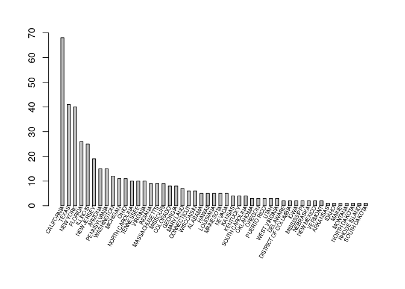
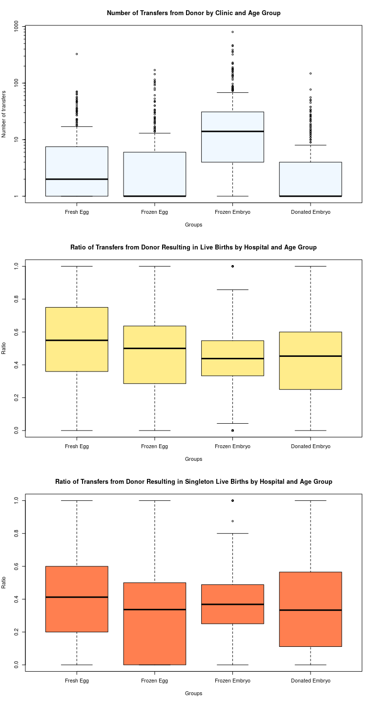
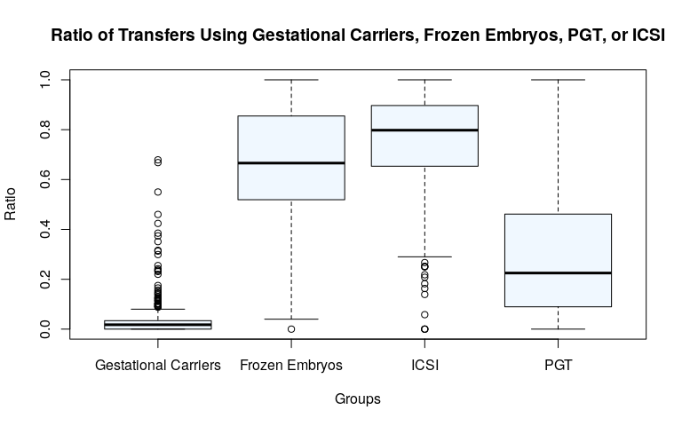
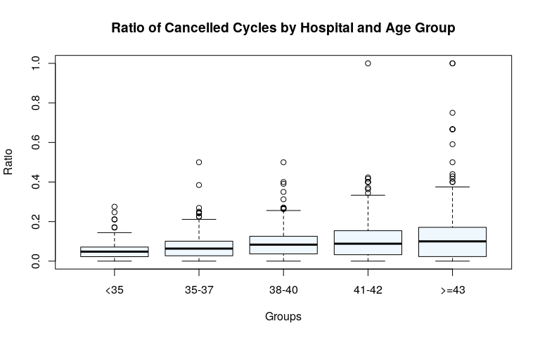
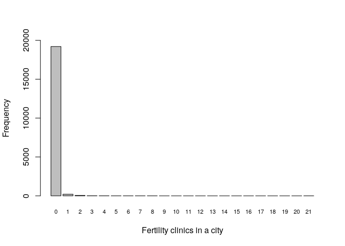
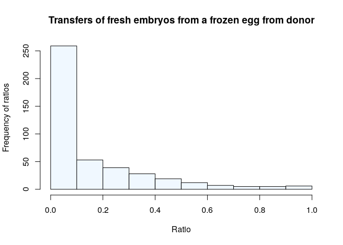
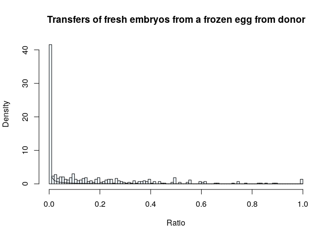
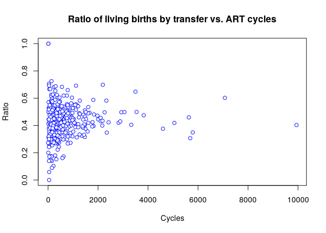

2017 Assisted Reproduction Clinics Dataset Analysis: Practice of data analysis with R
=====================================================================================

Foreword
--------

This work is inspired in an exercise from the course 'Software para el
análisis de datos' in UOC's degree 'Bioinformática y Bioestadística'.

I am using this to learn the use of the language R, and the tools
RStudio, Git and GitHub. This is not a professional level study of
assisted reproduction data from clinics in the USA. If you want to have
access to such studies, or even the raw data, you can get them from
CDC's webpage [ART's Success Rate
Data](https://www.cdc.gov/art/artdata/index.html).

Statement
---------

MARKDOWN will be used for this paper, generating a Pdf report with Knitr
in RStudio.

The file with the R code have to be delivered as well.

From a dataset, a statistical study must be carried out using R. The
points below can be used as an outline:

### 1- Look for a dataset related with Biostatistics or Bioinformatics.

Must be public data. Explain source of data and include pertinent
references. Justify why that specific dataset has been chosen.

### 2- Display the data.

Using R, display and explain the type of file that has been imported,
which variables are included (type, classification,...) and anything
else that seems relevant.  
Include snapshots and R commands used for import and display of the
data.

### 3- Probe questions.

Make a minimum of six questions that probe the kind of information
contained in the dataset.

### 4- Descriptive analysis of the data.

The paper must include a parametric summary of the data and several
graphic representations of said data.

### 5- Probability and simulation.

A minimum of three questions answering probability questions and a
question corresponding a short simulation model.

### 6- Regression analysis.

A brief regression analysis from the variables in the dataset answering
some question of interest.

### 7- Final assessment.

Final assessment from source data and analysis: Do we have conclusions?
Would be necessary a more advanced analysis? Would be necessary more
data for obtaining another kind of information?

1- Dataset
==========

I wanted to do something with data from human assisted reproduction
techniques. Those are difficult to find as public datasets, I suppose
that it is due to privacy issues.

Finally, I found public datasets published by the Centers for Disease
Control and Prevention (CDC) with several kinds of data from assisted
reproduction clinics in the United States:  
<https://www.cdc.gov/art/artdata/index.html>

Other datasets from previous years can be downloaded/looked up as
well:  
<https://www.cdc.gov/art/reports/archive.html>

Datasets downloading
--------------------

    # The code option eval = FALSE prevents this chunk to run. In this way, data WON'T
    # be downloaded each time the .Rmd file is knitted to produce a report.
    # For allowing this chunk to run, change eval to TRUE.

    source_url <- "https://www.cdc.gov/art/artdata/docs/excel/FINAL-2017-Clinic-Table-Dataset.xlsx"

    download.file(source_url, destfile = "../datos/FINAL-2017-Clinic-Table-Dataset.xlsx", method = "curl")

This is the dataset I am using for this practice study, but we could
want to download datasets from previous years to do longitudinal
studies:

    # The code option eval = FALSE prevents this chunk to run. In this way, data WON'T
    # be downloaded each time the .Rmd file is knitted to produce a report.
    # For allowing this chunk to run, change eval to TRUE.

    years <- c(1995:2015)

    url_start1 <- "https://www.cdc.gov/art/excelfiles/clinic_tables_data_"
    url_start2 <- "https://www.cdc.gov/art/excelfiles/"
    url_start3 <- "https://www.cdc.gov/art/artdata/docs/excel/FINAL-"

    file_start1 <- "clinic_tables_data_"
    file_start2 <- ""
    file_start3 <- "FINAL-"

    url_end1 <- ".xls"
    url_end2 <- "-clinic-tables-dataset.xls"
    url_end3 <- "-clinic-table-dataset.xls"

    folder <- "../datos/"

    # This code is rough on the edges, it doesn't take into account when a file
    # fails to download.

    for (year in years){
      if (year <= 2012){
        url <- paste0(url_start1, year, url_end1)
        destfile <- paste0(folder, file_start1, year, url_end1)
      }
      else if (year == 2013){
        url <- paste0(url_start2, year, url_end2)
        destfile <- paste0(folder, file_start2, year, url_end2)
      }
        else if (year == 2014){
        url <- "https://www.cdc.gov/art/artdata/docs/excel/2014-Clinic-Tables-Data-Dictionary.xls"
        destfile <- paste0(folder, "2014-Clinic-Tables-Data-Dictionary.xls")
      }
      else {
        url <- paste0(url_start3, year, url_end3)
        destfile <- paste0(folder, file_start3, year, url_end3)
      }
      
      #cat(url, "\n", destfile, "\n\n") # Cheks that the names of url and files are rightly constructed.
      download.file(url, destfile, method = "curl")
    }

2- Display data
===============

The downloaded file *FINAL-2017-Clinic-Table-Dataset.xlsx* includes data
from assisted reproduction treatments from 448 US clinics, collected
during 2017. It is an Excel workbook containing four sheets:

**National Summary Data**. Aggregated data from all the clinics included
in the report.  
**National Table Dictionary**. Dictionary-table with the explanation for
each variable in the previous table.  
**Clinic Table Data Records**. Tabla with data broke down by clinic.  
**Clinic Table Dictionary**. Dictionary-table explaining each variable
from Clinic Table.

I am interested in the data broke down by clinic. Therefore, I will
import the data from sheets **Clinic Table Dictionary** and **Clinic
Table Data Records**.

    require("xlsx")

    ## Loading required package: xlsx

    clinic_dictionary <- read.xlsx("../datos/FINAL-2017-Clinic-Table-Dataset.xlsx", 4,
                                   endRow = 165, encoding = "UTF-8")
    # Everything is NA after row 166; row 166 is a comment.

    View(clinic_dictionary)

    # In Viewer, in the column Age the symbols '>=' are displayed as '=',
    # but if we print the column to screen the correct symbols are displayed.

    clinic_data <- read.xlsx("../datos/FINAL-2017-Clinic-Table-Dataset.xlsx", 3
                             , encoding = "UTF-8", stringsAsFactors=FALSE)
    View(clinic_data)

Let's see how each variable has been codified:

    str(clinic_data, list.len = length(clinic_data))

    ## 'data.frame':    448 obs. of  164 variables:
    ##  $ OrderID                 : num  1 2 3 4 5 6 7 8 9 10 ...
    ##  $ CurrentClinicName1      : chr  "ALABAMA FERTILITY SPECIALISTS" "ART FERTILITY PROGRAM OF ALABAMA" "UNIVERSITY OF ALABAMA AT BIRMINGHAM" "CENTER FOR REPRODUCTIVE MEDICINE" ...
    ##  $ CurrentClinicName2      : chr  "" "" "REPRODUCTIVE ENDOCRINOLOGY AND INFERTILITY" "" ...
    ##  $ CurrentClinicCity       : chr  "BIRMINGHAM" "BIRMINGHAM" "BIRMINGHAM" "MOBILE" ...
    ##  $ CurrentClinicState      : chr  "ALABAMA" "ALABAMA" "ALABAMA" "ALABAMA" ...
    ##  $ MedicalDirector         : chr  "Janet M. Bouknight, MD" "Virginia L. Houserman, MD" "Deidre D. Gunn, MD" "George T. Koulianos, MD" ...
    ##  $ ND_NumIntentRet1        : chr  "30" "110" "76" "82" ...
    ##  $ ND_NumIntentRet2        : chr  "11" "49" "29" "34" ...
    ##  $ ND_NumIntentRet3        : chr  "12" "31" "23" "26" ...
    ##  $ ND_NumIntentRet4        : chr  "1" "6" "5" "16" ...
    ##  $ ND_NumIntentRet5        : chr  "0" "4" "2" "5" ...
    ##  $ ND_IntentRetLB1         : chr  "33.3%" "39.1%" "56.6%" "59.8%" ...
    ##  $ ND_IntentRetLB2         : chr  "2 / 11" "32.7%" "34.5%" "35.3%" ...
    ##  $ ND_IntentRetLB3         : chr  "4 / 12" "19.4%" "26.1%" "38.5%" ...
    ##  $ ND_IntentRetLB4         : chr  "0 / 1" "0 / 6" "0 / 5" "0 / 16" ...
    ##  $ ND_IntentRetLB5         : chr  "" "0 / 4" "0 / 2" "1 / 5" ...
    ##  $ ND_IntentRetSingleLB1   : chr  "20.0%" "24.5%" "51.3%" "43.9%" ...
    ##  $ ND_IntentRetSingleLB2   : chr  "2 / 11" "16.3%" "34.5%" "23.5%" ...
    ##  $ ND_IntentRetSingleLB3   : chr  "3 / 12" "19.4%" "21.7%" "23.1%" ...
    ##  $ ND_IntentRetSingleLB4   : chr  "0 / 1" "0 / 6" "0 / 5" "0 / 16" ...
    ##  $ ND_IntentRetSingleLB5   : chr  "" "0 / 4" "0 / 2" "1 / 5" ...
    ##  $ ND_NumRetrieve1         : chr  "24" "105" "70" "78" ...
    ##  $ ND_NumRetrieve2         : chr  "5" "42" "29" "26" ...
    ##  $ ND_NumRetrieve3         : chr  "9" "22" "21" "25" ...
    ##  $ ND_NumRetrieve4         : chr  "1" "6" "3" "11" ...
    ##  $ ND_NumRetrieve5         : chr  "0" "1" "1" "5" ...
    ##  $ ND_RetrieveLB1          : chr  "41.7%" "41.0%" "61.4%" "62.8%" ...
    ##  $ ND_RetrieveLB2          : chr  "2 / 5" "38.1%" "34.5%" "46.2%" ...
    ##  $ ND_RetrieveLB3          : chr  "4 / 9" "27.3%" "28.6%" "40.0%" ...
    ##  $ ND_RetrieveLB4          : chr  "0 / 1" "0 / 6" "0 / 3" "0 / 11" ...
    ##  $ ND_RetrieveLB5          : chr  "" "0 / 1" "0 / 1" "1 / 5" ...
    ##  $ ND_RetrieveSingleLB1    : chr  "25.0%" "25.7%" "55.7%" "46.2%" ...
    ##  $ ND_RetrieveSingleLB2    : chr  "2 / 5" "19.0%" "34.5%" "30.8%" ...
    ##  $ ND_RetrieveSingleLB3    : chr  "3 / 9" "27.3%" "23.8%" "24.0%" ...
    ##  $ ND_RetrieveSingleLB4    : chr  "0 / 1" "0 / 6" "0 / 3" "0 / 11" ...
    ##  $ ND_RetrieveSingleLB5    : chr  "" "0 / 1" "0 / 1" "1 / 5" ...
    ##  $ ND_NumTrans1            : chr  "30" "105" "72" "105" ...
    ##  $ ND_NumTrans2            : chr  "8" "34" "24" "29" ...
    ##  $ ND_NumTrans3            : chr  "13" "16" "14" "24" ...
    ##  $ ND_NumTrans4            : chr  "1" "6" "2" "3" ...
    ##  $ ND_NumTrans5            : chr  "0" "1" "0" "2" ...
    ##  $ ND_TransLB1             : chr  "33.3%" "41.0%" "59.7%" "46.7%" ...
    ##  $ ND_TransLB2             : chr  "2 / 8" "47.1%" "41.7%" "41.4%" ...
    ##  $ ND_TransLB3             : chr  "4 / 13" "6 / 16" "6 / 14" "41.7%" ...
    ##  $ ND_TransLB4             : chr  "0 / 1" "0 / 6" "0 / 2" "0 / 3" ...
    ##  $ ND_TransLB5             : chr  "" "0 / 1" "" "1 / 2" ...
    ##  $ ND_TransSingleLB1       : chr  "20.0%" "25.7%" "54.2%" "34.3%" ...
    ##  $ ND_TransSingleLB2       : chr  "2 / 8" "23.5%" "41.7%" "27.6%" ...
    ##  $ ND_TransSingleLB3       : chr  "3 / 13" "6 / 16" "5 / 14" "25.0%" ...
    ##  $ ND_TransSingleLB4       : chr  "0 / 1" "0 / 6" "0 / 2" "0 / 3" ...
    ##  $ ND_TransSingleLB5       : chr  "" "0 / 1" "" "1 / 2" ...
    ##  $ ND_IntentRetPerLB1      : chr  "3.0" "2.6" "1.8" "1.7" ...
    ##  $ ND_IntentRetPerLB2      : chr  "5.5" "3.1" "2.9" "2.8" ...
    ##  $ ND_IntentRetPerLB3      : chr  "3.0" "5.2" "3.8" "2.6" ...
    ##  $ ND_IntentRetPerLB4      : chr  "" "" "" "" ...
    ##  $ ND_IntentRetPerLB5      : chr  "" "" "" "5.0" ...
    ##  $ NewND_1IntentRetLB1     : chr  "40.9%" "34.7%" "61.8%" "58.3%" ...
    ##  $ NewND_1IntentRetLB2     : chr  "1 / 4" "27.3%" "4 / 15" "31.8%" ...
    ##  $ NewND_1IntentRetLB3     : chr  "3 / 7" "5 / 18" "3 / 10" "5 / 14" ...
    ##  $ NewND_1IntentRetLB4     : chr  "0 / 1" "0 / 3" "0 / 3" "0 / 3" ...
    ##  $ NewND_1IntentRetLB5     : chr  "" "0 / 2" "0 / 2" "0 / 1" ...
    ##  $ NewND_2IntentRetLB1     : chr  "40.9%" "44.0%" "63.6%" "68.3%" ...
    ##  $ NewND_2IntentRetLB2     : chr  "1 / 4" "36.4%" "6 / 15" "36.4%" ...
    ##  $ NewND_2IntentRetLB3     : chr  "3 / 7" "5 / 18" "4 / 10" "5 / 14" ...
    ##  $ NewND_2IntentRetLB4     : chr  "0 / 1" "0 / 3" "0 / 3" "0 / 3" ...
    ##  $ NewND_2IntentRetLB5     : chr  "" "0 / 2" "0 / 2" "0 / 1" ...
    ##  $ NewND_AllIntentRetLB1   : chr  "40.9%" "44.0%" "63.6%" "70.0%" ...
    ##  $ NewND_AllIntentRetLB2   : chr  "1 / 4" "36.4%" "6 / 15" "36.4%" ...
    ##  $ NewND_AllIntentRetLB3   : chr  "3 / 7" "5 / 18" "5 / 10" "5 / 14" ...
    ##  $ NewND_AllIntentRetLB4   : chr  "0 / 1" "0 / 3" "0 / 3" "0 / 3" ...
    ##  $ NewND_AllIntentRetLB5   : chr  "" "0 / 2" "0 / 2" "0 / 1" ...
    ##  $ NewND_IntentRetPerNew1  : chr  "1.2" "1.2" "1.1" "1.2" ...
    ##  $ NewND_IntentRetPerNew2  : chr  "1.0" "1.2" "1.3" "1.2" ...
    ##  $ NewND_IntentRetPerNew3  : chr  "1.1" "1.1" "1.5" "1.1" ...
    ##  $ NewND_IntentRetPerNew4  : chr  "1.0" "1.0" "1.0" "3.0" ...
    ##  $ NewND_IntentRetPerNew5  : chr  "" "1.0" "1.0" "2.0" ...
    ##  $ NewND_TransPerIntentRet1: chr  "1.0" "1.0" "1.0" "1.2" ...
    ##  $ NewND_TransPerIntentRet2: chr  "1.3" "0.7" "0.8" "0.8" ...
    ##  $ NewND_TransPerIntentRet3: chr  "1.0" "0.6" "0.6" "0.9" ...
    ##  $ NewND_TransPerIntentRet4: chr  "1.0" "1.0" "0.3" "0.2" ...
    ##  $ NewND_TransPerIntentRet5: chr  "" "0.5" "0.0" "0.0" ...
    ##  $ Donor_NumTrans1         : chr  "4" "2" "3" "1" ...
    ##  $ Donor_NumTrans2         : chr  "4" "3" "2" "11" ...
    ##  $ Donor_NumTrans3         : chr  "1" "7" "12" "4" ...
    ##  $ Donor_NumTrans4         : chr  "0" "9" "1" "2" ...
    ##  $ Donor_TransLB1          : chr  "3 / 4" "1 / 2" "2 / 3" "1 / 1" ...
    ##  $ Donor_TransLB2          : chr  "2 / 4" "2 / 3" "1 / 2" "5 / 11" ...
    ##  $ Donor_TransLB3          : chr  "0 / 1" "4 / 7" "8 / 12" "1 / 4" ...
    ##  $ Donor_TransLB4          : chr  "" "3 / 9" "0 / 1" "1 / 2" ...
    ##  $ Donor_TranSingleLB1     : chr  "2 / 4" "0 / 2" "2 / 3" "1 / 1" ...
    ##  $ Donor_TranSingleLB2     : chr  "1 / 4" "1 / 3" "1 / 2" "2 / 11" ...
    ##  $ Donor_TranSingleLB3     : chr  "0 / 1" "4 / 7" "7 / 12" "0 / 4" ...
    ##  $ Donor_TranSingleLB4     : chr  "" "1 / 9" "0 / 1" "0 / 2" ...
    ##  $ TotNumCycles1           : chr  "58" "208" "121" "186" ...
    ##  $ TotNumCycles2           : chr  "19" "104" "52" "58" ...
    ##  $ TotNumCycles3           : chr  "13" "55" "42" "55" ...
    ##  $ TotNumCycles4           : chr  "7" "22" "13" "21" ...
    ##  $ TotNumCycles5           : chr  "5" "16" "16" "24" ...
    ##  $ TotNumCyclesAll         : chr  "102" "405" "244" "344" ...
    ##  $ CycleCancel1            : chr  "8.6%" "14.4%" "4.1%" "10.2%" ...
    ##  $ CycleCancel2            : chr  "2 / 19" "15.4%" "5.8%" "6.9%" ...
    ##  $ CycleCancel3            : chr  "2 / 13" "21.8%" "14.3%" "12.7%" ...
    ##  $ CycleCancel4            : chr  "1 / 7" "31.8%" "2 / 13" "28.6%" ...
    ##  $ CycleCancel5            : chr  "2 / 5" "6 / 16" "6 / 16" "29.2%" ...
    ##  $ CycleCancelAll          : chr  "11.8%" "17.5%" "9.0%" "12.5%" ...
    ##  $ CycleStop1              : chr  "3.4%" "13.0%" "4.1%" "17.7%" ...
    ##  $ CycleStop2              : chr  "0 / 19" "12.5%" "5.8%" "12.1%" ...
    ##  $ CycleStop3              : chr  "1 / 13" "16.4%" "4.8%" "9.1%" ...
    ##  $ CycleStop4              : chr  "1 / 7" "22.7%" "2 / 13" "14.3%" ...
    ##  $ CycleStop5              : chr  "0 / 5" "2 / 16" "2 / 16" "8.3%" ...
    ##  $ CycleStopAll            : chr  "3.9%" "13.8%" "5.7%" "14.5%" ...
    ##  $ CycleFertPres1          : chr  "0.0%" "2.4%" "5.0%" "3.8%" ...
    ##  $ CycleFertPres2          : chr  "1 / 19" "6.7%" "1.9%" "1.7%" ...
    ##  $ CycleFertPres3          : chr  "0 / 13" "9.1%" "0.0%" "0.0%" ...
    ##  $ CycleFertPres4          : chr  "0 / 7" "0.0%" "0 / 13" "9.5%" ...
    ##  $ CycleFertPres5          : chr  "0 / 5" "0 / 16" "0 / 16" "0.0%" ...
    ##  $ CycleFertPresAll        : chr  "1.0%" "4.2%" "2.9%" "2.9%" ...
    ##  $ TransCarrier1           : chr  "0.0%" "1.6%" "0.0%" "2.5%" ...
    ##  $ TransCarrier2           : chr  "0 / 16" "0.0%" "0.0%" "2.3%" ...
    ##  $ TransCarrier3           : chr  "0 / 10" "0.0%" "0.0%" "0.0%" ...
    ##  $ TransCarrier4           : chr  "0 / 5" "0 / 10" "0 / 8" "0 / 8" ...
    ##  $ TransCarrier5           : chr  "0 / 3" "0 / 8" "0 / 7" "3 / 14" ...
    ##  $ TransCarrierAll         : chr  "0.0%" "0.9%" "0.0%" "3.1%" ...
    ##  $ TransFrozEmb1           : chr  "25.5%" "54.1%" "78.7%" "58.0%" ...
    ##  $ TransFrozEmb2           : chr  "7 / 16" "58.8%" "87.1%" "50.0%" ...
    ##  $ TransFrozEmb3           : chr  "3 / 10" "51.9%" "95.0%" "55.3%" ...
    ##  $ TransFrozEmb4           : chr  "1 / 5" "8 / 10" "5 / 8" "3 / 8" ...
    ##  $ TransFrozEmb5           : chr  "2 / 3" "6 / 8" "5 / 7" "6 / 14" ...
    ##  $ TransFrozEmbAll         : chr  "30.9%" "56.9%" "81.6%" "54.3%" ...
    ##  $ TransICSI1              : chr  "46.8%" "88.5%" "80.0%" "96.6%" ...
    ##  $ TransICSI2              : chr  "6 / 16" "68.6%" "71.0%" "95.5%" ...
    ##  $ TransICSI3              : chr  "7 / 10" "70.4%" "60.0%" "89.5%" ...
    ##  $ TransICSI4              : chr  "2 / 5" "6 / 10" "4 / 8" "7 / 8" ...
    ##  $ TransICSI5              : chr  "1 / 3" "5 / 8" "2 / 7" "8 / 14" ...
    ##  $ TransICSIAll            : chr  "46.9%" "79.4%" "70.9%" "92.4%" ...
    ##  $ TransPGT1               : chr  "2.1%" "8.2%" "45.3%" "5.9%" ...
    ##  $ TransPGT2               : chr  "0 / 16" "15.7%" "48.4%" "0.0%" ...
    ##  $ TransPGT3               : chr  "0 / 10" "11.1%" "65.0%" "15.8%" ...
    ##  $ TransPGT4               : chr  "0 / 5" "1 / 10" "4 / 8" "3 / 8" ...
    ##  $ TransPGT5               : chr  "1 / 3" "0 / 8" "3 / 7" "1 / 14" ...
    ##  $ TransPGTAll             : chr  "2.5%" "10.1%" "48.9%" "7.6%" ...
    ##  $ ReasonMale              : chr  "30%" "60%" "37%" "43%" ...
    ##  $ ReasonEndo              : chr  "25%" "27%" "24%" "16%" ...
    ##  $ ReasonTubal             : chr  "12%" "21%" "17%" "18%" ...
    ##  $ ReasonOvul              : chr  "37%" "15%" "8%" "22%" ...
    ##  $ ReasonUterine           : chr  "10%" "3%" "8%" "3%" ...
    ##  $ ReasonPGT               : chr  "0%" "6%" "4%" "5%" ...
    ##  $ ReasonCarrier           : chr  "0%" "<1%" "0%" "<1%" ...
    ##  $ ReasonDOR               : chr  "18%" "10%" "26%" "12%" ...
    ##  $ ReasonBank              : chr  "5%" "17%" "28%" "10%" ...
    ##  $ ReasonPregLoss          : chr  "4%" "6%" "1%" "2%" ...
    ##  $ ReasonOtherInfert       : chr  "11%" "53%" "11%" "15%" ...
    ##  $ ReasonNonInfert         : chr  "0%" "12%" "3%" "2%" ...
    ##  $ ReasonUnexplained       : chr  "4%" "1%" "12%" "8%" ...
    ##  $ DonorEggService         : chr  "Yes" "Yes" "Yes" "Yes" ...
    ##  $ DonatedEmbryoService    : chr  "No" "Yes" "Yes" "Yes" ...
    ##  $ EmbryoCryoService       : chr  "Yes" "Yes" "Yes" "Yes" ...
    ##  $ EggCryoService          : chr  "Yes" "Yes" "Yes" "Yes" ...
    ##  $ SingleWomenService      : chr  "Yes" "Yes" "Yes" "Yes" ...
    ##  $ GestCarrierService      : chr  "Yes" "Yes" "Yes" "Yes" ...
    ##  $ SARTmember              : chr  "Yes" "Yes" "Yes" "Yes" ...
    ##  $ LabAccred               : chr  "Yes" "Yes" "Yes" "Yes" ...
    ##  $ NumResearch             : chr  "0" "0" "0" "0" ...
    ##  $ CurrentStateAbbrev      : chr  "AL" "AL" "AL" "AL" ...

In the structure can be seen a problem from this data source.
Percentages and ratios are coded as text, not as numbers. It will be
necessary pre-processing the data from the table before we can work with
them.

Why are numeric variables detected as characters? Ratios contain
non-numeric symbols ("%", "/", "&lt;"). What's the problem with the
rest?

We will order alphabetically each column, see what happens.

Should we order the values in the columns, we see that there are columns
with integers in which the thousands are marked with a comma (",").

    ordenadas <- sapply(clinic_data, function(x) sort(x, na.last = TRUE))

    View(ordenadas)

Next, we will correct those variables that should be `integer` o
`numeric`.

Code adapted from a question in Stack Overflow: [How to read data when
some numbers contain commas as thousand
separator?](https://stackoverflow.com/questions/1523126/how-to-read-data-when-some-numbers-contain-commas-as-thousand-separator)

    # Vectors that refer the columns that should be integers
    # and the columns that should be ratios.

    integers <- c(7:11, 22:26, 37:41, 82:85, 94:99, 163)
    ratios <- c(12:21, 27:36, 42:81, 86:93, 100:154)

    # Pre-processing columns with integers deleting "," symbol.
    clinic_data[, integers] <- lapply(clinic_data[, integers],
                                      function(x){
                                        as.integer(gsub(",", "", x))
                                      })

    str(clinic_data[, integers])

    ## 'data.frame':    448 obs. of  26 variables:
    ##  $ ND_NumIntentRet1: int  30 110 76 82 15 224 42 56 3 28 ...
    ##  $ ND_NumIntentRet2: int  11 49 29 34 6 106 33 38 0 12 ...
    ##  $ ND_NumIntentRet3: int  12 31 23 26 4 53 16 32 0 15 ...
    ##  $ ND_NumIntentRet4: int  1 6 5 16 3 36 2 8 1 4 ...
    ##  $ ND_NumIntentRet5: int  0 4 2 5 2 40 7 8 0 8 ...
    ##  $ ND_NumRetrieve1 : int  24 105 70 78 12 223 42 54 3 27 ...
    ##  $ ND_NumRetrieve2 : int  5 42 29 26 4 105 31 30 0 12 ...
    ##  $ ND_NumRetrieve3 : int  9 22 21 25 3 53 16 23 0 12 ...
    ##  $ ND_NumRetrieve4 : int  1 6 3 11 3 36 2 7 1 4 ...
    ##  $ ND_NumRetrieve5 : int  0 1 1 5 2 40 6 5 0 8 ...
    ##  $ ND_NumTrans1    : int  30 105 72 105 12 233 54 70 3 28 ...
    ##  $ ND_NumTrans2    : int  8 34 24 29 4 82 37 36 0 15 ...
    ##  $ ND_NumTrans3    : int  13 16 14 24 3 36 17 16 0 8 ...
    ##  $ ND_NumTrans4    : int  1 6 2 3 3 10 2 2 1 4 ...
    ##  $ ND_NumTrans5    : int  0 1 0 2 2 5 6 3 0 6 ...
    ##  $ Donor_NumTrans1 : int  4 2 3 1 0 1 9 1 1 2 ...
    ##  $ Donor_NumTrans2 : int  4 3 2 11 0 0 1 4 1 2 ...
    ##  $ Donor_NumTrans3 : int  1 7 12 4 0 9 20 34 2 3 ...
    ##  $ Donor_NumTrans4 : int  0 9 1 2 0 0 5 0 1 2 ...
    ##  $ TotNumCycles1   : int  58 208 121 186 21 458 95 180 19 72 ...
    ##  $ TotNumCycles2   : int  19 104 52 58 11 195 72 83 12 40 ...
    ##  $ TotNumCycles3   : int  13 55 42 55 9 181 42 54 15 29 ...
    ##  $ TotNumCycles4   : int  7 22 13 21 3 59 10 21 3 11 ...
    ##  $ TotNumCycles5   : int  5 16 16 24 5 62 17 31 1 1 ...
    ##  $ TotNumCyclesAll : int  102 405 244 344 49 955 236 369 50 153 ...
    ##  $ NumResearch     : int  0 0 0 0 0 0 0 0 0 0 ...

Pre-processing the columns with ratios is a bit more complex. It is
necessary to deal with three different cases:

1.  Data as &lt;1%. Since we don't have the real value, what I will do
    is arbitrarily chose the value 0.5%, expressed as 0.005 ratio.

2.  Data including "%" symbol. Same strategy that we followed with
    integers; I will remove the symbol with `gsub`. Besides, I will
    divide the result by 100, making all numbers a ratio (parts per
    unit).

3.  Data as fractions. Even a bit more complex. I will use regular
    expressions to isolate numerator and denominator, and will return
    the result of the division as a ratio.

<!-- -->

    # This function processes ratios expressed as fractions.
    divide <- function(x){
      numerator <- as.numeric(gsub(" .*$", "", x))
      denominator <- as.numeric(gsub("^.*/ ", "", x))
      return (numerator / denominator)
    }

    # This is the main function for processing ratios from characters to numbers.
    # Expect the appearance of several warnings of 'NA introduced by coercion' due to multiple # data points represented as 'NA' in characters which the function is unable to deal with.
    numerizador <- function(dato){
        ifelse (dato == "<1%", 0.005,
                ifelse ((grepl("%", dato) == TRUE), as.numeric(gsub("%", "", dato))/100,
                        ifelse ((grepl("/", dato)==TRUE), divide(dato), as.numeric(dato))))
    }
    # The function 'ifelse' is needed for working with vectors of length >1.

    # Pre-processing ratios:
    clinic_data[, ratios] <- lapply(clinic_data[, ratios], numerizador)
    # When using this expression, multiple warnings of 'NAs introduced by coercion' appear.
    # I think it is due to "NA" being stored as character strings.
    # I haven't been able to correct it yet. It is possible to avoid the raise of the warning,
    # but I don't feel comfortable masking error warnings.

    # Using chunk option warning=FALSE masks those error warnings.

    str(clinic_data[, ratios], list.len = length(clinic_data[, ratios]))

    ## 'data.frame':    448 obs. of  123 variables:
    ##  $ ND_IntentRetLB1         : num  0.333 0.391 0.566 0.598 0.4 ...
    ##  $ ND_IntentRetLB2         : num  0.182 0.327 0.345 0.353 0 ...
    ##  $ ND_IntentRetLB3         : num  0.333 0.194 0.261 0.385 0 ...
    ##  $ ND_IntentRetLB4         : num  0 0 0 0 0 0.056 0.5 0 1 0.5 ...
    ##  $ ND_IntentRetLB5         : num  NA 0 0 0.2 0 ...
    ##  $ ND_IntentRetSingleLB1   : num  0.2 0.245 0.513 0.439 0.267 ...
    ##  $ ND_IntentRetSingleLB2   : num  0.182 0.163 0.345 0.235 0 ...
    ##  $ ND_IntentRetSingleLB3   : num  0.25 0.194 0.217 0.231 0 ...
    ##  $ ND_IntentRetSingleLB4   : num  0 0 0 0 0 0.028 0.5 0 1 0.5 ...
    ##  $ ND_IntentRetSingleLB5   : num  NA 0 0 0.2 0 0.05 0 0 NA 0.125 ...
    ##  $ ND_RetrieveLB1          : num  0.417 0.41 0.614 0.628 0.5 ...
    ##  $ ND_RetrieveLB2          : num  0.4 0.381 0.345 0.462 0 ...
    ##  $ ND_RetrieveLB3          : num  0.444 0.273 0.286 0.4 0 ...
    ##  $ ND_RetrieveLB4          : num  0 0 0 0 0 0.056 0.5 0 1 0.5 ...
    ##  $ ND_RetrieveLB5          : num  NA 0 0 0.2 0 ...
    ##  $ ND_RetrieveSingleLB1    : num  0.25 0.257 0.557 0.462 0.333 ...
    ##  $ ND_RetrieveSingleLB2    : num  0.4 0.19 0.345 0.308 0 ...
    ##  $ ND_RetrieveSingleLB3    : num  0.333 0.273 0.238 0.24 0 ...
    ##  $ ND_RetrieveSingleLB4    : num  0 0 0 0 0 0.028 0.5 0 1 0.5 ...
    ##  $ ND_RetrieveSingleLB5    : num  NA 0 0 0.2 0 0.05 0 0 NA 0.125 ...
    ##  $ ND_TransLB1             : num  0.333 0.41 0.597 0.467 0.5 ...
    ##  $ ND_TransLB2             : num  0.25 0.471 0.417 0.414 0 ...
    ##  $ ND_TransLB3             : num  0.308 0.375 0.429 0.417 0 ...
    ##  $ ND_TransLB4             : num  0 0 0 0 0 0.2 0.5 0 1 0.5 ...
    ##  $ ND_TransLB5             : num  NA 0 NA 0.5 0 ...
    ##  $ ND_TransSingleLB1       : num  0.2 0.257 0.542 0.343 0.333 ...
    ##  $ ND_TransSingleLB2       : num  0.25 0.235 0.417 0.276 0 ...
    ##  $ ND_TransSingleLB3       : num  0.231 0.375 0.357 0.25 0 ...
    ##  $ ND_TransSingleLB4       : num  0 0 0 0 0 0.1 0.5 0 1 0.5 ...
    ##  $ ND_TransSingleLB5       : num  NA 0 NA 0.5 0 ...
    ##  $ ND_IntentRetPerLB1      : num  3 2.6 1.8 1.7 2.5 1.6 1.8 1.8 1.5 2.3 ...
    ##  $ ND_IntentRetPerLB2      : num  5.5 3.1 2.9 2.8 NA 2.1 1.8 2.7 NA 1.7 ...
    ##  $ ND_IntentRetPerLB3      : num  3 5.2 3.8 2.6 NA 2.5 8 6.4 NA 5 ...
    ##  $ ND_IntentRetPerLB4      : num  NA NA NA NA NA 18 2 NA 1 2 ...
    ##  $ ND_IntentRetPerLB5      : num  NA NA NA 5 NA 13.3 7 NA NA 8 ...
    ##  $ NewND_1IntentRetLB1     : num  0.409 0.347 0.618 0.583 0.571 ...
    ##  $ NewND_1IntentRetLB2     : num  0.25 0.273 0.267 0.318 0 ...
    ##  $ NewND_1IntentRetLB3     : num  0.429 0.278 0.3 0.357 0 ...
    ##  $ NewND_1IntentRetLB4     : num  0 0 0 0 0 ...
    ##  $ NewND_1IntentRetLB5     : num  NA 0 0 0 NA ...
    ##  $ NewND_2IntentRetLB1     : num  0.409 0.44 0.636 0.683 0.714 ...
    ##  $ NewND_2IntentRetLB2     : num  0.25 0.364 0.4 0.364 0 ...
    ##  $ NewND_2IntentRetLB3     : num  0.429 0.278 0.4 0.357 0 ...
    ##  $ NewND_2IntentRetLB4     : num  0 0 0 0 0 ...
    ##  $ NewND_2IntentRetLB5     : num  NA 0 0 0 NA ...
    ##  $ NewND_AllIntentRetLB1   : num  0.409 0.44 0.636 0.7 0.714 ...
    ##  $ NewND_AllIntentRetLB2   : num  0.25 0.364 0.4 0.364 0 ...
    ##  $ NewND_AllIntentRetLB3   : num  0.429 0.278 0.5 0.357 0 ...
    ##  $ NewND_AllIntentRetLB4   : num  0 0 0 0 0 ...
    ##  $ NewND_AllIntentRetLB5   : num  NA 0 0 0 NA ...
    ##  $ NewND_IntentRetPerNew1  : num  1.2 1.2 1.1 1.2 1.3 1.2 1.1 1 2 1 ...
    ##  $ NewND_IntentRetPerNew2  : num  1 1.2 1.3 1.2 1.3 1.2 1.1 1.1 NA 1 ...
    ##  $ NewND_IntentRetPerNew3  : num  1.1 1.1 1.5 1.1 1.3 1.3 1.3 1.3 NA 1.2 ...
    ##  $ NewND_IntentRetPerNew4  : num  1 1 1 3 1 1.7 1 1.4 NA 1.3 ...
    ##  $ NewND_IntentRetPerNew5  : num  NA 1 1 2 NA 2.3 1 1 NA 1.8 ...
    ##  $ NewND_TransPerIntentRet1: num  1 1 1 1.2 0.8 1 1.3 1.3 1 1.1 ...
    ##  $ NewND_TransPerIntentRet2: num  1.3 0.7 0.8 0.8 0.6 0.8 1.1 1 NA 1.4 ...
    ##  $ NewND_TransPerIntentRet3: num  1 0.6 0.6 0.9 0.8 0.7 1 0.5 NA 0.6 ...
    ##  $ NewND_TransPerIntentRet4: num  1 1 0.3 0.2 1 0.2 1 0.3 NA 1 ...
    ##  $ NewND_TransPerIntentRet5: num  NA 0.5 0 0 NA 0.1 0.5 0.4 NA 0.7 ...
    ##  $ Donor_TransLB1          : num  0.75 0.5 0.667 1 NA ...
    ##  $ Donor_TransLB2          : num  0.5 0.667 0.5 0.455 NA ...
    ##  $ Donor_TransLB3          : num  0 0.571 0.667 0.25 NA ...
    ##  $ Donor_TransLB4          : num  NA 0.333 0 0.5 NA ...
    ##  $ Donor_TranSingleLB1     : num  0.5 0 0.667 1 NA ...
    ##  $ Donor_TranSingleLB2     : num  0.25 0.333 0.5 0.182 NA ...
    ##  $ Donor_TranSingleLB3     : num  0 0.571 0.583 0 NA ...
    ##  $ Donor_TranSingleLB4     : num  NA 0.111 0 0 NA ...
    ##  $ CycleCancel1            : num  0.086 0.144 0.041 0.102 0 0.011 0.032 0.017 0 0.028 ...
    ##  $ CycleCancel2            : num  0.1053 0.154 0.058 0.069 0.0909 ...
    ##  $ CycleCancel3            : num  0.154 0.218 0.143 0.127 0 ...
    ##  $ CycleCancel4            : num  0.143 0.318 0.154 0.286 0 ...
    ##  $ CycleCancel5            : num  0.4 0.375 0.375 0.292 0 ...
    ##  $ CycleCancelAll          : num  0.118 0.175 0.09 0.125 0.02 0.016 0.059 0.073 0.02 0.033 ...
    ##  $ CycleStop1              : num  0.034 0.13 0.041 0.177 0 ...
    ##  $ CycleStop2              : num  0 0.125 0.058 0.121 0.182 ...
    ##  $ CycleStop3              : num  0.0769 0.164 0.048 0.091 0 ...
    ##  $ CycleStop4              : num  0.143 0.227 0.154 0.143 0 ...
    ##  $ CycleStop5              : num  0 0.125 0.125 0.083 0.6 ...
    ##  $ CycleStopAll            : num  0.039 0.138 0.057 0.145 0.102 0.07 0.055 0.019 0.28 0.078 ...
    ##  $ CycleFertPres1          : num  0 0.024 0.05 0.038 0.143 ...
    ##  $ CycleFertPres2          : num  0.0526 0.067 0.019 0.017 0.0909 ...
    ##  $ CycleFertPres3          : num  0 0.091 0 0 0 0 0 0.037 0 0.069 ...
    ##  $ CycleFertPres4          : num  0 0 0 0.095 0.333 ...
    ##  $ CycleFertPres5          : num  0 0 0 0 0.2 0 0 0 0 0 ...
    ##  $ CycleFertPresAll        : num  0.01 0.042 0.029 0.029 0.122 0.014 0.008 0.027 0.02 0.033 ...
    ##  $ TransCarrier1           : num  0 0.016 0 0.025 0 0.004 0.013 0.011 0 0 ...
    ##  $ TransCarrier2           : num  0 0 0 0.023 0 0.022 0.053 0 0 0.107 ...
    ##  $ TransCarrier3           : num  0 0 0 0 0 0.015 0.057 0 0 0 ...
    ##  $ TransCarrier4           : num  0 0 0 0 0 0 0.125 0.125 NA 0 ...
    ##  $ TransCarrier5           : num  0 0 0 0.214 0 ...
    ##  $ TransCarrierAll         : num  0 0.009 0 0.031 0 0.012 0.037 0.016 0.034 0.028 ...
    ##  $ TransFrozEmb1           : num  0.255 0.541 0.787 0.58 0.385 ...
    ##  $ TransFrozEmb2           : num  0.438 0.588 0.871 0.5 0.167 ...
    ##  $ TransFrozEmb3           : num  0.3 0.519 0.95 0.553 0.667 ...
    ##  $ TransFrozEmb4           : num  0.2 0.8 0.625 0.375 0 ...
    ##  $ TransFrozEmb5           : num  0.667 0.75 0.714 0.429 0 ...
    ##  $ TransFrozEmbAll         : num  0.309 0.569 0.816 0.543 0.357 0.988 0.633 0.973 0.483 0.481 ...
    ##  $ TransICSI1              : num  0.468 0.885 0.8 0.966 1 0.746 0.893 0.931 1 0.929 ...
    ##  $ TransICSI2              : num  0.375 0.686 0.71 0.955 1 0.72 0.807 0.732 1 0.929 ...
    ##  $ TransICSI3              : num  0.7 0.704 0.6 0.895 1 ...
    ##  $ TransICSI4              : num  0.4 0.6 0.5 0.875 1 0.8 0.625 0.5 NA 1 ...
    ##  $ TransICSI5              : num  0.333 0.625 0.286 0.571 1 ...
    ##  $ TransICSIAll            : num  0.469 0.794 0.709 0.924 1 0.732 0.846 0.824 0.966 0.934 ...
    ##  $ TransPGT1               : num  0.021 0.082 0.453 0.059 0 ...
    ##  $ TransPGT2               : num  0 0.157 0.484 0 0 0.204 0.211 0.39 0.25 0.143 ...
    ##  $ TransPGT3               : num  0 0.111 0.65 0.158 0 ...
    ##  $ TransPGT4               : num  0 0.1 0.5 0.375 0 ...
    ##  $ TransPGT5               : num  0.3333 0 0.4286 0.0714 0 ...
    ##  $ TransPGTAll             : num  0.025 0.101 0.489 0.076 0 0.207 0.149 0.341 0.276 0.085 ...
    ##  $ ReasonMale              : num  0.3 0.6 0.37 0.43 0.35 0.28 0.71 0.5 0.46 0.29 ...
    ##  $ ReasonEndo              : num  0.25 0.27 0.24 0.16 0.31 0.07 0.1 0.08 0.02 0.12 ...
    ##  $ ReasonTubal             : num  0.12 0.21 0.17 0.18 0.35 0.1 0.2 0.17 0.3 0.2 ...
    ##  $ ReasonOvul              : num  0.37 0.15 0.08 0.22 0.39 0.17 0.15 0.16 0.12 0.12 ...
    ##  $ ReasonUterine           : num  0.1 0.03 0.08 0.03 0.41 0.04 0.04 0.02 0.08 0.08 ...
    ##  $ ReasonPGT               : num  0 0.06 0.04 0.05 0 0.72 0.01 0.09 0.08 0 ...
    ##  $ ReasonCarrier           : num  0 0.005 0 0.005 0 0.005 0 0.01 0.02 0.02 ...
    ##  $ ReasonDOR               : num  0.18 0.1 0.26 0.12 0.47 0.22 0.21 0.45 0.2 0.35 ...
    ##  $ ReasonBank              : num  0.05 0.17 0.28 0.1 0.35 0.99 0.09 0.46 0.12 0.2 ...
    ##  $ ReasonPregLoss          : num  0.04 0.06 0.01 0.02 0.04 0.07 0.04 0.01 0.12 0.03 ...
    ##  $ ReasonOtherInfert       : num  0.11 0.53 0.11 0.15 0.08 0.005 0.08 0.15 0.12 0.06 ...
    ##  $ ReasonNonInfert         : num  0 0.12 0.03 0.02 0 0.05 0.01 0.04 0.06 0.02 ...
    ##  $ ReasonUnexplained       : num  0.04 0.01 0.12 0.08 0 0.09 0.03 0.01 0.06 0.12 ...

The use of chunk option `warning=FALSE` prevents the displaying of
multiple `NAs introduced by coercion` messages. I am not sure, but I
suppose the cause for the warnings is that the`NA` values in the table
are stored as text.

Variables: type and description
-------------------------------

I might have allowed myself to get carried along in passion choosing a
file too big. The table contains 165 variables. It is not a ridiculous
number, but may be not easy enough to handle for the scope of this
study.

    str(clinic_data, list.len = length(clinic_data))

    ## 'data.frame':    448 obs. of  164 variables:
    ##  $ OrderID                 : num  1 2 3 4 5 6 7 8 9 10 ...
    ##  $ CurrentClinicName1      : chr  "ALABAMA FERTILITY SPECIALISTS" "ART FERTILITY PROGRAM OF ALABAMA" "UNIVERSITY OF ALABAMA AT BIRMINGHAM" "CENTER FOR REPRODUCTIVE MEDICINE" ...
    ##  $ CurrentClinicName2      : chr  "" "" "REPRODUCTIVE ENDOCRINOLOGY AND INFERTILITY" "" ...
    ##  $ CurrentClinicCity       : chr  "BIRMINGHAM" "BIRMINGHAM" "BIRMINGHAM" "MOBILE" ...
    ##  $ CurrentClinicState      : chr  "ALABAMA" "ALABAMA" "ALABAMA" "ALABAMA" ...
    ##  $ MedicalDirector         : chr  "Janet M. Bouknight, MD" "Virginia L. Houserman, MD" "Deidre D. Gunn, MD" "George T. Koulianos, MD" ...
    ##  $ ND_NumIntentRet1        : int  30 110 76 82 15 224 42 56 3 28 ...
    ##  $ ND_NumIntentRet2        : int  11 49 29 34 6 106 33 38 0 12 ...
    ##  $ ND_NumIntentRet3        : int  12 31 23 26 4 53 16 32 0 15 ...
    ##  $ ND_NumIntentRet4        : int  1 6 5 16 3 36 2 8 1 4 ...
    ##  $ ND_NumIntentRet5        : int  0 4 2 5 2 40 7 8 0 8 ...
    ##  $ ND_IntentRetLB1         : num  0.333 0.391 0.566 0.598 0.4 ...
    ##  $ ND_IntentRetLB2         : num  0.182 0.327 0.345 0.353 0 ...
    ##  $ ND_IntentRetLB3         : num  0.333 0.194 0.261 0.385 0 ...
    ##  $ ND_IntentRetLB4         : num  0 0 0 0 0 0.056 0.5 0 1 0.5 ...
    ##  $ ND_IntentRetLB5         : num  NA 0 0 0.2 0 ...
    ##  $ ND_IntentRetSingleLB1   : num  0.2 0.245 0.513 0.439 0.267 ...
    ##  $ ND_IntentRetSingleLB2   : num  0.182 0.163 0.345 0.235 0 ...
    ##  $ ND_IntentRetSingleLB3   : num  0.25 0.194 0.217 0.231 0 ...
    ##  $ ND_IntentRetSingleLB4   : num  0 0 0 0 0 0.028 0.5 0 1 0.5 ...
    ##  $ ND_IntentRetSingleLB5   : num  NA 0 0 0.2 0 0.05 0 0 NA 0.125 ...
    ##  $ ND_NumRetrieve1         : int  24 105 70 78 12 223 42 54 3 27 ...
    ##  $ ND_NumRetrieve2         : int  5 42 29 26 4 105 31 30 0 12 ...
    ##  $ ND_NumRetrieve3         : int  9 22 21 25 3 53 16 23 0 12 ...
    ##  $ ND_NumRetrieve4         : int  1 6 3 11 3 36 2 7 1 4 ...
    ##  $ ND_NumRetrieve5         : int  0 1 1 5 2 40 6 5 0 8 ...
    ##  $ ND_RetrieveLB1          : num  0.417 0.41 0.614 0.628 0.5 ...
    ##  $ ND_RetrieveLB2          : num  0.4 0.381 0.345 0.462 0 ...
    ##  $ ND_RetrieveLB3          : num  0.444 0.273 0.286 0.4 0 ...
    ##  $ ND_RetrieveLB4          : num  0 0 0 0 0 0.056 0.5 0 1 0.5 ...
    ##  $ ND_RetrieveLB5          : num  NA 0 0 0.2 0 ...
    ##  $ ND_RetrieveSingleLB1    : num  0.25 0.257 0.557 0.462 0.333 ...
    ##  $ ND_RetrieveSingleLB2    : num  0.4 0.19 0.345 0.308 0 ...
    ##  $ ND_RetrieveSingleLB3    : num  0.333 0.273 0.238 0.24 0 ...
    ##  $ ND_RetrieveSingleLB4    : num  0 0 0 0 0 0.028 0.5 0 1 0.5 ...
    ##  $ ND_RetrieveSingleLB5    : num  NA 0 0 0.2 0 0.05 0 0 NA 0.125 ...
    ##  $ ND_NumTrans1            : int  30 105 72 105 12 233 54 70 3 28 ...
    ##  $ ND_NumTrans2            : int  8 34 24 29 4 82 37 36 0 15 ...
    ##  $ ND_NumTrans3            : int  13 16 14 24 3 36 17 16 0 8 ...
    ##  $ ND_NumTrans4            : int  1 6 2 3 3 10 2 2 1 4 ...
    ##  $ ND_NumTrans5            : int  0 1 0 2 2 5 6 3 0 6 ...
    ##  $ ND_TransLB1             : num  0.333 0.41 0.597 0.467 0.5 ...
    ##  $ ND_TransLB2             : num  0.25 0.471 0.417 0.414 0 ...
    ##  $ ND_TransLB3             : num  0.308 0.375 0.429 0.417 0 ...
    ##  $ ND_TransLB4             : num  0 0 0 0 0 0.2 0.5 0 1 0.5 ...
    ##  $ ND_TransLB5             : num  NA 0 NA 0.5 0 ...
    ##  $ ND_TransSingleLB1       : num  0.2 0.257 0.542 0.343 0.333 ...
    ##  $ ND_TransSingleLB2       : num  0.25 0.235 0.417 0.276 0 ...
    ##  $ ND_TransSingleLB3       : num  0.231 0.375 0.357 0.25 0 ...
    ##  $ ND_TransSingleLB4       : num  0 0 0 0 0 0.1 0.5 0 1 0.5 ...
    ##  $ ND_TransSingleLB5       : num  NA 0 NA 0.5 0 ...
    ##  $ ND_IntentRetPerLB1      : num  3 2.6 1.8 1.7 2.5 1.6 1.8 1.8 1.5 2.3 ...
    ##  $ ND_IntentRetPerLB2      : num  5.5 3.1 2.9 2.8 NA 2.1 1.8 2.7 NA 1.7 ...
    ##  $ ND_IntentRetPerLB3      : num  3 5.2 3.8 2.6 NA 2.5 8 6.4 NA 5 ...
    ##  $ ND_IntentRetPerLB4      : num  NA NA NA NA NA 18 2 NA 1 2 ...
    ##  $ ND_IntentRetPerLB5      : num  NA NA NA 5 NA 13.3 7 NA NA 8 ...
    ##  $ NewND_1IntentRetLB1     : num  0.409 0.347 0.618 0.583 0.571 ...
    ##  $ NewND_1IntentRetLB2     : num  0.25 0.273 0.267 0.318 0 ...
    ##  $ NewND_1IntentRetLB3     : num  0.429 0.278 0.3 0.357 0 ...
    ##  $ NewND_1IntentRetLB4     : num  0 0 0 0 0 ...
    ##  $ NewND_1IntentRetLB5     : num  NA 0 0 0 NA ...
    ##  $ NewND_2IntentRetLB1     : num  0.409 0.44 0.636 0.683 0.714 ...
    ##  $ NewND_2IntentRetLB2     : num  0.25 0.364 0.4 0.364 0 ...
    ##  $ NewND_2IntentRetLB3     : num  0.429 0.278 0.4 0.357 0 ...
    ##  $ NewND_2IntentRetLB4     : num  0 0 0 0 0 ...
    ##  $ NewND_2IntentRetLB5     : num  NA 0 0 0 NA ...
    ##  $ NewND_AllIntentRetLB1   : num  0.409 0.44 0.636 0.7 0.714 ...
    ##  $ NewND_AllIntentRetLB2   : num  0.25 0.364 0.4 0.364 0 ...
    ##  $ NewND_AllIntentRetLB3   : num  0.429 0.278 0.5 0.357 0 ...
    ##  $ NewND_AllIntentRetLB4   : num  0 0 0 0 0 ...
    ##  $ NewND_AllIntentRetLB5   : num  NA 0 0 0 NA ...
    ##  $ NewND_IntentRetPerNew1  : num  1.2 1.2 1.1 1.2 1.3 1.2 1.1 1 2 1 ...
    ##  $ NewND_IntentRetPerNew2  : num  1 1.2 1.3 1.2 1.3 1.2 1.1 1.1 NA 1 ...
    ##  $ NewND_IntentRetPerNew3  : num  1.1 1.1 1.5 1.1 1.3 1.3 1.3 1.3 NA 1.2 ...
    ##  $ NewND_IntentRetPerNew4  : num  1 1 1 3 1 1.7 1 1.4 NA 1.3 ...
    ##  $ NewND_IntentRetPerNew5  : num  NA 1 1 2 NA 2.3 1 1 NA 1.8 ...
    ##  $ NewND_TransPerIntentRet1: num  1 1 1 1.2 0.8 1 1.3 1.3 1 1.1 ...
    ##  $ NewND_TransPerIntentRet2: num  1.3 0.7 0.8 0.8 0.6 0.8 1.1 1 NA 1.4 ...
    ##  $ NewND_TransPerIntentRet3: num  1 0.6 0.6 0.9 0.8 0.7 1 0.5 NA 0.6 ...
    ##  $ NewND_TransPerIntentRet4: num  1 1 0.3 0.2 1 0.2 1 0.3 NA 1 ...
    ##  $ NewND_TransPerIntentRet5: num  NA 0.5 0 0 NA 0.1 0.5 0.4 NA 0.7 ...
    ##  $ Donor_NumTrans1         : int  4 2 3 1 0 1 9 1 1 2 ...
    ##  $ Donor_NumTrans2         : int  4 3 2 11 0 0 1 4 1 2 ...
    ##  $ Donor_NumTrans3         : int  1 7 12 4 0 9 20 34 2 3 ...
    ##  $ Donor_NumTrans4         : int  0 9 1 2 0 0 5 0 1 2 ...
    ##  $ Donor_TransLB1          : num  0.75 0.5 0.667 1 NA ...
    ##  $ Donor_TransLB2          : num  0.5 0.667 0.5 0.455 NA ...
    ##  $ Donor_TransLB3          : num  0 0.571 0.667 0.25 NA ...
    ##  $ Donor_TransLB4          : num  NA 0.333 0 0.5 NA ...
    ##  $ Donor_TranSingleLB1     : num  0.5 0 0.667 1 NA ...
    ##  $ Donor_TranSingleLB2     : num  0.25 0.333 0.5 0.182 NA ...
    ##  $ Donor_TranSingleLB3     : num  0 0.571 0.583 0 NA ...
    ##  $ Donor_TranSingleLB4     : num  NA 0.111 0 0 NA ...
    ##  $ TotNumCycles1           : int  58 208 121 186 21 458 95 180 19 72 ...
    ##  $ TotNumCycles2           : int  19 104 52 58 11 195 72 83 12 40 ...
    ##  $ TotNumCycles3           : int  13 55 42 55 9 181 42 54 15 29 ...
    ##  $ TotNumCycles4           : int  7 22 13 21 3 59 10 21 3 11 ...
    ##  $ TotNumCycles5           : int  5 16 16 24 5 62 17 31 1 1 ...
    ##  $ TotNumCyclesAll         : int  102 405 244 344 49 955 236 369 50 153 ...
    ##  $ CycleCancel1            : num  0.086 0.144 0.041 0.102 0 0.011 0.032 0.017 0 0.028 ...
    ##  $ CycleCancel2            : num  0.1053 0.154 0.058 0.069 0.0909 ...
    ##  $ CycleCancel3            : num  0.154 0.218 0.143 0.127 0 ...
    ##  $ CycleCancel4            : num  0.143 0.318 0.154 0.286 0 ...
    ##  $ CycleCancel5            : num  0.4 0.375 0.375 0.292 0 ...
    ##  $ CycleCancelAll          : num  0.118 0.175 0.09 0.125 0.02 0.016 0.059 0.073 0.02 0.033 ...
    ##  $ CycleStop1              : num  0.034 0.13 0.041 0.177 0 ...
    ##  $ CycleStop2              : num  0 0.125 0.058 0.121 0.182 ...
    ##  $ CycleStop3              : num  0.0769 0.164 0.048 0.091 0 ...
    ##  $ CycleStop4              : num  0.143 0.227 0.154 0.143 0 ...
    ##  $ CycleStop5              : num  0 0.125 0.125 0.083 0.6 ...
    ##  $ CycleStopAll            : num  0.039 0.138 0.057 0.145 0.102 0.07 0.055 0.019 0.28 0.078 ...
    ##  $ CycleFertPres1          : num  0 0.024 0.05 0.038 0.143 ...
    ##  $ CycleFertPres2          : num  0.0526 0.067 0.019 0.017 0.0909 ...
    ##  $ CycleFertPres3          : num  0 0.091 0 0 0 0 0 0.037 0 0.069 ...
    ##  $ CycleFertPres4          : num  0 0 0 0.095 0.333 ...
    ##  $ CycleFertPres5          : num  0 0 0 0 0.2 0 0 0 0 0 ...
    ##  $ CycleFertPresAll        : num  0.01 0.042 0.029 0.029 0.122 0.014 0.008 0.027 0.02 0.033 ...
    ##  $ TransCarrier1           : num  0 0.016 0 0.025 0 0.004 0.013 0.011 0 0 ...
    ##  $ TransCarrier2           : num  0 0 0 0.023 0 0.022 0.053 0 0 0.107 ...
    ##  $ TransCarrier3           : num  0 0 0 0 0 0.015 0.057 0 0 0 ...
    ##  $ TransCarrier4           : num  0 0 0 0 0 0 0.125 0.125 NA 0 ...
    ##  $ TransCarrier5           : num  0 0 0 0.214 0 ...
    ##  $ TransCarrierAll         : num  0 0.009 0 0.031 0 0.012 0.037 0.016 0.034 0.028 ...
    ##  $ TransFrozEmb1           : num  0.255 0.541 0.787 0.58 0.385 ...
    ##  $ TransFrozEmb2           : num  0.438 0.588 0.871 0.5 0.167 ...
    ##  $ TransFrozEmb3           : num  0.3 0.519 0.95 0.553 0.667 ...
    ##  $ TransFrozEmb4           : num  0.2 0.8 0.625 0.375 0 ...
    ##  $ TransFrozEmb5           : num  0.667 0.75 0.714 0.429 0 ...
    ##  $ TransFrozEmbAll         : num  0.309 0.569 0.816 0.543 0.357 0.988 0.633 0.973 0.483 0.481 ...
    ##  $ TransICSI1              : num  0.468 0.885 0.8 0.966 1 0.746 0.893 0.931 1 0.929 ...
    ##  $ TransICSI2              : num  0.375 0.686 0.71 0.955 1 0.72 0.807 0.732 1 0.929 ...
    ##  $ TransICSI3              : num  0.7 0.704 0.6 0.895 1 ...
    ##  $ TransICSI4              : num  0.4 0.6 0.5 0.875 1 0.8 0.625 0.5 NA 1 ...
    ##  $ TransICSI5              : num  0.333 0.625 0.286 0.571 1 ...
    ##  $ TransICSIAll            : num  0.469 0.794 0.709 0.924 1 0.732 0.846 0.824 0.966 0.934 ...
    ##  $ TransPGT1               : num  0.021 0.082 0.453 0.059 0 ...
    ##  $ TransPGT2               : num  0 0.157 0.484 0 0 0.204 0.211 0.39 0.25 0.143 ...
    ##  $ TransPGT3               : num  0 0.111 0.65 0.158 0 ...
    ##  $ TransPGT4               : num  0 0.1 0.5 0.375 0 ...
    ##  $ TransPGT5               : num  0.3333 0 0.4286 0.0714 0 ...
    ##  $ TransPGTAll             : num  0.025 0.101 0.489 0.076 0 0.207 0.149 0.341 0.276 0.085 ...
    ##  $ ReasonMale              : num  0.3 0.6 0.37 0.43 0.35 0.28 0.71 0.5 0.46 0.29 ...
    ##  $ ReasonEndo              : num  0.25 0.27 0.24 0.16 0.31 0.07 0.1 0.08 0.02 0.12 ...
    ##  $ ReasonTubal             : num  0.12 0.21 0.17 0.18 0.35 0.1 0.2 0.17 0.3 0.2 ...
    ##  $ ReasonOvul              : num  0.37 0.15 0.08 0.22 0.39 0.17 0.15 0.16 0.12 0.12 ...
    ##  $ ReasonUterine           : num  0.1 0.03 0.08 0.03 0.41 0.04 0.04 0.02 0.08 0.08 ...
    ##  $ ReasonPGT               : num  0 0.06 0.04 0.05 0 0.72 0.01 0.09 0.08 0 ...
    ##  $ ReasonCarrier           : num  0 0.005 0 0.005 0 0.005 0 0.01 0.02 0.02 ...
    ##  $ ReasonDOR               : num  0.18 0.1 0.26 0.12 0.47 0.22 0.21 0.45 0.2 0.35 ...
    ##  $ ReasonBank              : num  0.05 0.17 0.28 0.1 0.35 0.99 0.09 0.46 0.12 0.2 ...
    ##  $ ReasonPregLoss          : num  0.04 0.06 0.01 0.02 0.04 0.07 0.04 0.01 0.12 0.03 ...
    ##  $ ReasonOtherInfert       : num  0.11 0.53 0.11 0.15 0.08 0.005 0.08 0.15 0.12 0.06 ...
    ##  $ ReasonNonInfert         : num  0 0.12 0.03 0.02 0 0.05 0.01 0.04 0.06 0.02 ...
    ##  $ ReasonUnexplained       : num  0.04 0.01 0.12 0.08 0 0.09 0.03 0.01 0.06 0.12 ...
    ##  $ DonorEggService         : chr  "Yes" "Yes" "Yes" "Yes" ...
    ##  $ DonatedEmbryoService    : chr  "No" "Yes" "Yes" "Yes" ...
    ##  $ EmbryoCryoService       : chr  "Yes" "Yes" "Yes" "Yes" ...
    ##  $ EggCryoService          : chr  "Yes" "Yes" "Yes" "Yes" ...
    ##  $ SingleWomenService      : chr  "Yes" "Yes" "Yes" "Yes" ...
    ##  $ GestCarrierService      : chr  "Yes" "Yes" "Yes" "Yes" ...
    ##  $ SARTmember              : chr  "Yes" "Yes" "Yes" "Yes" ...
    ##  $ LabAccred               : chr  "Yes" "Yes" "Yes" "Yes" ...
    ##  $ NumResearch             : int  0 0 0 0 0 0 0 0 0 0 ...
    ##  $ CurrentStateAbbrev      : chr  "AL" "AL" "AL" "AL" ...

From those 165 variables, 17 are character strings, 25 are integers and
123 are non-integer numbers.

Character variables correspond to descriptive data as: clinic name, city
of the clinic, state, name of the medical director, and the availability
of several services(oocyte donation, embryo donation, oocyte
cryopreservation, embryo cryopreservation, services for single women,
gestational carriers, if the clinic is a member of SART (Society for
Assisted Reproductive Technology), and if the clinic owns an accredited
embryology laboratory). Many of these variables will work as factors.

Variables of type `integer`are:  
*OrderID*: unique identifier for each register.  
*ND\_NumIntentRet*: number of intended oocyte retrievals (excluding
donors). As in most of numerical variables in this table, this one is
divided into five age categories, from less than 35 years old to more
than 43 years old.  
*ND\_NumRetrieve*: number of oocyte retrievals (excluding donors). It
doesn't match with intended retrievals because, sometimes, it is
necessary to stop the retrieval process or a particular process is not
successful.  
*ND\_NumTrans*: number of transfers (excluding donors). Transfer is the
technique by with an embryo grown in vitro is transferred from cultured
to the patient uterus.  
*Donor\_NumTrans*: number of transfers from donor oocytes. This category
is divided into four variables depending if the oocytes are fresh of
frozen, fresh or frozen embryo, and embryo from donor.  
*TotNumCycles*: total number of cycles. In assisted reproduction, the
cycles include any process in which at least one of this conditions
happen; 1) an assisted reproduction process is carried out, 2) the
patient is subjected to ovarian stimulation or monitoring with the
intent of having an ART procedure, or 3) frozen embryos have been thawed
with the intent of transferring them to a patient.  
*NumResearch*: number of excluded cycles for research.

Numeric variables are:  
*ND\_IntentRetLB*: Percentage of intended oocyte retrievals resulting in
live births (excluding donors).  
*ND\_IntentRetSingleLB*: Percentage of intended oocyte retrievals
resulting in singleton live births (excluding donors).  
*ND\_RetrieveLB*: Percentage of oocyte retrievals resulting in live
births (excluding donors).  
*ND\_RetrieveSingleLB*: Percentage of oocyte retrievals resulting in
singleton live births (excluding donors).  
*ND\_TransLB*: Percentage of transfers resulting in live births
(excluding donors).  
*ND\_TransSingleLB*: Percentage of transfers resulting in singleton live
births (excluding donors).  
*ND\_IntentRetPerLB*: Number of intended oocyte retrievals resulting in
live births (excluding donors).  
*NewND\_1IntentRetLB1*: Percentage of new patients with live birth after
one intended retrieval (excluding donors).  
*NewND\_2IntentRetLB*: Percentage of new patients with live birth after
one or two intended retrievals (excluding donors).  
*NewND\_AllIntentRetLB*: Percentage of new patients with live birth
after all intended retrievals (excluding donors).  
*NewND\_IntentRetPerNew1*: Average number of intended retrievals per new
patient (excluding donors).  
*NewND\_TransPerIntentRet1*: Average number of transfers per intended
retrieval (excluding donors).  
*Donor\_TransLB*: Percentage of transfers resulting in live births (only
donors). This variable is divided in four variables according to the
condition of the oocyte (fresh, frozen, frozen embryo, embryo from
donor).  
*Donor\_TranSingleLB*: Percentage of transfers resulting in a singleton
live birth (only donors). Divided in four variables according to the
condition of the oocyte (fresh, frozen, frozen embryo, embryo from
donor).  
*CycleCancel*: Percentage of cycles canceled prior to retrieval or
thawing.  
*CycleStop*: Percentage of cycles canceled between retrieval and
transfer or banking.  
*CycleFertPres*: Percentage of cycles for fertility preservation.  
*TransCarrier*: Percentage of transfers using gestational carrier.  
*TransFrozEmb*: Percentage of transfers using frozen embryos.  
*TransICSI*: Percentage of transfers of at least one embryo with ICSI.  
*TransPGT*: Percentage of transfers of at least on embryo with PGT.  
*ReasonMale*: Percentage of cycles for male factor reason.  
*ReasonEndo*: Percentage of cycles for endometriosis reason.  
*ReasonTubal*: Percentage of cycles for tubal factor reason.  
*ReasonOvul*: Percentage of cycles for ovulatory dysfunction reason.  
*ReasonUterine*: Percentage of cycles for uterine factor reason.  
*ReasonPGT*: Percentage of cycles for PGT reason.  
*ReasonCarrier*: Percentage of cycles for gestational carrier reason.  
*ReasonDOR*: Percentage of cycles for diminished ovarian reserve
reason.  
*ReasonBank*: Percentage of cycles for banking reason.  
*ReasonPregLoss*: Percentage of cycles for recurrent pregnancy loss
reason.  
*ReasonOtherInfert*: Percentage of cycles for other infertility
reason.  
*ReasonNonInfert*: Percentage of cycles for other non-infertility
reason.  
*ReasonUnexplained*: Percentage of cycles for unexplained reason.

3- Probe questions
==================

Basic numeric summary for the total number of cycles by clinic (without
taking patient age into account):

    # Basic numeric summary
    statistics <- c("average", "min.", "max.", "stdr.deviation", "C.V.", "25%", "50%", "75%")
    variables <- c("TotNumCyclesAll")
    df <- clinic_data
    est_vector <- c()

    for (var in variables) {
      df_subset <- df[,var] # Extracts column corresponding to the variable
      var_sd <- sd(df_subset, na.rm=TRUE) # standard deviation
      var_mean <- mean(df_subset, na.rm = TRUE) # average
      var_min <- min(df_subset,na.rm = TRUE)
      var_max <- max(df_subset, na.rm = TRUE)
      var_CV <- var_sd/var_mean # coefficient of variation
      var_percentile <- quantile(df_subset, probs=c(0.25, 0.5, 0.75), names=FALSE, na.rm = TRUE) # percentiles
      est_vector = c(est_vector, var_mean, var_min, var_max, var_sd, var_CV, var_percentile) # Adding all results to the same vector.
      }

    # Transform the vector with all the results into a matrix, and that into a dataframe.
    testmatrix <- matrix(data=est_vector, ncol=length(statistics), byrow = TRUE, 
                         dimnames = list(variables, statistics))
    testdf <- as.data.frame(testmatrix)

    testdf

    ##                  average min. max. stdr.deviation     C.V.    25% 50%
    ## TotNumCyclesAll 634.7879    3 9940       951.5676 1.499032 167.75 338
    ##                   75%
    ## TotNumCyclesAll 737.5

Frequency histogram displaying number of transfers from donor. Four
graphs, each one for each of the starting states: fresh oocyte, frozen
oocyte, frozen embryo, and donated embryo (in the other three cases it
is only the oocyte which comes from a donor).

    par(mfrow = c(2, 2)) # generate a 2x2 array for printing the graphs.

    xlab <- "Transfers by clinic"
    ylab <- "Frequency"

    # For better comparing the histograms, the values of the x-axis, y-axis, and the bins will be the same for all four variables.
    htd_xlim <- c(0,  max(clinic_data[,c("Donor_NumTrans1","Donor_NumTrans2","Donor_NumTrans3","Donor_NumTrans4")]+10))
    htd_ylim <- c(0, 400)

    hist(clinic_data$Donor_NumTrans1,
         main = "Fresh embryo from fresh oocyte", xlab = xlab, ylab = ylab,
         col = "blue", xlim = htd_xlim, ylim = htd_ylim,
         breaks = seq(0, max(clinic_data$Donor_NumTrans1)+5, 10))
    hist(clinic_data$Donor_NumTrans2,
         main = "Fresh embryo from frozen oocyte", xlab = xlab, ylab = ylab,
         col = "tomato", xlim = htd_xlim, ylim = htd_ylim,
         breaks = seq(0, max(clinic_data$Donor_NumTrans2)+5, 10))
    hist(clinic_data$Donor_NumTrans3,
         main = "Frozen embryo", xlab = xlab, ylab = ylab,
         col = "yellow", xlim = htd_xlim, ylim = htd_ylim,
         breaks = seq(0, max(clinic_data$Donor_NumTrans3)+10, 10))
    hist(clinic_data$Donor_NumTrans4,
         main = "Embryo from donor", xlab = xlab, ylab = ylab,
         col = "green", xlim = htd_xlim, ylim = htd_ylim,
         breaks = seq(0, max(clinic_data$Donor_NumTrans4)+5, 10))

One of the variables is the state of accreditation for embryology
laboratory. For this kind of data a table may be more useful than a
graph:

    table(clinic_data$LabAccred)

    ## 
    ##      No Pending     Yes 
    ##      34       4     410

Nevertheless, for other qualitative data we could find more interesting
to display them in a graph. For example, how many clinics offer ART, by
state.

    # Most of this code I adapted it from:
    # https://stackoverflow.com/questions/10286473/rotating-x-axis-labels-in-r-for-barplot

    par(mar = c(7, 4, 2, 2) + 0.2)

    end_point <- 0.5 + length(unique(clinic_data$CurrentClinicState)) + length(unique(clinic_data$CurrentClinicState))-1

    barplot(sort(table(clinic_data$CurrentClinicState), decreasing = TRUE),
            # This adjust the maxim value in the y axis:
            ylim = c(0,5+max(table(clinic_data$CurrentClinicState))),
            xaxt = "n", # Avoids plotting the names in the x axis.
            space = 1)

    text(seq(1.5,end_point,by=2), par("usr")[3]-0.25, 
         srt = 60, adj= 1, xpd = TRUE,
         labels = paste(names(sort(table(clinic_data$CurrentClinicState), decreasing = TRUE))), cex=0.55)

Does the number of intended retrievals change with age? Let's use a box
plot graphic:

    # To avoid problems with the logarithm of 0, let's change the value 0 by value 1.
    intended_retrievals <- clinic_data[,7:11]
    intended_retrievals[intended_retrievals == 0] <- 1

    boxplot(intended_retrievals,
            log = "y",
            yaxt = "n",  # Don't draw the ticks in y axis.
            xlab = "Age groups",
            ylab = "Intended Retrievals by Clinic",
            main = "Intended Retrievals by Clinic and Age Group",
            names = c("<35", "35-37", "38-40", "41-42", ">=43"))

    # Establishes limits for y axis and, from base 10 logarithm,
    # max and min values of the dataframe.
    y1 <- floor(log10(range(intended_retrievals))) 
    # Vector with integer values from minimum to maximum for the axis.
    pow <- seq(y1[1], y1[2]+1)
    # Vector with ticks' positions.
    ticksat <- as.vector(sapply(pow, function(p) (1:10)*10^p))
    # Drawing the axis (main ticks)
    axis(2, 10^pow)
    # Drawing the axis (secondary ticks)
    axis(2, ticksat, labels = NA, tcl = -0.25, lwd = 0, lwd.ticks = 1)

I suspect that the median diminishes with age group because donor eggs
are preferred for older women instead of retrieval of their own eggs.

Equally, we can wonder about the percentage of intended oocyte
retrievals that results in live births. That would give a little guiding
about if it is worth the effort of retrieve oocytes from patients of a
relatively advanced age.

    # Ratio of intended retrievals resulting in live births, by age
    pct_int_ret <- clinic_data[,12:16]

    boxplot(pct_int_ret,
            xlab = "Age groups",
            ylab = "Ratio",
            main = bquote("Ratio of intended retrievals resulting in live births \nby hospital and age group"),
            names = c("<35", "35-37", "38-40", "41-42", ">=43"))

As was suspected, this graph shows a marked descent in the ratio of
intended oocyte retrieval resulting in live births when taking into
account the age group of the patient.

4- Descriptive analysis
=======================

In this section we will accomplish a more thorough exploration of our
variables, including a parametric summary of data, and graphic
representations.

Services
--------

Summary of services offered by the clinics.

    # Columns including the data for the services: 155-160 and 162.
    services <- clinic_data[c(155:160, 162)]

    # Variables' names:
    services_names <- c("Oocyte donation",
      "Embryo donation",
      "Embryo cryopreservation",
      "Oocyte cryopreservation",
      "Services for single women",
      "Gestational carriers",
      "Accredited embryo laboratory")

    colnames(services) <- services_names

    lapply(services, table)

    ## $`Oocyte donation`
    ## 
    ##  No Yes 
    ##  49 399 
    ## 
    ## $`Embryo donation`
    ## 
    ##  No Yes 
    ## 169 279 
    ## 
    ## $`Embryo cryopreservation`
    ## 
    ## Yes 
    ## 448 
    ## 
    ## $`Oocyte cryopreservation`
    ## 
    ##  No Yes 
    ##   9 439 
    ## 
    ## $`Services for single women`
    ## 
    ##  No Yes 
    ##   4 444 
    ## 
    ## $`Gestational carriers`
    ## 
    ##  No Yes 
    ##  54 394 
    ## 
    ## $`Accredited embryo laboratory`
    ## 
    ##      No Pending     Yes 
    ##      34       4     410

Results from assisted reproduction techniques
---------------------------------------------

Descriptive summary of numeric variables:

    variables <- colnames(clinic_data[c(7:154, 163)])
    statistics <- c("average", "min.", "max.", "stdr.deviation", "C.V.", "25%", "50%", "75%")
    est_vector <- c()

    for (var in variables) {
        df_subset <- clinic_data[,var] # Extract value column for the corresponding variable
        var_sd <- sd(df_subset, na.rm=TRUE) # standard deviation
        var_mean <- mean(df_subset, na.rm = TRUE) # average
        var_min <- min(df_subset,na.rm = TRUE)
        var_max <- max(df_subset, na.rm = TRUE)
        var_CV <- var_sd/var_mean # coefficient of variation
        var_percentile <- quantile(df_subset, probs=c(0.25, 0.5, 0.75), names=FALSE, na.rm = TRUE) # percentiles
        est_vector = c(est_vector, var_mean, var_min, var_max, var_sd, var_CV, var_percentile) # Adding all results to the same vector.
      }
      
      # Transform the vector with all the results into a matrix, and that into a dataframe.
      testmatrix <- matrix(data=est_vector, ncol=length(statistics), byrow = TRUE, 
                           dimnames = list(variables, statistics))
      testdf <- as.data.frame(testmatrix)
      
      testdf

    ##                               average      min.         max.
    ## ND_NumIntentRet1         117.02678571 0.0000000 1546.0000000
    ## ND_NumIntentRet2          64.72321429 0.0000000  983.0000000
    ## ND_NumIntentRet3          63.14062500 0.0000000 1054.0000000
    ## ND_NumIntentRet4          32.04910714 0.0000000  569.0000000
    ## ND_NumIntentRet5          25.90178571 0.0000000 1067.0000000
    ## ND_IntentRetLB1            0.49170486 0.1052632    1.0000000
    ## ND_IntentRetLB2            0.36227595 0.0000000    1.0000000
    ## ND_IntentRetLB3            0.23511779 0.0000000    1.0000000
    ## ND_IntentRetLB4            0.13372337 0.0000000    1.0000000
    ## ND_IntentRetLB5            0.03778441 0.0000000    1.0000000
    ## ND_IntentRetSingleLB1      0.39203041 0.0000000    0.8571429
    ## ND_IntentRetSingleLB2      0.29320079 0.0000000    1.0000000
    ## ND_IntentRetSingleLB3      0.19962193 0.0000000    1.0000000
    ## ND_IntentRetSingleLB4      0.12030290 0.0000000    1.0000000
    ## ND_IntentRetSingleLB5      0.03556929 0.0000000    1.0000000
    ## ND_NumRetrieve1          110.80580357 0.0000000 1463.0000000
    ## ND_NumRetrieve2           59.10491071 0.0000000  880.0000000
    ## ND_NumRetrieve3           55.56473214 0.0000000  934.0000000
    ## ND_NumRetrieve4           27.40401786 0.0000000  475.0000000
    ## ND_NumRetrieve5           20.80133929 0.0000000  861.0000000
    ## ND_RetrieveLB1             0.52010708 0.1200000    1.0000000
    ## ND_RetrieveLB2             0.39370184 0.0000000    1.0000000
    ## ND_RetrieveLB3             0.26646078 0.0000000    1.0000000
    ## ND_RetrieveLB4             0.15245762 0.0000000    1.0000000
    ## ND_RetrieveLB5             0.04406181 0.0000000    1.0000000
    ## ND_RetrieveSingleLB1       0.41475505 0.0000000    1.0000000
    ## ND_RetrieveSingleLB2       0.31828387 0.0000000    1.0000000
    ## ND_RetrieveSingleLB3       0.22570394 0.0000000    1.0000000
    ## ND_RetrieveSingleLB4       0.13755555 0.0000000    1.0000000
    ## ND_RetrieveSingleLB5       0.04143632 0.0000000    1.0000000
    ## ND_NumTrans1             124.34375000 0.0000000 1912.0000000
    ## ND_NumTrans2              56.52901786 0.0000000 1012.0000000
    ## ND_NumTrans3              41.51785714 0.0000000  864.0000000
    ## ND_NumTrans4              15.20089286 0.0000000  348.0000000
    ## ND_NumTrans5               7.97321429 0.0000000  297.0000000
    ## ND_TransLB1                0.47768128 0.1250000    1.0000000
    ## ND_TransLB2                0.41955422 0.0000000    1.0000000
    ## ND_TransLB3                0.35080077 0.0000000    1.0000000
    ## ND_TransLB4                0.27003269 0.0000000    1.0000000
    ## ND_TransLB5                0.11318822 0.0000000    1.0000000
    ## ND_TransSingleLB1          0.38056146 0.0000000    1.0000000
    ## ND_TransSingleLB2          0.34101308 0.0000000    1.0000000
    ## ND_TransSingleLB3          0.30077700 0.0000000    1.0000000
    ## ND_TransSingleLB4          0.24611972 0.0000000    1.0000000
    ## ND_TransSingleLB5          0.10778644 0.0000000    1.0000000
    ## ND_IntentRetPerLB1         2.24508009 1.0000000    9.5000000
    ## ND_IntentRetPerLB2         3.34941725 1.0000000   30.0000000
    ## ND_IntentRetPerLB3         5.32512077 1.0000000   39.0000000
    ## ND_IntentRetPerLB4         8.93015873 1.0000000   40.0000000
    ## ND_IntentRetPerLB5        23.23400000 1.0000000  153.5000000
    ## NewND_1IntentRetLB1        0.51348125 0.0000000    1.0000000
    ## NewND_1IntentRetLB2        0.38108610 0.0000000    1.0000000
    ## NewND_1IntentRetLB3        0.24374055 0.0000000    1.0000000
    ## NewND_1IntentRetLB4        0.12504474 0.0000000    1.0000000
    ## NewND_1IntentRetLB5        0.03543616 0.0000000    1.0000000
    ## NewND_2IntentRetLB1        0.56495541 0.0000000    1.0000000
    ## NewND_2IntentRetLB2        0.43827944 0.0000000    1.0000000
    ## NewND_2IntentRetLB3        0.29361847 0.0000000    1.0000000
    ## NewND_2IntentRetLB4        0.15789783 0.0000000    1.0000000
    ## NewND_2IntentRetLB5        0.04182682 0.0000000    1.0000000
    ## NewND_AllIntentRetLB1      0.57254861 0.0000000    1.0000000
    ## NewND_AllIntentRetLB2      0.44985226 0.0000000    1.0000000
    ## NewND_AllIntentRetLB3      0.30977865 0.0000000    1.0000000
    ## NewND_AllIntentRetLB4      0.16875269 0.0000000    1.0000000
    ## NewND_AllIntentRetLB5      0.04509496 0.0000000    1.0000000
    ## NewND_IntentRetPerNew1     1.15091743 1.0000000    2.0000000
    ## NewND_IntentRetPerNew2     1.23302540 1.0000000    2.5000000
    ## NewND_IntentRetPerNew3     1.32191142 1.0000000    3.0000000
    ## NewND_IntentRetPerNew4     1.38405797 1.0000000    3.0000000
    ## NewND_IntentRetPerNew5     1.38989362 1.0000000    7.0000000
    ## NewND_TransPerIntentRet1   1.05940367 0.5000000    1.8000000
    ## NewND_TransPerIntentRet2   0.89491917 0.2000000    2.0000000
    ## NewND_TransPerIntentRet3   0.71328671 0.0000000    2.4000000
    ## NewND_TransPerIntentRet4   0.54323671 0.0000000    2.0000000
    ## NewND_TransPerIntentRet5   0.41356383 0.0000000    2.0000000
    ## Donor_NumTrans1            7.18750000 0.0000000  327.0000000
    ## Donor_NumTrans2            6.78125000 0.0000000  170.0000000
    ## Donor_NumTrans3           32.10044643 0.0000000  803.0000000
    ## Donor_NumTrans4            4.66294643 0.0000000  148.0000000
    ## Donor_TransLB1             0.54607181 0.0000000    1.0000000
    ## Donor_TransLB2             0.47068627 0.0000000    1.0000000
    ## Donor_TransLB3             0.42794590 0.0000000    1.0000000
    ## Donor_TransLB4             0.44509260 0.0000000    1.0000000
    ## Donor_TranSingleLB1        0.42633188 0.0000000    1.0000000
    ## Donor_TranSingleLB2        0.34480621 0.0000000    1.0000000
    ## Donor_TranSingleLB3        0.36167715 0.0000000    1.0000000
    ## Donor_TranSingleLB4        0.38490039 0.0000000    1.0000000
    ## TotNumCycles1            238.76339286 0.0000000 2999.0000000
    ## TotNumCycles2            141.44866071 0.0000000 2310.0000000
    ## TotNumCycles3            123.22098214 0.0000000 2134.0000000
    ## TotNumCycles4             59.79464286 0.0000000 1128.0000000
    ## TotNumCycles5             71.56026786 0.0000000 1942.0000000
    ## TotNumCyclesAll          634.78794643 3.0000000 9940.0000000
    ## CycleCancel1               0.04996046 0.0000000    0.2750000
    ## CycleCancel2               0.07025175 0.0000000    0.5000000
    ## CycleCancel3               0.08873656 0.0000000    0.5000000
    ## CycleCancel4               0.10410946 0.0000000    1.0000000
    ## CycleCancel5               0.12110178 0.0000000    1.0000000
    ## CycleCancelAll             0.07182499 0.0000000    0.2830000
    ## CycleStop1                 0.08328022 0.0000000    0.4400000
    ## CycleStop2                 0.08090211 0.0000000    0.5000000
    ## CycleStop3                 0.10467436 0.0000000    0.6111111
    ## CycleStop4                 0.12990330 0.0000000    0.7830000
    ## CycleStop5                 0.12113899 0.0000000    1.0000000
    ## CycleStopAll               0.09640971 0.0000000    0.4760000
    ## CycleFertPres1             0.04889588 0.0000000    1.0000000
    ## CycleFertPres2             0.05418340 0.0000000    0.9140000
    ## CycleFertPres3             0.04853358 0.0000000    0.8550000
    ## CycleFertPres4             0.03420350 0.0000000    0.8000000
    ## CycleFertPres5             0.01961859 0.0000000    0.6920000
    ## CycleFertPresAll           0.04611031 0.0000000    0.8660000
    ## TransCarrier1              0.02847275 0.0000000    0.5570000
    ## TransCarrier2              0.03051214 0.0000000    0.7310000
    ## TransCarrier3              0.03296724 0.0000000    0.6270000
    ## TransCarrier4              0.04246710 0.0000000    0.7780000
    ## TransCarrier5              0.07889901 0.0000000    1.0000000
    ## TransCarrierAll            0.03732813 0.0000000    0.6790000
    ## TransFrozEmb1              0.67584081 0.0000000    1.0000000
    ## TransFrozEmb2              0.68463776 0.0000000    1.0000000
    ## TransFrozEmb3              0.67134288 0.0000000    1.0000000
    ## TransFrozEmb4              0.63410265 0.0000000    1.0000000
    ## TransFrozEmb5              0.64514223 0.0000000    1.0000000
    ## TransFrozEmbAll            0.67198728 0.0000000    1.0000000
    ## TransICSI1                 0.77855604 0.0000000    1.0000000
    ## TransICSI2                 0.76168018 0.0000000    1.0000000
    ## TransICSI3                 0.74600625 0.0000000    1.0000000
    ## TransICSI4                 0.72084561 0.0000000    1.0000000
    ## TransICSI5                 0.65432835 0.0000000    1.0000000
    ## TransICSIAll               0.75117662 0.0000000    1.0000000
    ## TransPGT1                  0.28856170 0.0000000    1.0000000
    ## TransPGT2                  0.32202896 0.0000000    1.0000000
    ## TransPGT3                  0.34352202 0.0000000    1.0000000
    ## TransPGT4                  0.30950212 0.0000000    1.0000000
    ## TransPGT5                  0.24399528 0.0000000    1.0000000
    ## TransPGTAll                0.30155142 0.0000000    1.0000000
    ## ReasonMale                 0.29690848 0.0000000    0.8600000
    ## ReasonEndo                 0.08424107 0.0000000    0.5600000
    ## ReasonTubal                0.13062500 0.0000000    0.4400000
    ## ReasonOvul                 0.16747768 0.0000000    0.8800000
    ## ReasonUterine              0.06073661 0.0000000    0.7900000
    ## ReasonPGT                  0.09017857 0.0000000    0.9500000
    ## ReasonCarrier              0.01036830 0.0000000    0.2100000
    ## ReasonDOR                  0.28280134 0.0000000    0.8300000
    ## ReasonBank                 0.27523437 0.0000000    0.9900000
    ## ReasonPregLoss             0.03911830 0.0000000    0.3700000
    ## ReasonOtherInfert          0.18568080 0.0000000    0.9100000
    ## ReasonNonInfert            0.03738839 0.0000000    0.6700000
    ## ReasonUnexplained          0.10792411 0.0000000    0.7900000
    ## NumResearch                0.04017857 0.0000000   18.0000000
    ##                          stdr.deviation       C.V.          25%
    ## ND_NumIntentRet1           152.35333416  1.3018672  33.75000000
    ## ND_NumIntentRet2            94.22947475  1.4558837  18.75000000
    ## ND_NumIntentRet3           104.92396459  1.6617505  15.00000000
    ## ND_NumIntentRet4            61.98392156  1.9340296   5.00000000
    ## ND_NumIntentRet5            78.26241750  3.0215066   2.00000000
    ## ND_IntentRetLB1              0.12826263  0.2608529   0.41700000
    ## ND_IntentRetLB2              0.14051126  0.3878570   0.28571429
    ## ND_IntentRetLB3              0.12550900  0.5338133   0.16097368
    ## ND_IntentRetLB4              0.15890220  1.1882904   0.00000000
    ## ND_IntentRetLB5              0.09053067  2.3959791   0.00000000
    ## ND_IntentRetSingleLB1        0.11587418  0.2955745   0.32800000
    ## ND_IntentRetSingleLB2        0.13319782  0.4542887   0.21126316
    ## ND_IntentRetSingleLB3        0.11709331  0.5865754   0.13250000
    ## ND_IntentRetSingleLB4        0.15475206  1.2863535   0.00000000
    ## ND_IntentRetSingleLB5        0.08864536  2.4921878   0.00000000
    ## ND_NumRetrieve1            144.88293589  1.3075392  32.00000000
    ## ND_NumRetrieve2             85.51939049  1.4469084  16.75000000
    ## ND_NumRetrieve3             92.94257594  1.6726901  13.00000000
    ## ND_NumRetrieve4             53.11655903  1.9382763   4.00000000
    ## ND_NumRetrieve5             63.14326807  3.0355386   2.00000000
    ## ND_RetrieveLB1               0.13343462  0.2565522   0.44400000
    ## ND_RetrieveLB2               0.14673906  0.3727162   0.30950000
    ## ND_RetrieveLB3               0.13666465  0.5128884   0.18195455
    ## ND_RetrieveLB4               0.16724793  1.0970126   0.00000000
    ## ND_RetrieveLB5               0.09732785  2.2088936   0.00000000
    ## ND_RetrieveSingleLB1         0.12245353  0.2952430   0.34100000
    ## ND_RetrieveSingleLB2         0.13802944  0.4336677   0.23664706
    ## ND_RetrieveSingleLB3         0.12597214  0.5581300   0.15250000
    ## ND_RetrieveSingleLB4         0.16331761  1.1872847   0.00000000
    ## ND_RetrieveSingleLB5         0.09546119  2.3038046   0.00000000
    ## ND_NumTrans1               171.49015966  1.3791619  33.00000000
    ## ND_NumTrans2                86.30684584  1.5267707  16.00000000
    ## ND_NumTrans3                71.94401653  1.7328451  10.00000000
    ## ND_NumTrans4                30.72865730  2.0215034   2.00000000
    ## ND_NumTrans5                20.61903719  2.5860383   1.00000000
    ## ND_TransLB1                  0.12137419  0.2540903   0.41300000
    ## ND_TransLB2                  0.14763914  0.3518953   0.33333333
    ## ND_TransLB3                  0.17748442  0.5059408   0.25000000
    ## ND_TransLB4                  0.24745085  0.9163737   0.08333333
    ## ND_TransLB5                  0.19537729  1.7261274   0.00000000
    ## ND_TransSingleLB1            0.10928429  0.2871659   0.31800000
    ## ND_TransSingleLB2            0.14642203  0.4293736   0.25800000
    ## ND_TransSingleLB3            0.17322397  0.5759216   0.20000000
    ## ND_TransSingleLB4            0.24128136  0.9803414   0.04200000
    ## ND_TransSingleLB5            0.19251090  1.7860401   0.00000000
    ## ND_IntentRetPerLB1           0.94994196  0.4231216   1.70000000
    ## ND_IntentRetPerLB2           2.58696966  0.7723641   2.30000000
    ## ND_IntentRetPerLB3           4.20713643  0.7900547   3.30000000
    ## ND_IntentRetPerLB4           6.41057136  0.7178564   4.85000000
    ## ND_IntentRetPerLB5          23.10966511  0.9946486   9.12500000
    ## NewND_1IntentRetLB1          0.13900405  0.2707091   0.43575000
    ## NewND_1IntentRetLB2          0.16656982  0.4370923   0.28200000
    ## NewND_1IntentRetLB3          0.15010828  0.6158527   0.15384615
    ## NewND_1IntentRetLB4          0.17076124  1.3656011   0.00000000
    ## NewND_1IntentRetLB5          0.09725923  2.7446320   0.00000000
    ## NewND_2IntentRetLB1          0.13975057  0.2473657   0.49850000
    ## NewND_2IntentRetLB2          0.16900159  0.3856024   0.34500000
    ## NewND_2IntentRetLB3          0.17103208  0.5824977   0.20000000
    ## NewND_2IntentRetLB4          0.18515606  1.1726321   0.00000000
    ## NewND_2IntentRetLB5          0.10202515  2.4392283   0.00000000
    ## NewND_AllIntentRetLB1        0.13988339  0.2443171   0.50000000
    ## NewND_AllIntentRetLB2        0.17093795  0.3799869   0.35714286
    ## NewND_AllIntentRetLB3        0.17475987  0.5641443   0.21428571
    ## NewND_AllIntentRetLB4        0.19060909  1.1295174   0.00000000
    ## NewND_AllIntentRetLB5        0.10665315  2.3650789   0.00000000
    ## NewND_IntentRetPerNew1       0.12621486  0.1096646   1.10000000
    ## NewND_IntentRetPerNew2       0.18344527  0.1487766   1.10000000
    ## NewND_IntentRetPerNew3       0.24767155  0.1873587   1.20000000
    ## NewND_IntentRetPerNew4       0.35888846  0.2593016   1.10000000
    ## NewND_IntentRetPerNew5       0.53446945  0.3845398   1.00000000
    ## NewND_TransPerIntentRet1     0.19411719  0.1832325   0.90000000
    ## NewND_TransPerIntentRet2     0.24948476  0.2787791   0.70000000
    ## NewND_TransPerIntentRet3     0.28032969  0.3930112   0.50000000
    ## NewND_TransPerIntentRet4     0.32970771  0.6069319   0.30000000
    ## NewND_TransPerIntentRet5     0.36704523  0.8875177   0.10000000
    ## Donor_NumTrans1             18.94418093  2.6357121   0.00000000
    ## Donor_NumTrans2             17.45730250  2.5743488   0.00000000
    ## Donor_NumTrans3             66.62524127  2.0755238   4.00000000
    ## Donor_NumTrans4             11.03057627  2.3655807   0.00000000
    ## Donor_TransLB1               0.30595779  0.5602886   0.36725000
    ## Donor_TransLB2               0.30538201  0.6488016   0.28928571
    ## Donor_TransLB3               0.21281366  0.4972911   0.33300000
    ## Donor_TransLB4               0.31832731  0.7151934   0.25000000
    ## Donor_TranSingleLB1          0.31191789  0.7316316   0.20000000
    ## Donor_TranSingleLB2          0.27455189  0.7962498   0.03125000
    ## Donor_TranSingleLB3          0.20603715  0.5696715   0.25000000
    ## Donor_TranSingleLB4          0.32274777  0.8385228   0.11274510
    ## TotNumCycles1              320.78208023  1.3435145  65.50000000
    ## TotNumCycles2              213.10772197  1.5066083  37.75000000
    ## TotNumCycles3              201.81128981  1.6377997  26.75000000
    ## TotNumCycles4              108.49869438  1.8145220  12.00000000
    ## TotNumCycles5              161.66470655  2.2591406  10.00000000
    ## TotNumCyclesAll            951.56764200  1.4990323 167.75000000
    ## CycleCancel1                 0.03778707  0.7563396   0.02250000
    ## CycleCancel2                 0.05848232  0.8324678   0.02700000
    ## CycleCancel3                 0.07075268  0.7973340   0.03650000
    ## CycleCancel4                 0.09914091  0.9522757   0.03250000
    ## CycleCancel5                 0.12931714  1.0678385   0.02300000
    ## CycleCancelAll               0.04422993  0.6158013   0.03975000
    ## CycleStop1                   0.07109341  0.8536650   0.03400000
    ## CycleStop2                   0.06861755  0.8481553   0.03300000
    ## CycleStop3                   0.08758025  0.8366925   0.04700000
    ## CycleStop4                   0.11183942  0.8609437   0.04750000
    ## CycleStop5                   0.12479568  1.0301859   0.03675000
    ## CycleStopAll                 0.06285647  0.6519723   0.05375000
    ## CycleFertPres1               0.09389332  1.9202706   0.00500000
    ## CycleFertPres2               0.08765429  1.6177333   0.00000000
    ## CycleFertPres3               0.08875892  1.8288147   0.00000000
    ## CycleFertPres4               0.08225420  2.4048476   0.00000000
    ## CycleFertPres5               0.06126952  3.1230334   0.00000000
    ## CycleFertPresAll             0.07623304  1.6532753   0.00900000
    ## TransCarrier1                0.06270773  2.2023766   0.00000000
    ## TransCarrier2                0.07689648  2.5201926   0.00000000
    ## TransCarrier3                0.07429517  2.2536056   0.00000000
    ## TransCarrier4                0.10019312  2.3593114   0.00000000
    ## TransCarrier5                0.14655421  1.8574912   0.00000000
    ## TransCarrierAll              0.07730452  2.0709456   0.00000000
    ## TransFrozEmb1                0.22817502  0.3376165   0.51600000
    ## TransFrozEmb2                0.23307689  0.3404383   0.52650000
    ## TransFrozEmb3                0.24485655  0.3647265   0.50000000
    ## TransFrozEmb4                0.27799533  0.4384075   0.47000000
    ## TransFrozEmb5                0.27150198  0.4208405   0.50000000
    ## TransFrozEmbAll              0.21513264  0.3201439   0.51900000
    ## TransICSI1                   0.19862840  0.2551241   0.68500000
    ## TransICSI2                   0.21273188  0.2792929   0.65100000
    ## TransICSI3                   0.21752579  0.2915871   0.64285714
    ## TransICSI4                   0.25326372  0.3513425   0.57142857
    ## TransICSI5                   0.25995390  0.3972836   0.50000000
    ## TransICSIAll                 0.19642549  0.2614904   0.65425000
    ## TransPGT1                    0.26590590  0.9214872   0.07800000
    ## TransPGT2                    0.27492786  0.8537365   0.09100000
    ## TransPGT3                    0.27654799  0.8050371   0.10526316
    ## TransPGT4                    0.28940973  0.9350816   0.05031579
    ## TransPGT5                    0.27089874  1.1102622   0.00000000
    ## TransPGTAll                  0.25697332  0.8521708   0.08975000
    ## ReasonMale                   0.13815534  0.4653129   0.21000000
    ## ReasonEndo                   0.07785781  0.9242263   0.04000000
    ## ReasonTubal                  0.07981768  0.6110444   0.07000000
    ## ReasonOvul                   0.12604773  0.7526241   0.09000000
    ## ReasonUterine                0.07832713  1.2896197   0.02000000
    ## ReasonPGT                    0.14039801  1.5568888   0.01000000
    ## ReasonCarrier                0.02404853  2.3194273   0.00000000
    ## ReasonDOR                    0.14640173  0.5176840   0.18000000
    ## ReasonBank                   0.18251169  0.6631137   0.14000000
    ## ReasonPregLoss               0.04209494  1.0760931   0.01000000
    ## ReasonOtherInfert            0.16740497  0.9015739   0.07000000
    ## ReasonNonInfert              0.06312153  1.6882654   0.01000000
    ## ReasonUnexplained            0.10450929  0.9683591   0.03000000
    ## NumResearch                  0.85042006 21.1660105   0.00000000
    ##                                   50%          75%
    ## ND_NumIntentRet1          70.00000000 143.25000000
    ## ND_NumIntentRet2          34.00000000  74.25000000
    ## ND_NumIntentRet3          30.50000000  66.00000000
    ## ND_NumIntentRet4          13.00000000  30.00000000
    ## ND_NumIntentRet5           7.00000000  20.00000000
    ## ND_IntentRetLB1            0.50000000   0.57300000
    ## ND_IntentRetLB2            0.36842105   0.43950000
    ## ND_IntentRetLB3            0.23038462   0.30000000
    ## ND_IntentRetLB4            0.10100000   0.17400000
    ## ND_IntentRetLB5            0.00000000   0.04200000
    ## ND_IntentRetSingleLB1      0.39400000   0.46900000
    ## ND_IntentRetSingleLB2      0.29500000   0.35950000
    ## ND_IntentRetSingleLB3      0.19750000   0.25000000
    ## ND_IntentRetSingleLB4      0.08333333   0.16666667
    ## ND_IntentRetSingleLB5      0.00000000   0.03725000
    ## ND_NumRetrieve1           67.00000000 136.00000000
    ## ND_NumRetrieve2           31.00000000  69.00000000
    ## ND_NumRetrieve3           26.00000000  58.25000000
    ## ND_NumRetrieve4           11.00000000  27.00000000
    ## ND_NumRetrieve5            6.00000000  16.00000000
    ## ND_RetrieveLB1             0.53200000   0.60500000
    ## ND_RetrieveLB2             0.40000000   0.48350000
    ## ND_RetrieveLB3             0.26315789   0.33333333
    ## ND_RetrieveLB4             0.12300000   0.20000000
    ## ND_RetrieveLB5             0.00000000   0.05272368
    ## ND_RetrieveSingleLB1       0.42000000   0.49100000
    ## ND_RetrieveSingleLB2       0.32400000   0.39450000
    ## ND_RetrieveSingleLB3       0.22200000   0.28571429
    ## ND_RetrieveSingleLB4       0.10413158   0.18350000
    ## ND_RetrieveSingleLB5       0.00000000   0.04725000
    ## ND_NumTrans1              72.50000000 157.75000000
    ## ND_NumTrans2              30.00000000  68.50000000
    ## ND_NumTrans3              20.00000000  45.00000000
    ## ND_NumTrans4               6.00000000  15.00000000
    ## ND_NumTrans5               2.00000000   7.00000000
    ## ND_TransLB1                0.47300000   0.54700000
    ## ND_TransLB2                0.41700000   0.50000000
    ## ND_TransLB3                0.34200000   0.43625000
    ## ND_TransLB4                0.22500000   0.38100000
    ## ND_TransLB5                0.00000000   0.14871154
    ## ND_TransSingleLB1          0.38100000   0.44400000
    ## ND_TransSingleLB2          0.33333333   0.41950000
    ## ND_TransSingleLB3          0.28571429   0.38750000
    ## ND_TransSingleLB4          0.20000000   0.33333333
    ## ND_TransSingleLB5          0.00000000   0.14285714
    ## ND_IntentRetPerLB1         2.00000000   2.40000000
    ## ND_IntentRetPerLB2         2.70000000   3.50000000
    ## ND_IntentRetPerLB3         4.30000000   5.70000000
    ## ND_IntentRetPerLB4         7.00000000  11.00000000
    ## ND_IntentRetPerLB5        17.00000000  28.00000000
    ## NewND_1IntentRetLB1        0.52700000   0.60050000
    ## NewND_1IntentRetLB2        0.38888889   0.48100000
    ## NewND_1IntentRetLB3        0.24000000   0.33333333
    ## NewND_1IntentRetLB4        0.08333333   0.20000000
    ## NewND_1IntentRetLB5        0.00000000   0.00000000
    ## NewND_2IntentRetLB1        0.58100000   0.66225000
    ## NewND_2IntentRetLB2        0.44444444   0.54545455
    ## NewND_2IntentRetLB3        0.29200000   0.38100000
    ## NewND_2IntentRetLB4        0.12500000   0.23094231
    ## NewND_2IntentRetLB5        0.00000000   0.03225000
    ## NewND_AllIntentRetLB1      0.58711765   0.66666667
    ## NewND_AllIntentRetLB2      0.45500000   0.55900000
    ## NewND_AllIntentRetLB3      0.31000000   0.40000000
    ## NewND_AllIntentRetLB4      0.14285714   0.25000000
    ## NewND_AllIntentRetLB5      0.00000000   0.04200000
    ## NewND_IntentRetPerNew1     1.10000000   1.20000000
    ## NewND_IntentRetPerNew2     1.20000000   1.30000000
    ## NewND_IntentRetPerNew3     1.30000000   1.40000000
    ## NewND_IntentRetPerNew4     1.30000000   1.60000000
    ## NewND_IntentRetPerNew5     1.30000000   1.60000000
    ## NewND_TransPerIntentRet1   1.10000000   1.20000000
    ## NewND_TransPerIntentRet2   0.90000000   1.00000000
    ## NewND_TransPerIntentRet3   0.70000000   0.90000000
    ## NewND_TransPerIntentRet4   0.50000000   0.70000000
    ## NewND_TransPerIntentRet5   0.30000000   0.60000000
    ## Donor_NumTrans1            2.00000000   7.25000000
    ## Donor_NumTrans2            1.00000000   6.00000000
    ## Donor_NumTrans3           14.00000000  31.00000000
    ## Donor_NumTrans4            1.00000000   4.00000000
    ## Donor_TransLB1             0.54922727   0.75000000
    ## Donor_TransLB2             0.50000000   0.63527273
    ## Donor_TransLB3             0.43800000   0.54700000
    ## Donor_TransLB4             0.45322222   0.60000000
    ## Donor_TranSingleLB1        0.41238235   0.60000000
    ## Donor_TranSingleLB2        0.33666667   0.50000000
    ## Donor_TranSingleLB3        0.36842105   0.48850000
    ## Donor_TranSingleLB4        0.33333333   0.56150000
    ## TotNumCycles1            139.50000000 291.75000000
    ## TotNumCycles2             73.00000000 162.25000000
    ## TotNumCycles3             58.50000000 134.50000000
    ## TotNumCycles4             26.50000000  62.00000000
    ## TotNumCycles5             26.50000000  64.25000000
    ## TotNumCyclesAll          338.00000000 737.50000000
    ## CycleCancel1               0.04800000   0.07121429
    ## CycleCancel2               0.06350000   0.10075000
    ## CycleCancel3               0.08333333   0.12550000
    ## CycleCancel4               0.08800000   0.15392308
    ## CycleCancel5               0.10000000   0.17100000
    ## CycleCancelAll             0.07000000   0.09900000
    ## CycleStop1                 0.06500000   0.11200000
    ## CycleStop2                 0.06800000   0.10875000
    ## CycleStop3                 0.08900000   0.13850000
    ## CycleStop4                 0.11400000   0.18181818
    ## CycleStop5                 0.09500000   0.16316667
    ## CycleStopAll               0.08366667   0.12800000
    ## CycleFertPres1             0.02100000   0.05300000
    ## CycleFertPres2             0.02650000   0.06700000
    ## CycleFertPres3             0.02300000   0.05900000
    ## CycleFertPres4             0.00000000   0.03550000
    ## CycleFertPres5             0.00000000   0.01000000
    ## CycleFertPresAll           0.02200000   0.05025000
    ## TransCarrier1              0.01000000   0.02800000
    ## TransCarrier2              0.00000000   0.03050000
    ## TransCarrier3              0.00000000   0.03600000
    ## TransCarrier4              0.00000000   0.03650000
    ## TransCarrier5              0.00000000   0.09150000
    ## TransCarrierAll            0.01750000   0.03400000
    ## TransFrozEmb1              0.67500000   0.88000000
    ## TransFrozEmb2              0.68800000   0.88750000
    ## TransFrozEmb3              0.68400000   0.88600000
    ## TransFrozEmb4              0.66666667   0.85714286
    ## TransFrozEmb5              0.66666667   0.86775000
    ## TransFrozEmbAll            0.66600000   0.85450000
    ## TransICSI1                 0.83333333   0.92900000
    ## TransICSI2                 0.81700000   0.92150000
    ## TransICSI3                 0.78947368   0.90800000
    ## TransICSI4                 0.77400000   0.92678571
    ## TransICSI5                 0.68585526   0.85050000
    ## TransICSIAll               0.79800000   0.89700000
    ## TransPGT1                  0.20000000   0.43400000
    ## TransPGT2                  0.24200000   0.51350000
    ## TransPGT3                  0.27700000   0.55555556
    ## TransPGT4                  0.23300000   0.50000000
    ## TransPGT5                  0.14285714   0.38125000
    ## TransPGTAll                0.22500000   0.46125000
    ## ReasonMale                 0.28000000   0.38000000
    ## ReasonEndo                 0.06000000   0.10000000
    ## ReasonTubal                0.12000000   0.17000000
    ## ReasonOvul                 0.14000000   0.21000000
    ## ReasonUterine              0.04000000   0.08000000
    ## ReasonPGT                  0.04000000   0.09000000
    ## ReasonCarrier              0.00500000   0.01000000
    ## ReasonDOR                  0.27000000   0.36250000
    ## ReasonBank                 0.26000000   0.38000000
    ## ReasonPregLoss             0.03000000   0.05000000
    ## ReasonOtherInfert          0.14000000   0.25000000
    ## ReasonNonInfert            0.02000000   0.04000000
    ## ReasonUnexplained          0.08000000   0.15000000
    ## NumResearch                0.00000000   0.00000000

Graphic representations
-----------------------

### Retrievals

**Egg retrieval** is a procedure to collect the eggs contained in the
ovarian follicles.

    # Since I think I am going to need this code several times, I will wrap it into a function.

    log_boxplot <- function(x, ...){
      # To avoid problems with the logarithm of 0, let's change the value 0 by value 1.
      x[x == 0] <- 1

      boxplot(x,
            log = "y",
            yaxt = "n",  # Do not draw ticks in y axis.
            ...) # Additional arguments to be passed to the function boxplot.

    # Establishes limits for y axis and, from base 10 logarithm,
    # max and min values of the dataframe.
      y1 <- floor(log10(range(x, na.rm = TRUE))) 
    # Vector with integer values from minimum to maximum for the axis.
      pow <- seq(y1[1], y1[2]+1)
    # Vector with ticks' positions.
      ticksat <- as.vector(sapply(pow, function(p) (1:10)*10^p))
    # Drawing the axis (main ticks)
      axis(2, 10^pow)
    # Drawing the axis (secondary ticks)
      axis(2, ticksat, labels = NA, tcl = -0.25, lwd = 0, lwd.ticks = 1)
    }

    # Let's actually draw the graphs.

    par(mfcol = c(3, 1))

    # Egg retrievals by clinic
    x <- clinic_data[,22:26]
    log_boxplot(x,xlab = "Age groups", ylab = "Egg Retrievals by Clinic",
            main = "Egg Retrievals by Clinic and Age Group",
            names = c("<35", "35-37", "38-40", "41-42", ">=43"),
            col = "aliceblue")

    # Ratio of retrievals resulting in live births
    boxplot(clinic_data[c(27:31)],
            xlab = "Age groups",
            ylab = "Ratio",
            main = bquote("Ratio of Retrievals Resulting in Live Births \nby Hospital and Age Group"),
            names = c("<35", "35-37", "38-40", "41-42", ">=43"),
            col = "lightgoldenrod1")

    # Ratio of retrievals resulting in singleton live births
    boxplot(clinic_data[c(32:36)],
            xlab = "Age groups",
            ylab = "Ratio",
            main = bquote("Ratio of Retrievals Resulting in Singleton Live Births \nby Hospital and Age Group"),
            names = c("<35", "35-37", "38-40", "41-42", ">=43"),
            col = "coral")

I have had some problems with this image. Labels and points are more
little than I wanted, but at least I have managed to include all three
graphs into the same image.

**Intended egg retrievals** take into account even those retrievals that
failed because the procedure had to be interrupted, because no egg were
retrieved or due to other causes.

There are some statistics associated to the intended egg retrievals:

    par(mfcol = c(6, 1))

    # Number of intended egg retrievals per live birth
    x <- clinic_data[,52:56]
    log_boxplot(x,xlab = "Age groups", ylab = "Intended Egg Retrievals",
            main = "Number of Intended Egg Retrievals by Clinic and Age Group",
            names = c("<35", "35-37", "38-40", "41-42", ">=43"),
            col = "aliceblue")

    # Ratio of new patients with live births after 1 intended egg retrieval
    boxplot(clinic_data[c(57:61)],
            xlab = "Age groups",
            ylab = "Ratio",
            main = bquote("Ratio of New Patients with Live Births After One Intended Egg Retrieval by Clinic and Age Group"),
            names = c("<35", "35-37", "38-40", "41-42", ">=43"),
            col = "lightgoldenrod1")

    # Ratio of new patients with live births after 1 or 2 intended egg retrievals
    boxplot(clinic_data[c(62:66)],
            xlab = "Age groups",
            ylab = "Ratio",
            main = bquote("Ratio of New Patients with Live Births After One or Two Intended Egg Retrieval by Clinic and Age Group"),
            names = c("<35", "35-37", "38-40", "41-42", ">=43"),
            col = "coral")

    # Ratio of new patients with live births after all intended egg retrievals
    boxplot(clinic_data[c(67:71)],
            xlab = "Age groups",
            ylab = "Ratio",
            main = bquote("Ratio of New Patients with Live Births After All Intended Egg Retrieval by Clinic and Age Group"),
            names = c("<35", "35-37", "38-40", "41-42", ">=43"),
            col = "darkseagreen")

    # Average number of intended retrievals per new patient
    boxplot(clinic_data[c(72:76)],
            xlab = "Age groups",
            ylab = "Ratio",
            main = bquote("Average Number of Intended Retrievals per New Patient by Clinic and Age Group"),
            names = c("<35", "35-37", "38-40", "41-42", ">=43"),
            col = "aliceblue")

    # Average number of transfers per intended retrievals
    boxplot(clinic_data[c(77:81)],
            xlab = "Age groups",
            ylab = "Ratio",
            main = bquote("Average Number of Transfers per Intended Retrieval per New Patient by Clinic and Age Group"),
            names = c("<35", "35-37", "38-40", "41-42", ">=43"),
            col = "lightgoldenrod1")

Also in this set of variables the effect of the age group seems clear in
all of them.

Transfers
---------

**Transfer** is a procedure in which an embryo is transferred, from
laboratory culture, to the uterus.

Like above, we will represent number of transfers, percentage of
transfers resulting in live births, and those resulting in singleton
live births.

    par(mfcol = c(3, 1))

    # Number of transfers
    x <- clinic_data[,37:41]
    log_boxplot(x,xlab = "Age groups", ylab = "Transfers by Clinic",
            main = "Number of Transfers by Clinic and Age Group",
            names = c("<35", "35-37", "38-40", "41-42", ">=43"),
            col = "aliceblue")

    # Ratio of transfers resulting in live births
    boxplot(clinic_data[c(42:46)],
            xlab = "Age groups",
            ylab = "Ratio",
            main = bquote("Ratio of Transfers Resulting in Live Births \nby Hospital and Age Group"),
            names = c("<35", "35-37", "38-40", "41-42", ">=43"),
            col = "lightgoldenrod1")

    # Ratio of transfers resulting in singleton live births
    boxplot(clinic_data[c(47:51)],
            xlab = "Age groups",
            ylab = "Ratio",
            main = bquote("Ratio of Transfers Resulting in Singleton Live Births \nby Hospital and Age Group"),
            names = c("<35", "35-37", "38-40", "41-42", ">=43"),
            col = "coral")

Look at the median value of the percentage of transfers resulting in
live births for the &gt;=43 years age group. It is zero. If we look up
the value of the mean, it is a just bit better with 0.11.

All in all, even the median ratio for the youngest age group is not that
great, a tad under 0.5 (0.48).

**Transfers from a donor** is a possibility when the own oocytes from
the patient can not be used.

    par(mfcol = c(3, 1))

    # Number of transfers from donor
    x <- clinic_data[,82:85]
    log_boxplot(x,xlab = "Groups", ylab = "Number of transfers",
            main = "Number of Transfers from Donor by Clinic and Age Group",
            names = c("Fresh Egg", "Frozen Egg", "Frozen Embryo", "Donated Embryo"),
            col = "aliceblue")

    # Ratio of transfers resulting in live births
    boxplot(clinic_data[c(86:89)],
            xlab = "Groups",
            ylab = "Ratio",
            main = bquote("Ratio of Transfers from Donor Resulting in Live Births by Hospital and Age Group"),
            names = c("Fresh Egg", "Frozen Egg", "Frozen Embryo", "Donated Embryo"),
            col = "lightgoldenrod1")

    # Ratio of transfers resulting in singleton live births
    boxplot(clinic_data[c(90:93)],
            xlab = "Groups",
            ylab = "Ratio",
            main = bquote("Ratio of Transfers from Donor Resulting in Singleton Live Births by Hospital and Age Group"),
            names = c("Fresh Egg", "Frozen Egg", "Frozen Embryo", "Donated Embryo"),
            col = "coral")

We see than the most common source of transfer from donor is the frozen
embryo. It makes sense, since it does not require to coordinate egg
retrieval from the donor with patient's receptivity.

On the other hand, there does not seem to be much difference in the
ratio of live births between the different sources (fresh or frozen egg,
frozen embryo, and donated embryo).

Gestational carriers, frozen embryos, ICSI and PGT
--------------------------------------------------

A *gestational carrier* is a woman who gestates an embryo originated
from the egg of another woman. The expectation is that the newborn will
be given to another woman or couple. People who use gestational carriers
my include women with no uterus or women who cannot carry a pregnancy
due to health problems; also, gay couples.

*Frozen embryos* are embryos obtained by IVF (in vitro fertilization)
that have been cryopreserved.

*ICSI* (intracytoplasmatic sperm injection) is a technique of IVF in
which a sperm in injected directly into the egg.

*PGT* (Preimplantation Genetic Testing) is the diagnosis of a genetic
condition prior to achievement of pregnancy. It is performed on embryos
obtained by IVF to prevent pregnancies affected by a genetic condition
or chromosomal disorder.

In the next graph we will represent the data of the ratio of transfers
that use a gestational carriers, those that use frozen embryos, those in
which PGT has been performed, and those in which at least one embryo has
been obtained by ICSI:

    # Ratio of transfers (gestational carriers, frozen embryos, ICSI)
    boxplot(clinic_data[c(123, 129, 135, 141)],
            xlab = "Groups",
            ylab = "Ratio",
            main = bquote("Ratio of Transfers Using Gestational Carriers, Frozen Embryos, PGT, or ICSI"),
            names = c("Gestational Carriers", "Frozen Embryos", "ICSI", "PGT"),
            col = "aliceblue")

Seen the data represented, we can say that gestational carrier transfers
are a minority in most of the clinics (median 0.02), with notable
exceptions. On the other hand, both the use of frozen embryos (median
0.67), and the ICSI technique (median 0.80) are normalized and very
frequent. Transfers of embryos that have undergone PGT have also a low
ratio (median 0.23), but not as low as gestational carriers and the
distribution of ratios is wider. The relative rarity of PGT testing is
probably due to it being an expensive and time-consuming technique, that
usually is performed only when a possible genetic condition is
suspected.

I was wondering about those two clinics with a ratio higher than 0.6 of
transfers to gestational carriers.

    carrier_clinic <- clinic_data[clinic_data$TransCarrierAll > 0.6,]

    carrier_clinic$CurrentClinicName1

    ## [1] "WESTERN FERTILITY INSTITUTE"         
    ## [2] "REPRODUCTIVE SCIENCES MEDICAL CENTER"

    carrier_clinic$CurrentClinicCity

    ## [1] "ENCINO"    "SAN DIEGO"

    carrier_clinic$CurrentClinicState

    ## [1] "CALIFORNIA" "CALIFORNIA"

    paste((carrier_clinic$TransCarrierAll) * 100,"%", sep = "")

    ## [1] "66.8%" "67.9%"

Clinics: WESTERN FERTILITY INSTITUTE, REPRODUCTIVE SCIENCES MEDICAL
CENTER  
Cities: ENCINO, SAN DIEGO  
States: CALIFORNIA, CALIFORNIA  
Pct of transfers to gestational carriers: 66.8%, 67.9%

For anyone interested, a quick query in a search engine provides us with
the websites of the clinics:  
[Western Fertility Institute](https://www.westernfertility.com/)  
[Reproductive Sciences Medical Center](https://fertile.com/)

We can break down the ratios of transfers into age groups for
gestational carriers, transfers of frozen embryos, embryos obtained by
ICSI, and embryos subjected to PGT.  
I am assuming here that the age is that of the patient.

    par(mfcol = c(4, 1))

    # Ratio of transfers to gestational carriers
    boxplot(clinic_data[c(118:122)],
            xlab = "Age groups",
            ylab = "Ratio",
            main = bquote("Ratio of Transfers to Gestational Carriers by Hospital and Age Group"),
            names = c("<35", "35-37", "38-40", "41-42", ">=43"),
            col = "lightgoldenrod1")

    # Ratio of transfers using frozen embryos
    boxplot(clinic_data[c(124:128)],
            xlab = "Age groups",
            ylab = "Ratio",
            main = bquote("Ratio of Transfers Using Frozen Embryos by Hospital and Age Group"),
            names = c("<35", "35-37", "38-40", "41-42", ">=43"),
            col = "coral")

    # Ratio of transfers with embryos obtained by ICSI
    boxplot(clinic_data[c(130:134)],
            xlab = "Age groups",
            ylab = "Ratio",
            main = bquote("Ratio of Transfers Using Embryos obtained by ICSI by Hospital and Age Group"),
            names = c("<35", "35-37", "38-40", "41-42", ">=43"),
            col = "green")

    # Ratio of transfers with embryos subjected to PGT
    boxplot(clinic_data[c(136:140)],
            xlab = "Age groups",
            ylab = "Ratio",
            main = bquote("Ratio of Transfers Using Embryos Subjected to PGT by Hospital and Age Group"),
            names = c("<35", "35-37", "38-40", "41-42", ">=43"),
            col = "aliceblue")

In the case of the transfers to gestational carriers, the distributions
by ages doesn't seem to change much except for &lt;35 and &gt;=43 years
old patients. It seems to be a service used slightly less often by
younger patients, and somewhat more often by older patients compared
with the groups covering the 35 to 42 years old range. In any case, the
median of the ratio is close to 0 in all the groups.

The distribution of the ratio of the use of frozen embryos in transfer
remains constant for all age groups, with their medians grazing the 0.7.
It may be said the same for the use of embryos obtained by ICSI, except
for the &gt;=43 years old group, in which this technique seems slightly
less common (even the median for the ratio lowers to 0.7 from around 0.8
in the rest of the groups).

When observing the ratio of transfers in which at least one of the
embryos have been subjected to PGT, the distributions by age are very
similar. I was expecting a rise of the median for the more aged groups,
since their eggs would be more prone to experiment chromosomal
abnormalities. Nevertheless, it may be that the more frequent use of
donor eggs by those groups a reason to not use PGT more that the younger
age groups.

Number of cycles
----------------

ART cycles start when a woman begins taking fertility drugs or having
her ovaries monitored for follicle production. If eggs are produced, the
cycle progresses to egg retrieval. The eggs are combined with sperm to
create embryos and at least one embryo is selected for transfer. If
implantation of the embryo occurs, the cycle may progress to clinical
pregnancy and sometimes live birth.  
Keep in mind that the woman may not necessarily be the patient, but a
donor. The egg may be frozen and thawed before fertilization, or the
embryo may be frozen and thawed before implantation.

    # Total number of cycles by age group
    x <- clinic_data[,94:98]
    log_boxplot(x,xlab = "Age groups", ylab = "Number of cycles",
            main = "Number of Cycles by Clinic and Age Group",
            names = c("<35", "35-37", "38-40", "41-42", ">=43"),
            col = "aliceblue")

This results -in a way- have surprised me, since I was expecting more
cycles for the higher age groups. It does not seem to be the case,
although we don't know if the differences are significant.

Fate of the cycles
------------------

Not all cycles end successfully, and not all cycles are started to
achieve pregnancy. Sometimes the cycles are cancelled and no eggs are
retrieved, or the eggs are lost without being used or stored. Sometimes,
the aim of the cycles is not immediately looking for a pregnancy, but
storing eggs as a precaution against an estimated loss of fertility (due
to illness or age).

In the dataset we have three of such cases: Cycles canceled prior to
retrieval or thaw, cycles stopped between retrieval and transfer or
banking, and cycles for fertility preservation.

    # Fate of cycles
    boxplot(clinic_data[c(105, 111, 117)],
            xlab = "Groups",
            ylab = "Ratio",
            main = bquote("Ratio of Cycles Interrupted Before Transfer"),
            names = c("Canceled", "Stopped", "Fertility preservation"),
            col = "lightgoldenrod1")

It is curious that cycles for fertility preservation are the less common
ones, but there is a clinic in which most of the cycles are performed
for such an end.

We can easily extract the name and other data of the clinic from the
database:

    preserv_clinic <- clinic_data[clinic_data$CycleFertPresAll > 0.8,]

Clinic: EXTEND FERTILITY-EXPECT FERTILITY  
City: NEW YORK  
State: NEW YORK  
Total number of cycles: 716  
Pct of cycles for fertility preservation: 86.6%

For anyone interested, a quick query in a search engine provides us with
the website of the clinic: <https://extendfertility.com/>

Cancelled cycles by age
-----------------------

Cancelled cycles are cycles that have been started but where cancelled
prior to the retrieval of fresh eggs or the thawing of cryopreserved
eggs. Here, we want to see if the age of the patient may have any effect
on the ratio of cancelled cycles.

    # Cancelled cycles by age group
    boxplot(clinic_data[c(100:104)],
            xlab = "Groups",
            ylab = "Ratio",
            main = bquote("Ratio of Cancelled Cycles by Hospital and Age Group"),
            names = c("<35", "35-37", "38-40", "41-42", ">=43"),
            col = "aliceblue")

The median doesn't really change between the age groups; the
distribution of the data points, though, keeps expanding with the age of
the patients.  
Also, keep in mind that the ratio is not of the total of cycles, but the
cycles for each age group.

Stopped cycles by age
---------------------

Stopped cycles are those cycles that started but where cancelled between
retrieval and transfer (or banking). We will visualize these data to see
if the age of the patient may have an effect on the ratio of stopped
cycles.

    # Stopped cycles by age group
    boxplot(clinic_data[c(106:110)],
            xlab = "Groups",
            ylab = "Ratio",
            main = bquote("Ratio of Stopped Cycles by Hospital and Age Group"),
            names = c("<35", "35-37", "38-40", "41-42", ">=43"),
            col = "lightgoldenrod1")

This graphic is similar to that of cancelled cycles by age. There is no
much difference in the median of the different groups, but the
distribution grows wider with the age of the patient, especially that of
the outliers.

Fertility preservation cycles
-----------------------------

Fertility preservation cycles are those started with the intent to
freeze all resulting eggs or embryos for 12 months or longer in order to
preserve future fertility. Let's see which age group makes more use of
this tool.

    # Stopped cycles by age group
    boxplot(clinic_data[c(112:116)],
            xlab = "Groups",
            ylab = "Ratio",
            main = bquote("Ratio of Fertility Preservation Cycles by Hospital and Age Group"),
            names = c("<35", "35-37", "38-40", "41-42", ">=43"),
            col = "coral")

This case shows an interesting trend in which the medians are slightly
higher in the groups ranging 35 to 42 years old patients; the
distribution of the data is quite narrow around the median in all
groups; and the distribution in the group of patients older than 43 year
has almost collapsed on the value of the median (0.0).  
Nevertheless, there is an impressive quantity of high outliers in every
group (an outlier here taken as any data point more than 1.5 times the
length of the box).  
That trend in these distributions is more or less expected since
patients of more age would prefer to achieve pregnancy as soon as
possible instead of saving eggs for the future. While younger patients
may be still developing their professional careers and would want to
preserve good quality eggs for later in life. Also, if the cause to
wanting to store the eggs is related to an illness, older women are more
probable to have already had children, while younger women may not, and
then would want to store healthy egg before a treatment that could
sterilize them.

Cause of the cycles
-------------------

In this section we will examine the data that describe the reason behind
the ART cycles performed by the clinics. Most of them are directly
related to infertility (male factor, endometriosis, tubal factor, and so
on), while some are aimed to prevent genetic disorders (PGT),
preservation of fertility (banking) or unknown.

    # Cause of the cycles
    boxplot(clinic_data[c(142:154)],
            #xlab = "Groups",
            ylab = "Ratio",
            main = bquote("Ratio of Cycles for Different Reasons by Hospital and Cause"),
            names = c("Male factor", "Endometriosis", "Tubal factor", "Ovulatory dysfunction",
                      "Uterine factor", "PGT", "Gestational carrier", "DOR", "Banking",
                      "Recurrent pregnancy loss", "Other infertility", "Other non-infertility",
                      "Unexplained"),
            col = "aliceblue",
            xaxt = "n")

    cycle_labels <- c("Male factor", "Endometriosis", "Tubal factor", "Ovulatory\ndysfunction",
                      "Uterine factor", "PGT", "Gestational\ncarrier", "DOR", "Banking",
                      "Recurrent\npregnancy loss", "Other infertility", "Other\nnon-infertility",
                      "Unexplained")

    cycle_end_point <- 0.5 + length(cycle_labels)

    text(seq(1,cycle_end_point,by=1), par("usr")[3]-0.05, 
         srt = 60, adj= 1, xpd = TRUE,
         labels = cycle_labels,
         cex=0.8)

The most frequent causes behind ART cycles are male factor (which
encompasses all the causes dependent on the males), diminished ovarian
reserve (DOR), and banking.  
After that, come ovulatory dysfunction, tubal factor,infertility due to
causes not specified and causes unexplained). The least frequent causes
are endometriosis, uterine factor, PGT, recurrent pregnancy loss, causes
not related to infertility but not specified, and -almost anecdotal-
cycles for using a gestational carrier.

What stands out for me is that, even for clinics in which the ratio of
transfers with the objective of using gestational carriers, the ratio of
cycles committed to gestational carriers is very low:

    cycle_carrier_table <- clinic_data[clinic_data$CurrentClinicName1 == "WESTERN FERTILITY INSTITUTE" | clinic_data$CurrentClinicName1 == "REPRODUCTIVE SCIENCES MEDICAL CENTER", c("CurrentClinicName1", "TransCarrierAll", "ReasonCarrier")]

    knitr::kable(cycle_carrier_table,
                 format = 'pandoc', # I have to specify this format to print the caption
                 row.names = FALSE,
                 col.names = c("Clinic Name", "Ratio transfers", "Ratio cycles"), 
                 align = c('l','c','c') , # column alignment: left, center, center
                 caption = "Comparing ratio of transfers with ratio of cycles,
                 for gestational carriers")

<table>
<caption>Comparing ratio of transfers with ratio of cycles, for gestational carriers</caption>
<thead>
<tr class="header">
<th align="left">Clinic Name</th>
<th align="center">Ratio transfers</th>
<th align="center">Ratio cycles</th>
</tr>
</thead>
<tbody>
<tr class="odd">
<td align="left">WESTERN FERTILITY INSTITUTE</td>
<td align="center">0.668</td>
<td align="center">0.18</td>
</tr>
<tr class="even">
<td align="left">REPRODUCTIVE SCIENCES MEDICAL CENTER</td>
<td align="center">0.679</td>
<td align="center">0.21</td>
</tr>
</tbody>
</table>

I don't know which is the reason for that difference.

5- Probability and simulation
=============================

5.1 Probability distribution of variable CurrentCityClinic.
-----------------------------------------------------------

Let's take a variable; for example, the name of the city
(CurrentCityClinic). How many clinics are in each city that has at least
one clinic?

    # The table below fuses variables for city and state, for distinguising
    # account those cities with the same name in different states.
    cities_by_clinic <- sort(table(
      paste(clinic_data$CurrentClinicCity, clinic_data$CurrentClinicState, sep = ", ", collapse = NULL)),
      decreasing = TRUE)

    knitr::kable(cities_by_clinic,
                 format = "pandoc",
                 col.names = c("City", "Clinics"),
                 caption = "Number of clinics in each city")

<table>
<caption>Number of clinics in each city</caption>
<thead>
<tr class="header">
<th align="left">City</th>
<th align="right">Clinics</th>
</tr>
</thead>
<tbody>
<tr class="odd">
<td align="left">NEW YORK, NEW YORK</td>
<td align="right">21</td>
</tr>
<tr class="even">
<td align="left">HOUSTON, TEXAS</td>
<td align="right">8</td>
</tr>
<tr class="odd">
<td align="left">CHICAGO, ILLINOIS</td>
<td align="right">7</td>
</tr>
<tr class="even">
<td align="left">LOS ANGELES, CALIFORNIA</td>
<td align="right">7</td>
</tr>
<tr class="odd">
<td align="left">DALLAS, TEXAS</td>
<td align="right">6</td>
</tr>
<tr class="even">
<td align="left">INDIANAPOLIS, INDIANA</td>
<td align="right">6</td>
</tr>
<tr class="odd">
<td align="left">SCOTTSDALE, ARIZONA</td>
<td align="right">6</td>
</tr>
<tr class="even">
<td align="left">SAN DIEGO, CALIFORNIA</td>
<td align="right">5</td>
</tr>
<tr class="odd">
<td align="left">ATLANTA, GEORGIA</td>
<td align="right">4</td>
</tr>
<tr class="even">
<td align="left">AUSTIN, TEXAS</td>
<td align="right">4</td>
</tr>
<tr class="odd">
<td align="left">HONOLULU, HAWAII</td>
<td align="right">4</td>
</tr>
<tr class="even">
<td align="left">IRVINE, CALIFORNIA</td>
<td align="right">4</td>
</tr>
<tr class="odd">
<td align="left">JACKSONVILLE, FLORIDA</td>
<td align="right">4</td>
</tr>
<tr class="even">
<td align="left">NEWPORT BEACH, CALIFORNIA</td>
<td align="right">4</td>
</tr>
<tr class="odd">
<td align="left">SAN ANTONIO, TEXAS</td>
<td align="right">4</td>
</tr>
<tr class="even">
<td align="left">SAN FRANCISCO, CALIFORNIA</td>
<td align="right">4</td>
</tr>
<tr class="odd">
<td align="left">SEATTLE, WASHINGTON</td>
<td align="right">4</td>
</tr>
<tr class="even">
<td align="left">BIRMINGHAM, ALABAMA</td>
<td align="right">3</td>
</tr>
<tr class="odd">
<td align="left">BLOOMFIELD HILLS, MICHIGAN</td>
<td align="right">3</td>
</tr>
<tr class="even">
<td align="left">ENCINO, CALIFORNIA</td>
<td align="right">3</td>
</tr>
<tr class="odd">
<td align="left">FRISCO, TEXAS</td>
<td align="right">3</td>
</tr>
<tr class="even">
<td align="left">LAS VEGAS, NEVADA</td>
<td align="right">3</td>
</tr>
<tr class="odd">
<td align="left">PHOENIX, ARIZONA</td>
<td align="right">3</td>
</tr>
<tr class="even">
<td align="left">PITTSBURGH, PENNSYLVANIA</td>
<td align="right">3</td>
</tr>
<tr class="odd">
<td align="left">RALEIGH, NORTH CAROLINA</td>
<td align="right">3</td>
</tr>
<tr class="even">
<td align="left">ST. LOUIS, MISSOURI</td>
<td align="right">3</td>
</tr>
<tr class="odd">
<td align="left">TUCSON, ARIZONA</td>
<td align="right">3</td>
</tr>
<tr class="even">
<td align="left">WINTER PARK, FLORIDA</td>
<td align="right">3</td>
</tr>
<tr class="odd">
<td align="left">AKRON, OHIO</td>
<td align="right">2</td>
</tr>
<tr class="even">
<td align="left">ALBUQUERQUE, NEW MEXICO</td>
<td align="right">2</td>
</tr>
<tr class="odd">
<td align="left">AUGUSTA, GEORGIA</td>
<td align="right">2</td>
</tr>
<tr class="even">
<td align="left">BEACHWOOD, OHIO</td>
<td align="right">2</td>
</tr>
<tr class="odd">
<td align="left">BELLEVUE, WASHINGTON</td>
<td align="right">2</td>
</tr>
<tr class="even">
<td align="left">BEVERLY HILLS, CALIFORNIA</td>
<td align="right">2</td>
</tr>
<tr class="odd">
<td align="left">BOCA RATON, FLORIDA</td>
<td align="right">2</td>
</tr>
<tr class="even">
<td align="left">BOSTON, MASSACHUSETTS</td>
<td align="right">2</td>
</tr>
<tr class="odd">
<td align="left">BROOKLYN, NEW YORK</td>
<td align="right">2</td>
</tr>
<tr class="even">
<td align="left">CHARLOTTE, NORTH CAROLINA</td>
<td align="right">2</td>
</tr>
<tr class="odd">
<td align="left">CHATTANOOGA, TENNESSEE</td>
<td align="right">2</td>
</tr>
<tr class="even">
<td align="left">CHESTERFIELD, MISSOURI</td>
<td align="right">2</td>
</tr>
<tr class="odd">
<td align="left">CINCINNATI, OHIO</td>
<td align="right">2</td>
</tr>
<tr class="even">
<td align="left">CLIFTON, NEW JERSEY</td>
<td align="right">2</td>
</tr>
<tr class="odd">
<td align="left">DENVER, COLORADO</td>
<td align="right">2</td>
</tr>
<tr class="even">
<td align="left">FLOWOOD, MISSISSIPPI</td>
<td align="right">2</td>
</tr>
<tr class="odd">
<td align="left">FORT MYERS, FLORIDA</td>
<td align="right">2</td>
</tr>
<tr class="even">
<td align="left">FOUNTAIN VALLEY, CALIFORNIA</td>
<td align="right">2</td>
</tr>
<tr class="odd">
<td align="left">GREENVILLE, SOUTH CAROLINA</td>
<td align="right">2</td>
</tr>
<tr class="even">
<td align="left">KANSAS CITY, MISSOURI</td>
<td align="right">2</td>
</tr>
<tr class="odd">
<td align="left">KNOXVILLE, TENNESSEE</td>
<td align="right">2</td>
</tr>
<tr class="even">
<td align="left">LEXINGTON, KENTUCKY</td>
<td align="right">2</td>
</tr>
<tr class="odd">
<td align="left">LOUISVILLE, KENTUCKY</td>
<td align="right">2</td>
</tr>
<tr class="even">
<td align="left">LUBBOCK, TEXAS</td>
<td align="right">2</td>
</tr>
<tr class="odd">
<td align="left">LUTHERVILLE, MARYLAND</td>
<td align="right">2</td>
</tr>
<tr class="even">
<td align="left">MARLTON, NEW JERSEY</td>
<td align="right">2</td>
</tr>
<tr class="odd">
<td align="left">MEMPHIS, TENNESSEE</td>
<td align="right">2</td>
</tr>
<tr class="even">
<td align="left">MIAMI, FLORIDA</td>
<td align="right">2</td>
</tr>
<tr class="odd">
<td align="left">MIDDLETON, WISCONSIN</td>
<td align="right">2</td>
</tr>
<tr class="even">
<td align="left">MOBILE, ALABAMA</td>
<td align="right">2</td>
</tr>
<tr class="odd">
<td align="left">MOUNT PLEASANT, SOUTH CAROLINA</td>
<td align="right">2</td>
</tr>
<tr class="even">
<td align="left">NAPERVILLE, ILLINOIS</td>
<td align="right">2</td>
</tr>
<tr class="odd">
<td align="left">NASHVILLE, TENNESSEE</td>
<td align="right">2</td>
</tr>
<tr class="even">
<td align="left">NEWARK, DELAWARE</td>
<td align="right">2</td>
</tr>
<tr class="odd">
<td align="left">OAK BROOK, ILLINOIS</td>
<td align="right">2</td>
</tr>
<tr class="even">
<td align="left">OKLAHOMA CITY, OKLAHOMA</td>
<td align="right">2</td>
</tr>
<tr class="odd">
<td align="left">OVERLAND PARK, KANSAS</td>
<td align="right">2</td>
</tr>
<tr class="even">
<td align="left">PHILADELPHIA, PENNSYLVANIA</td>
<td align="right">2</td>
</tr>
<tr class="odd">
<td align="left">PLANO, TEXAS</td>
<td align="right">2</td>
</tr>
<tr class="even">
<td align="left">PORTLAND, OREGON</td>
<td align="right">2</td>
</tr>
<tr class="odd">
<td align="left">RICHMOND, VIRGINIA</td>
<td align="right">2</td>
</tr>
<tr class="even">
<td align="left">ROCHESTER, NEW YORK</td>
<td align="right">2</td>
</tr>
<tr class="odd">
<td align="left">ROCKVILLE, MARYLAND</td>
<td align="right">2</td>
</tr>
<tr class="even">
<td align="left">SACRAMENTO, CALIFORNIA</td>
<td align="right">2</td>
</tr>
<tr class="odd">
<td align="left">SKOKIE, ILLINOIS</td>
<td align="right">2</td>
</tr>
<tr class="even">
<td align="left">TAMPA, FLORIDA</td>
<td align="right">2</td>
</tr>
<tr class="odd">
<td align="left">TARZANA, CALIFORNIA</td>
<td align="right">2</td>
</tr>
<tr class="even">
<td align="left">TORRANCE, CALIFORNIA</td>
<td align="right">2</td>
</tr>
<tr class="odd">
<td align="left">TOWSON, MARYLAND</td>
<td align="right">2</td>
</tr>
<tr class="even">
<td align="left">TROY, MICHIGAN</td>
<td align="right">2</td>
</tr>
<tr class="odd">
<td align="left">WASHINGTON, DISTRICT OF COLUMBIA</td>
<td align="right">2</td>
</tr>
<tr class="even">
<td align="left">WEST CHESTER, OHIO</td>
<td align="right">2</td>
</tr>
<tr class="odd">
<td align="left">WINSTON-SALEM, NORTH CAROLINA</td>
<td align="right">2</td>
</tr>
<tr class="even">
<td align="left">ABINGTON, PENNSYLVANIA</td>
<td align="right">1</td>
</tr>
<tr class="odd">
<td align="left">ADDISON, TEXAS</td>
<td align="right">1</td>
</tr>
<tr class="even">
<td align="left">AGOURA HILLS, CALIFORNIA</td>
<td align="right">1</td>
</tr>
<tr class="odd">
<td align="left">ALLEN, TEXAS</td>
<td align="right">1</td>
</tr>
<tr class="even">
<td align="left">ALLENTOWN, PENNSYLVANIA</td>
<td align="right">1</td>
</tr>
<tr class="odd">
<td align="left">ANN ARBOR, MICHIGAN</td>
<td align="right">1</td>
</tr>
<tr class="even">
<td align="left">ANNANDALE, VIRGINIA</td>
<td align="right">1</td>
</tr>
<tr class="odd">
<td align="left">ARLINGTON, VIRGINIA</td>
<td align="right">1</td>
</tr>
<tr class="even">
<td align="left">AURORA, ILLINOIS</td>
<td align="right">1</td>
</tr>
<tr class="odd">
<td align="left">BASKING RIDGE, NEW JERSEY</td>
<td align="right">1</td>
</tr>
<tr class="even">
<td align="left">BATON ROUGE, LOUISIANA</td>
<td align="right">1</td>
</tr>
<tr class="odd">
<td align="left">BAYAMON, PUERTO RICO</td>
<td align="right">1</td>
</tr>
<tr class="even">
<td align="left">BEDFORD, TEXAS</td>
<td align="right">1</td>
</tr>
<tr class="odd">
<td align="left">BELLINGHAM, WASHINGTON</td>
<td align="right">1</td>
</tr>
<tr class="even">
<td align="left">BERKELEY, CALIFORNIA</td>
<td align="right">1</td>
</tr>
<tr class="odd">
<td align="left">BETHESDA, MARYLAND</td>
<td align="right">1</td>
</tr>
<tr class="even">
<td align="left">BETHLEHEM, PENNSYLVANIA</td>
<td align="right">1</td>
</tr>
<tr class="odd">
<td align="left">BILLINGS, MONTANA</td>
<td align="right">1</td>
</tr>
<tr class="even">
<td align="left">BOISE, IDAHO</td>
<td align="right">1</td>
</tr>
<tr class="odd">
<td align="left">BOYNTON BEACH, FLORIDA</td>
<td align="right">1</td>
</tr>
<tr class="even">
<td align="left">BREA, CALIFORNIA</td>
<td align="right">1</td>
</tr>
<tr class="odd">
<td align="left">BRIGHTON, MICHIGAN</td>
<td align="right">1</td>
</tr>
<tr class="even">
<td align="left">BRYN MAWR, PENNSYLVANIA</td>
<td align="right">1</td>
</tr>
<tr class="odd">
<td align="left">BUFFALO, NEW YORK</td>
<td align="right">1</td>
</tr>
<tr class="even">
<td align="left">BURLINGTON, VERMONT</td>
<td align="right">1</td>
</tr>
<tr class="odd">
<td align="left">CAGUAS, PUERTO RICO</td>
<td align="right">1</td>
</tr>
<tr class="even">
<td align="left">CARMEL, INDIANA</td>
<td align="right">1</td>
</tr>
<tr class="odd">
<td align="left">CARY, NORTH CAROLINA</td>
<td align="right">1</td>
</tr>
<tr class="even">
<td align="left">CHARLESTON, WEST VIRGINIA</td>
<td align="right">1</td>
</tr>
<tr class="odd">
<td align="left">CHARLOTTESVILLE, VIRGINIA</td>
<td align="right">1</td>
</tr>
<tr class="even">
<td align="left">CLEARWATER, FLORIDA</td>
<td align="right">1</td>
</tr>
<tr class="odd">
<td align="left">CLIVE, IOWA</td>
<td align="right">1</td>
</tr>
<tr class="even">
<td align="left">CLOVIS, CALIFORNIA</td>
<td align="right">1</td>
</tr>
<tr class="odd">
<td align="left">COLCHESTER, VERMONT</td>
<td align="right">1</td>
</tr>
<tr class="even">
<td align="left">COLORADO SPRINGS, COLORADO</td>
<td align="right">1</td>
</tr>
<tr class="odd">
<td align="left">COLUMBIA, MISSOURI</td>
<td align="right">1</td>
</tr>
<tr class="even">
<td align="left">COLUMBUS, GEORGIA</td>
<td align="right">1</td>
</tr>
<tr class="odd">
<td align="left">COLUMBUS, OHIO</td>
<td align="right">1</td>
</tr>
<tr class="even">
<td align="left">CORAL GABLES, FLORIDA</td>
<td align="right">1</td>
</tr>
<tr class="odd">
<td align="left">CREST HILL, ILLINOIS</td>
<td align="right">1</td>
</tr>
<tr class="even">
<td align="left">DANVILLE, PENNSYLVANIA</td>
<td align="right">1</td>
</tr>
<tr class="odd">
<td align="left">DAYTON, OHIO</td>
<td align="right">1</td>
</tr>
<tr class="even">
<td align="left">DEDHAM, MASSACHUSETTS</td>
<td align="right">1</td>
</tr>
<tr class="odd">
<td align="left">DOWNERS GROVE, ILLINOIS</td>
<td align="right">1</td>
</tr>
<tr class="even">
<td align="left">DURHAM, NORTH CAROLINA</td>
<td align="right">1</td>
</tr>
<tr class="odd">
<td align="left">EATONTOWN, NEW JERSEY</td>
<td align="right">1</td>
</tr>
<tr class="even">
<td align="left">EDINA, MINNESOTA</td>
<td align="right">1</td>
</tr>
<tr class="odd">
<td align="left">EDISON, NEW JERSEY</td>
<td align="right">1</td>
</tr>
<tr class="even">
<td align="left">EL PASO, TEXAS</td>
<td align="right">1</td>
</tr>
<tr class="odd">
<td align="left">ELKHORN, NEBRASKA</td>
<td align="right">1</td>
</tr>
<tr class="even">
<td align="left">ENCINITAS, CALIFORNIA</td>
<td align="right">1</td>
</tr>
<tr class="odd">
<td align="left">ENGLEWOOD CLIFFS, NEW JERSEY</td>
<td align="right">1</td>
</tr>
<tr class="even">
<td align="left">ENGLEWOOD, COLORADO</td>
<td align="right">1</td>
</tr>
<tr class="odd">
<td align="left">ENGLEWOOD, NEW JERSEY</td>
<td align="right">1</td>
</tr>
<tr class="even">
<td align="left">EUGENE, OREGON</td>
<td align="right">1</td>
</tr>
<tr class="odd">
<td align="left">EVANSVILLE, INDIANA</td>
<td align="right">1</td>
</tr>
<tr class="even">
<td align="left">FAIRFAX, VIRGINIA</td>
<td align="right">1</td>
</tr>
<tr class="odd">
<td align="left">FARGO, NORTH DAKOTA</td>
<td align="right">1</td>
</tr>
<tr class="even">
<td align="left">FARMINGTON, CONNECTICUT</td>
<td align="right">1</td>
</tr>
<tr class="odd">
<td align="left">FISHKILL, NEW YORK</td>
<td align="right">1</td>
</tr>
<tr class="even">
<td align="left">FLUSHING, NEW YORK</td>
<td align="right">1</td>
</tr>
<tr class="odd">
<td align="left">FORT BRAGG, NORTH CAROLINA</td>
<td align="right">1</td>
</tr>
<tr class="even">
<td align="left">FORT COLLINS, COLORADO</td>
<td align="right">1</td>
</tr>
<tr class="odd">
<td align="left">FORT SAM HOUSTON, TEXAS</td>
<td align="right">1</td>
</tr>
<tr class="even">
<td align="left">FORT WORTH, TEXAS</td>
<td align="right">1</td>
</tr>
<tr class="odd">
<td align="left">FOSTER CITY, CALIFORNIA</td>
<td align="right">1</td>
</tr>
<tr class="even">
<td align="left">FRANKLIN, TENNESSEE</td>
<td align="right">1</td>
</tr>
<tr class="odd">
<td align="left">FREMONT, CALIFORNIA</td>
<td align="right">1</td>
</tr>
<tr class="even">
<td align="left">GAINESVILLE, FLORIDA</td>
<td align="right">1</td>
</tr>
<tr class="odd">
<td align="left">GILBERT, ARIZONA</td>
<td align="right">1</td>
</tr>
<tr class="even">
<td align="left">GLENDALE, ARIZONA</td>
<td align="right">1</td>
</tr>
<tr class="odd">
<td align="left">GLENDALE, CALIFORNIA</td>
<td align="right">1</td>
</tr>
<tr class="even">
<td align="left">GLENVIEW, ILLINOIS</td>
<td align="right">1</td>
</tr>
<tr class="odd">
<td align="left">GRAND RAPIDS, MICHIGAN</td>
<td align="right">1</td>
</tr>
<tr class="even">
<td align="left">GREEN BAY, WISCONSIN</td>
<td align="right">1</td>
</tr>
<tr class="odd">
<td align="left">GREENBRAE, CALIFORNIA</td>
<td align="right">1</td>
</tr>
<tr class="even">
<td align="left">GREENWICH, CONNECTICUT</td>
<td align="right">1</td>
</tr>
<tr class="odd">
<td align="left">GURNEE, ILLINOIS</td>
<td align="right">1</td>
</tr>
<tr class="even">
<td align="left">HARTSDALE, NEW YORK</td>
<td align="right">1</td>
</tr>
<tr class="odd">
<td align="left">HASBROUCK HEIGHTS, NEW JERSEY</td>
<td align="right">1</td>
</tr>
<tr class="even">
<td align="left">HAVERTOWN, PENNSYLVANIA</td>
<td align="right">1</td>
</tr>
<tr class="odd">
<td align="left">HENDERSON, NEVADA</td>
<td align="right">1</td>
</tr>
<tr class="even">
<td align="left">HERSHEY, PENNSYLVANIA</td>
<td align="right">1</td>
</tr>
<tr class="odd">
<td align="left">HIGHLAND PARK, ILLINOIS</td>
<td align="right">1</td>
</tr>
<tr class="even">
<td align="left">HINSDALE, ILLINOIS</td>
<td align="right">1</td>
</tr>
<tr class="odd">
<td align="left">HOFFMAN ESTATES, ILLINOIS</td>
<td align="right">1</td>
</tr>
<tr class="even">
<td align="left">HUNTINGTON, WEST VIRGINIA</td>
<td align="right">1</td>
</tr>
<tr class="odd">
<td align="left">IOWA CITY, IOWA</td>
<td align="right">1</td>
</tr>
<tr class="even">
<td align="left">IRVING, TEXAS</td>
<td align="right">1</td>
</tr>
<tr class="odd">
<td align="left">JOHNSON CITY, TENNESSEE</td>
<td align="right">1</td>
</tr>
<tr class="even">
<td align="left">KING OF PRUSSIA, PENNSYLVANIA</td>
<td align="right">1</td>
</tr>
<tr class="odd">
<td align="left">KIRKLAND, WASHINGTON</td>
<td align="right">1</td>
</tr>
<tr class="even">
<td align="left">LA JOLLA, CALIFORNIA</td>
<td align="right">1</td>
</tr>
<tr class="odd">
<td align="left">LAFAYETTE, LOUISIANA</td>
<td align="right">1</td>
</tr>
<tr class="even">
<td align="left">LAKEWOOD, NEW JERSEY</td>
<td align="right">1</td>
</tr>
<tr class="odd">
<td align="left">LAWRENCEVILLE, NEW JERSEY</td>
<td align="right">1</td>
</tr>
<tr class="even">
<td align="left">LEXINGTON, MASSACHUSETTS</td>
<td align="right">1</td>
</tr>
<tr class="odd">
<td align="left">LITTLE ROCK, ARKANSAS</td>
<td align="right">1</td>
</tr>
<tr class="even">
<td align="left">LITTLETON, COLORADO</td>
<td align="right">1</td>
</tr>
<tr class="odd">
<td align="left">LIVINGSTON, NEW JERSEY</td>
<td align="right">1</td>
</tr>
<tr class="even">
<td align="left">LOMA LINDA, CALIFORNIA</td>
<td align="right">1</td>
</tr>
<tr class="odd">
<td align="left">LONE TREE, COLORADO</td>
<td align="right">1</td>
</tr>
<tr class="even">
<td align="left">LOS GATOS, CALIFORNIA</td>
<td align="right">1</td>
</tr>
<tr class="odd">
<td align="left">LOUDONVILLE, NEW YORK</td>
<td align="right">1</td>
</tr>
<tr class="even">
<td align="left">MANDEVILLE, LOUISIANA</td>
<td align="right">1</td>
</tr>
<tr class="odd">
<td align="left">MANHASSET, NEW YORK</td>
<td align="right">1</td>
</tr>
<tr class="even">
<td align="left">MANHATTAN BEACH, CALIFORNIA</td>
<td align="right">1</td>
</tr>
<tr class="odd">
<td align="left">MAPLE GROVE, MINNESOTA</td>
<td align="right">1</td>
</tr>
<tr class="even">
<td align="left">MARGATE, FLORIDA</td>
<td align="right">1</td>
</tr>
<tr class="odd">
<td align="left">MCALLEN, TEXAS</td>
<td align="right">1</td>
</tr>
<tr class="even">
<td align="left">MELBOURNE, FLORIDA</td>
<td align="right">1</td>
</tr>
<tr class="odd">
<td align="left">MELVILLE, NEW YORK</td>
<td align="right">1</td>
</tr>
<tr class="even">
<td align="left">MENLO PARK, CALIFORNIA</td>
<td align="right">1</td>
</tr>
<tr class="odd">
<td align="left">MENOMONEE FALLS, WISCONSIN</td>
<td align="right">1</td>
</tr>
<tr class="even">
<td align="left">MILLBURN, NEW JERSEY</td>
<td align="right">1</td>
</tr>
<tr class="odd">
<td align="left">MILWAUKEE, WISCONSIN</td>
<td align="right">1</td>
</tr>
<tr class="even">
<td align="left">MINEOLA, NEW YORK</td>
<td align="right">1</td>
</tr>
<tr class="odd">
<td align="left">MINNEAPOLIS, MINNESOTA</td>
<td align="right">1</td>
</tr>
<tr class="even">
<td align="left">MONTEREY, CALIFORNIA</td>
<td align="right">1</td>
</tr>
<tr class="odd">
<td align="left">MORGANTOWN, WEST VIRGINIA</td>
<td align="right">1</td>
</tr>
<tr class="even">
<td align="left">MOUNT KISCO, NEW YORK</td>
<td align="right">1</td>
</tr>
<tr class="odd">
<td align="left">MOUNT LAUREL, NEW JERSEY</td>
<td align="right">1</td>
</tr>
<tr class="even">
<td align="left">MOUNTAIN VIEW, CALIFORNIA</td>
<td align="right">1</td>
</tr>
<tr class="odd">
<td align="left">NEW HAVEN, CONNECTICUT</td>
<td align="right">1</td>
</tr>
<tr class="even">
<td align="left">NEW ORLEANS, LOUISIANA</td>
<td align="right">1</td>
</tr>
<tr class="odd">
<td align="left">NEWBURGH, INDIANA</td>
<td align="right">1</td>
</tr>
<tr class="even">
<td align="left">NEWTON, MASSACHUSETTS</td>
<td align="right">1</td>
</tr>
<tr class="odd">
<td align="left">NORFOLK, VIRGINIA</td>
<td align="right">1</td>
</tr>
<tr class="even">
<td align="left">NORWALK, CONNECTICUT</td>
<td align="right">1</td>
</tr>
<tr class="odd">
<td align="left">NOVATO, CALIFORNIA</td>
<td align="right">1</td>
</tr>
<tr class="even">
<td align="left">ODESSA, TEXAS</td>
<td align="right">1</td>
</tr>
<tr class="odd">
<td align="left">OLATHE, KANSAS</td>
<td align="right">1</td>
</tr>
<tr class="even">
<td align="left">OLYMPIA, WASHINGTON</td>
<td align="right">1</td>
</tr>
<tr class="odd">
<td align="left">OMAHA, NEBRASKA</td>
<td align="right">1</td>
</tr>
<tr class="even">
<td align="left">ORADELL, NEW JERSEY</td>
<td align="right">1</td>
</tr>
<tr class="odd">
<td align="left">PALM SPRINGS, CALIFORNIA</td>
<td align="right">1</td>
</tr>
<tr class="even">
<td align="left">PALO ALTO, CALIFORNIA</td>
<td align="right">1</td>
</tr>
<tr class="odd">
<td align="left">PARAMUS, NEW JERSEY</td>
<td align="right">1</td>
</tr>
<tr class="even">
<td align="left">PARKER, COLORADO</td>
<td align="right">1</td>
</tr>
<tr class="odd">
<td align="left">PASADENA, CALIFORNIA</td>
<td align="right">1</td>
</tr>
<tr class="even">
<td align="left">PENSACOLA, FLORIDA</td>
<td align="right">1</td>
</tr>
<tr class="odd">
<td align="left">PLANTATION, FLORIDA</td>
<td align="right">1</td>
</tr>
<tr class="even">
<td align="left">PLEASANT GROVE, UTAH</td>
<td align="right">1</td>
</tr>
<tr class="odd">
<td align="left">PROVIDENCE, RHODE ISLAND</td>
<td align="right">1</td>
</tr>
<tr class="even">
<td align="left">PURCHASE, NEW YORK</td>
<td align="right">1</td>
</tr>
<tr class="odd">
<td align="left">READING, MASSACHUSETTS</td>
<td align="right">1</td>
</tr>
<tr class="even">
<td align="left">REDONDO BEACH, CALIFORNIA</td>
<td align="right">1</td>
</tr>
<tr class="odd">
<td align="left">RENO, NEVADA</td>
<td align="right">1</td>
</tr>
<tr class="even">
<td align="left">RESTON, VIRGINIA</td>
<td align="right">1</td>
</tr>
<tr class="odd">
<td align="left">ROCHESTER HILLS, MICHIGAN</td>
<td align="right">1</td>
</tr>
<tr class="even">
<td align="left">ROCHESTER, MINNESOTA</td>
<td align="right">1</td>
</tr>
<tr class="odd">
<td align="left">ROCKFORD, ILLINOIS</td>
<td align="right">1</td>
</tr>
<tr class="even">
<td align="left">ROSEVILLE, CALIFORNIA</td>
<td align="right">1</td>
</tr>
<tr class="odd">
<td align="left">SAINT PETERS, MISSOURI</td>
<td align="right">1</td>
</tr>
<tr class="even">
<td align="left">SALT LAKE CITY, UTAH</td>
<td align="right">1</td>
</tr>
<tr class="odd">
<td align="left">SAN JOSE, CALIFORNIA</td>
<td align="right">1</td>
</tr>
<tr class="even">
<td align="left">SAN JUAN, PUERTO RICO</td>
<td align="right">1</td>
</tr>
<tr class="odd">
<td align="left">SAN RAMON, CALIFORNIA</td>
<td align="right">1</td>
</tr>
<tr class="even">
<td align="left">SANDY, UTAH</td>
<td align="right">1</td>
</tr>
<tr class="odd">
<td align="left">SANTA BARBARA, CALIFORNIA</td>
<td align="right">1</td>
</tr>
<tr class="even">
<td align="left">SANTA MONICA, CALIFORNIA</td>
<td align="right">1</td>
</tr>
<tr class="odd">
<td align="left">SANTA ROSA, CALIFORNIA</td>
<td align="right">1</td>
</tr>
<tr class="even">
<td align="left">SARASOTA, FLORIDA</td>
<td align="right">1</td>
</tr>
<tr class="odd">
<td align="left">SAVANNAH, GEORGIA</td>
<td align="right">1</td>
</tr>
<tr class="even">
<td align="left">SHERMAN OAKS, CALIFORNIA</td>
<td align="right">1</td>
</tr>
<tr class="odd">
<td align="left">SHREVEPORT, LOUISIANA</td>
<td align="right">1</td>
</tr>
<tr class="even">
<td align="left">SHREWSBURY, NEW JERSEY</td>
<td align="right">1</td>
</tr>
<tr class="odd">
<td align="left">SIOUX FALLS, SOUTH DAKOTA</td>
<td align="right">1</td>
</tr>
<tr class="even">
<td align="left">SOUTH MIAMI, FLORIDA</td>
<td align="right">1</td>
</tr>
<tr class="odd">
<td align="left">SOUTH PORTLAND, MAINE</td>
<td align="right">1</td>
</tr>
<tr class="even">
<td align="left">SOUTHFIELD, MICHIGAN</td>
<td align="right">1</td>
</tr>
<tr class="odd">
<td align="left">SPOKANE VALLEY, WASHINGTON</td>
<td align="right">1</td>
</tr>
<tr class="even">
<td align="left">SPOKANE, WASHINGTON</td>
<td align="right">1</td>
</tr>
<tr class="odd">
<td align="left">SPRINGFIELD, ILLINOIS</td>
<td align="right">1</td>
</tr>
<tr class="even">
<td align="left">SPRINGFIELD, MASSACHUSETTS</td>
<td align="right">1</td>
</tr>
<tr class="odd">
<td align="left">STAMFORD, CONNECTICUT</td>
<td align="right">1</td>
</tr>
<tr class="even">
<td align="left">STATEN ISLAND, NEW YORK</td>
<td align="right">1</td>
</tr>
<tr class="odd">
<td align="left">STONEHAM, MASSACHUSETTS</td>
<td align="right">1</td>
</tr>
<tr class="even">
<td align="left">SUNNYVALE, CALIFORNIA</td>
<td align="right">1</td>
</tr>
<tr class="odd">
<td align="left">SWANSEA, ILLINOIS</td>
<td align="right">1</td>
</tr>
<tr class="even">
<td align="left">SYOSSET, NEW YORK</td>
<td align="right">1</td>
</tr>
<tr class="odd">
<td align="left">SYRACUSE, NEW YORK</td>
<td align="right">1</td>
</tr>
<tr class="even">
<td align="left">TACOMA, WASHINGTON</td>
<td align="right">1</td>
</tr>
<tr class="odd">
<td align="left">TEMPE, ARIZONA</td>
<td align="right">1</td>
</tr>
<tr class="even">
<td align="left">TEMPLE, TEXAS</td>
<td align="right">1</td>
</tr>
<tr class="odd">
<td align="left">THE WOODLANDS, TEXAS</td>
<td align="right">1</td>
</tr>
<tr class="even">
<td align="left">THOUSAND OAKS, CALIFORNIA</td>
<td align="right">1</td>
</tr>
<tr class="odd">
<td align="left">TINLEY PARK, ILLINOIS</td>
<td align="right">1</td>
</tr>
<tr class="even">
<td align="left">TRIPLER AMC, HAWAII</td>
<td align="right">1</td>
</tr>
<tr class="odd">
<td align="left">TRUMBULL, CONNECTICUT</td>
<td align="right">1</td>
</tr>
<tr class="even">
<td align="left">TULSA, OKLAHOMA</td>
<td align="right">1</td>
</tr>
<tr class="odd">
<td align="left">VIENNA, VIRGINIA</td>
<td align="right">1</td>
</tr>
<tr class="even">
<td align="left">VIRGINIA BEACH, VIRGINIA</td>
<td align="right">1</td>
</tr>
<tr class="odd">
<td align="left">VOORHEES, NEW JERSEY</td>
<td align="right">1</td>
</tr>
<tr class="even">
<td align="left">WALTHAM, MASSACHUSETTS</td>
<td align="right">1</td>
</tr>
<tr class="odd">
<td align="left">WARREN, MICHIGAN</td>
<td align="right">1</td>
</tr>
<tr class="even">
<td align="left">WAYNE, PENNSYLVANIA</td>
<td align="right">1</td>
</tr>
<tr class="odd">
<td align="left">WEBSTER, TEXAS</td>
<td align="right">1</td>
</tr>
<tr class="even">
<td align="left">WEST ALLIS, WISCONSIN</td>
<td align="right">1</td>
</tr>
<tr class="odd">
<td align="left">WEST HOLLYWOOD, CALIFORNIA</td>
<td align="right">1</td>
</tr>
<tr class="even">
<td align="left">WESTERVILLE, OHIO</td>
<td align="right">1</td>
</tr>
<tr class="odd">
<td align="left">WESTON, FLORIDA</td>
<td align="right">1</td>
</tr>
<tr class="even">
<td align="left">WHITE PLAINS, NEW YORK</td>
<td align="right">1</td>
</tr>
<tr class="odd">
<td align="left">WICHITA, KANSAS</td>
<td align="right">1</td>
</tr>
<tr class="even">
<td align="left">WOODBURY, MINNESOTA</td>
<td align="right">1</td>
</tr>
<tr class="odd">
<td align="left">WOODBURY, NEW YORK</td>
<td align="right">1</td>
</tr>
<tr class="even">
<td align="left">YORK, PENNSYLVANIA</td>
<td align="right">1</td>
</tr>
</tbody>
</table>

If we represent it in a bar plot:

    # Most of this code I adapted it from:
    # https://stackoverflow.com/questions/10286473/rotating-x-axis-labels-in-r-for-barplot

    #par(mar = c(7, 4, 2, 2) + 0.2)

    #end_point <- 0.5 + length(unique(clinic_data$CurrentClinicState)) + length(unique(clinic_data$CurrentClinicState))-1

    barplot(cities_by_clinic,
            # This adjusts the maxim value in the y axis:
            ylim = c(0,4+max(table(clinic_data$CurrentClinicCity))),
            xaxt = "n", # Avoids plotting the names in the x axis.
            space = 1,
            main = "Number of clinics by city",
            xlab = "Cities (names not represented due to lack of space)",
            ylab = "Clinics")

    #text(seq(1.5,end_point,by=2), par("usr")[3]-0.25, 
    #     srt = 60, adj= 1, xpd = TRUE,
    #     labels = paste(unique(clinic_data$CurrentClinicState)), cex=0.55)

We see that there are few cities with several clinics, and many cities
with only one or two clinics.

We can get a contingency table:

    clinics_frequency <- table(cities_by_clinic)

    clinics_frequency

    ## cities_by_clinic
    ##   1   2   3   4   5   6   7   8  21 
    ## 207  53  11   9   1   3   2   1   1

Which informs us that we got 207 cities with one fertility clinic in
them, and one city with 21 clinics in it.

    clinic_cities <- length(cities_by_clinic)
    no_clinic_cities <- 19495 - clinic_cities

In total, we have 288 cities with at least a fertility clinic.

According to the [United States Census
Bureau](https://factfinder.census.gov/faces/tableservices/jsf/pages/productview.xhtml?src=bkmk),
there are 19,495 cities (defined as incorporated places, with some
exceptions) in the country. Which means that there are 1.920710^{4}
cities with no fertility clinic.

Let's add this datum to the table and represent it in a bar plot. We
will add counts with zero frequency as well, it will be useful later.

    clinics_frequency_dataframe <- rbind(
      data.frame(cities_by_clinic = as.character(c(0, 9:20)),
                 Freq = c(no_clinic_cities, rep(0, length(9:20)))),
      as.data.frame(clinics_frequency))

    #Order clinics_frequency_dataframe by $cities_by_clinic
    clinics_frequency_dataframe <- clinics_frequency_dataframe[order(as.numeric(as.character(
      (clinics_frequency_dataframe$cities_by_clinic)))), ]

    barplot(height = clinics_frequency_dataframe$Freq,
            names.arg = clinics_frequency_dataframe$cities_by_clinic,
            ylim = c(0,signif(max(clinics_frequency_dataframe$Freq), digits = 1)),
            #log = "y",
            ylab = "Frequency", xlab = "Fertility clinics in a city",
            cex.names = 0.7
            )

If we represent it in a logarithmic scale:

    barplot(height = (clinics_frequency_dataframe$Freq)+1, # To avoid errors converting to log
            names.arg = clinics_frequency_dataframe$cities_by_clinic,
            ylim = c(1,signif(max(clinics_frequency_dataframe$Freq), digits = 1)),
            log = "y",
            ylab = "Frequency (log10)", xlab = "Fertility clinics in a city",
            cex.names = 0.7
            )

We can see that the number of cities with not even one fertility clinic
is many more (by two orders of magnitude) than those that have only one
clinic, which are one order of magnitude more than those that have at
least two clinics. This signals that having a fertility clinics is a
very improbable characteristics for a randomly chosen city in the United
States.

The Poisson distribution is used for frequency distribution of counts of
rare but independent events. It is possible, then, that the frequency of
clinics follows a binomial.

We will try to reproduce the above bar plot with a random generation for
the Poisson distribution with parameter *lambda* equal to the mean count
per sample.

    # Generate a vector with the number of clinics in a city
    counts <- as.numeric(as.character(clinics_frequency_dataframe$cities_by_clinic))

    # Generate a vector with the number of cities for each count
    freq <- clinics_frequency_dataframe$Freq

    # Generate a vector with all the counts
    vector_counts <- rep(counts, freq)

    lambda <- mean(vector_counts)

    # Generate a random vector from the poisson distribution with the same length
    # that our case and lambda equal to our mean.
    set.seed(92)
    simulated_counts <- rpois(length(vector_counts), lambda)

    table(simulated_counts)

    ## simulated_counts
    ##     0     1     2 
    ## 19053   437     5

The data shown in the table doesn't look like a good match for our data.

Another possibility is the **negative binomial distribution**, for cases
in which the variance is much greater than the mean.  
In our case:

    var(vector_counts)/mean(vector_counts)

    ## [1] 3.097714

The variable is three times the mean. It would be 1 if the data were
Poisson distributed.  
Let's make a rough estimate of the clumping parameter *k*:

    # The formulae are adapted from _The R Book_, section 7.4.7
    mean(vector_counts)^2/(var(vector_counts)-mean(vector_counts))

    ## [1] 0.0109549

A function that computes the maximum likelihood estimate of **k** from a
vector of frequencies of counts:

    #From _The R Book_, section 7.4.7
    kfit <- function(x) {
      lhs <- numeric()
      rhs <- numeric()
      y <- 0:(length(x) - 1)
      j <- 0:(length(x) - 2)
      m <- sum(x * y)/sum(x)
      s2 <- (sum(x * y^2) - sum(x * y)^2/(sum(x))/(sum(x)) - 1)
      k1 <- m^2/(s2 - m)
      a <- numeric(length(x)-1)
      
      for (i in 1:(length(x) - 1)) a[i] <- sum(x [- c(1:i)])
      i <- 0
      for (k in seq(k1/1.2, 2*k1, 0.001)) {
        i <- i+1
        lhs[i] <- sum(x) * log(1 + m/k)
        rhs[i] <- sum(a/(k + j))
      }
      k <- seq(k1/1.2, 2*k1, 0.001)
      #plot(k, abs(lhs-rhs), xlab="k", ylab = "Difference", type = "l", col = "red")
      d <- min(abs(lhs-rhs))
      sdd <- which(abs(lhs-rhs)==d)
      k[sdd]
    }

Trying it with the clinics count data:

    k_for_freq <- kfit(freq)

    k_for_freq

    ## [1] 3.150208e-07

So, the maximum likelihood of *k* is this case is 3.150207810^{-7}.

How would a negative binomial distribution with a mean of 0.0229803 and
that *k* value describe our count data? The expected frequencies are
obtained by multiplying the probability density by the total sample size
(1.949510^{4} in this case).

    cities <- clinic_cities+no_clinic_cities
    k <- k_for_freq
    terms <- (0:(length(freq)-1))
    negative_binomial <- cities*(1+lambda/k)^(- k)*factorial(k+ terms -1)/
      (factorial(terms)*factorial(k-1))*(lambda/(lambda+k))^(terms)

We will compare observed and expected frequencies using bar plot,
alternating the bars for observed and expected (*from* The R Book,
*section 7.4.7*).

    #Concatenate observed and expected frequencies in an alternating sequence.
    # Put the observed counts (freq) in the odd-numbered bars and the expected counts
    # (negative_binomial) in the even-numbered bars.
    both <- numeric(length(freq)*2)

    both[1:length(both) %% 2 != 0] <- freq

    both[1:length(both) %% 2 == 0] <- negative_binomial

    #Create list of labels to name the bars (alternating blanks and counts)
    # Produce a vector of appropiate lenght (both) containing the repeating bar labels,
    # then replace the even-numbered entries with blanks.
    labs <- as.character(rep(0:(length(freq)-1), each=2))

    labs[1:(length(labs))%%2==0] <- " "

    #Draw the barplot
    barplot_legend <- function(x) {
    barplot(x, col=rep(c(3,4), length(freq)), ylab = "Frequency", names=labs,
            cex.names = 0.7)

    #Create a legend
    legend(x = 15, y= 15000, legend=c("Observed", "Expected"), fill=(c(3,4)))
    }

    barplot_legend(both)

To the naked eye, the fit between both distributions is close. But we
might want to measure the lack of fit between observed and expected
distributions. At the moment, I don't know which would be the most
adequate test.  
Nevertheless, the assumptions of this probability distribution aren't
valid. Each trial should be independent; however, it is reasonable to
assume that the existence of a fertility clinic in a city depends on the
city's population. Also, cities around a city that already has a
fertility clinic may have less probability of having a fertility clinic.

5.2 Probability distribution of variable Donor\_NumTrans2.
----------------------------------------------------------

Let's take another variable; Donor\_NumTrans2 (Number of transfers of
fresh embryos from a frozen egg from donor). Which distribution follows
this variable?

    donor_trans_2 <- clinic_data$Donor_NumTrans2

    #table(donor_trans_2)

    hist(donor_trans_2, breaks = (-0.5:170.5), ylim = c(0, 200), xlim = c(0, 200),
         main = "Transfers of fresh embryos from a frozen egg from donor",
         xlab = "Transfers", ylab = "Frequency", col = "aliceblue")

This once again looks like a Poisson distribution or a negative
binomial, where events (a particular kind of transfer in this case) have
low probability.  
Nevertheless, we may think that the number of transfers is heavily
dependent on the size of the clinic. We would want to look instead at
the ratio of this kind of transfers to the total number of transfers in
each clinic.  
For each clinic, we need to divide this variable (Donor\_NumTrans2)
between the sum of all the variables involving transfers from donor
(Donor\_NumTrans1 to 4):

    trans_donor_variables <- c("Donor_NumTrans1","Donor_NumTrans2","Donor_NumTrans3","Donor_NumTrans4")

    ratio_donor_trans2 <- clinic_data$Donor_NumTrans2 / rowSums(clinic_data[,trans_donor_variables])

    hist(ratio_donor_trans2, main = "Transfers of fresh embryos from a frozen egg from donor",
         xlab = "Ratio", ylab = "Frequency of ratios", col = "aliceblue")

Keep in mind that, this time, we are excluding those clinics with no
transfers from donor whatsoever (dividing by zero produces NaN results,
which are not included in the histogram).  
Still, the most frequent by large is the ratio ranging from 0 to 10%.  
Since the values of *x* (the ratio) are continuous and bounded between 0
and 1, I would say that it could be described by the *beta probability
distribution*.

    # From https://stats.stackexchange.com/questions/12232/calculating-the-parameters-of-a-beta-distribution-using-the-mean-and-variance

    estBetaParams <- function(mu, var) {
      alpha <- ((1 - mu) / var - 1 / mu) * mu ^ 2
      beta <- alpha * (1 / mu - 1)
      return(params = list(alpha = alpha, beta = beta))
    }

    # We can obtain alpha and beta:

    mu <- mean(ratio_donor_trans2, na.rm = TRUE)
    var <- var(ratio_donor_trans2, na.rm = TRUE)

    beta_ratio <- estBetaParams(mu, var)

    hist(ratio_donor_trans2, breaks = seq(0,1,0.01), main = "Transfers of fresh embryos from a frozen egg from donor",
         xlab = "Ratio", ylab = "Density", col = "aliceblue", freq = FALSE)
    lines(seq(0, 1, 0.01), dbeta(seq(0, 1, 0.01), beta_ratio[[1]], beta_ratio[[2]]))

I does not look bad. Although I wonder if we could use the negative
binomial (or the gamma distribution).  
The relation between mean and variance:

    var/mu

    ## [1] 0.3142162

The mean is quite higher than the variance, which leads away from the
negative binomial distribution, but away as well from the Poisson
distribution (which is characterized for having the same mean and
variance). Maybe the answer is in the gamma distribution.

    # Calculate the two parameter values for the gamma distribution
    rate <- mean(ratio_donor_trans2, na.rm = TRUE)
    shape <- rate*mean(ratio_donor_trans2, na.rm = TRUE)

    # Draw the histogram
    hist(ratio_donor_trans2, breaks = seq(0,1,0.01), main = "Transfers of fresh embryos from a frozen egg from donor",
         xlab = "Ratio", ylab = "Density", col = "aliceblue",
         freq = FALSE)

    # Draw the density function

    lines(seq(0, 1, 0.01), dgamma(seq(0, 1, 0.01), shape, rate))

Worse, I would definitively stick to the beta distribution.

In short, **I am accepting the beta distribution as the probability
distribution for this variable** (ratio of transfers of fresh embryos
from frozen donor's egg). But I still have doubts about it.

5.3 Probability distribution of variable ND\_IntentRetLB2.
----------------------------------------------------------

Let's take a last variable for a probability question; ND\_IntentRetLB2
(Ratio of intended retrievals resulting in live births for patients aged
35-37 years old). Which distribution follows this variable?

    #table(clinic_data$ND_IntentRetLB2)

    #max(table(clinic_data$ND_IntentRetLB2))

    hist(clinic_data$ND_IntentRetLB2, breaks = seq(0,1,0.01), 
         main = "Ratio of intended retrievals \nresulting in live births for patients aged 35-37 years old",
         xlab = "Ratio", ylab = "Frequency", col = "aliceblue")

This looks like a normal distribution skewed to the right. Maybe a
gamma, then.

    # Draw histogram with density instead of frequency of counts
    hist(clinic_data$ND_IntentRetLB2, breaks = seq(0,1,0.01), 
         main = "Ratio of intended retrievals \nresulting in live births for patients aged 35-37 years old",
         xlab = "Ratio", ylab = "Density", col = "aliceblue",
         freq = FALSE)

    # Draw the normal distribution
    lines(seq(0,1,0.01), dnorm(seq(0,1,0.01), mean(clinic_data$ND_IntentRetLB2, na.rm = TRUE), sqrt(var(clinic_data$ND_IntentRetLB2, na.rm = TRUE))), col = "blue")

    # Calculate the paremeter values for the gamma distribution
    rate5.3 <- mean(clinic_data$ND_IntentRetLB2, na.rm = TRUE)
    shape5.3 <- rate*mean(clinic_data$ND_IntentRetLB2, na.rm = TRUE)

    # Draw the density function
    lines(seq(0, 1, 0.01), dgamma(seq(0, 1, 0.01), shape, rate), col = "red")

    # Draw a legend
    legend(x = 0.8, y= 3, legend=c("Normal", "Gamma"), fill=(c("blue","red")))

Given the fit, I would say that the variable ND\_IntentRetLB2 follows a
**normal distribution** with mean 0.362276 and variance 0.0197434.

5.4 A brief simulation model
----------------------------

Let's say that the last studied variable, ND\_IntentRetLB2, effectively
follows a normal distribution with the calculated mean and variance. If
we were to simulate its frequency distribution, would we get and
histogram like that from the real data?

    # Use the same population size than in real data (exclude NA)
    n_NDIRLB2 <- sum(!is.na(clinic_data$ND_IntentRetLB2))

    # Generate random numbers
    set.seed(378992)
    simulated_NDIRLB2 <- rnorm(n_NDIRLB2,
                               mean = mean(clinic_data$ND_IntentRetLB2, na.rm = TRUE),
                               sd = sqrt(var(clinic_data$ND_IntentRetLB2, na.rm = TRUE)))

    # Replace negative values by zero
    simulated_NDIRLB2[simulated_NDIRLB2<0] = 0

    # Represent simulated data

    hist(simulated_NDIRLB2, breaks = seq(0,1,0.01), 
         main = "Ratio of intended retrievals \nresulting in live births for patients aged 35-37 years old (simulated)",
         xlab = "Ratio", ylab = "Frequency", col = "lightgoldenrod1"
         #,freq = FALSE
    )

    # Draw the normal distribution
    #lines(seq(0,1,0.01), dnorm(seq(0,1,0.01), mean(clinic_data$ND_IntentRetLB2, na.rm = TRUE), sqrt(var(clinic_data$ND_IntentRetLB2, na.rm = TRUE))), col = "blue")

This histogram looks way smoother than the one built with real data but,
all in all, the profile is quite similar. The exception being the few
counts of 0.9-1.0 that we found in the real data. I think that the
problem here is that, working with data of ratios, we loose the
information about the real number of procedures performed at each
clinic. That could have an effect on the distribution that best modeled
the data.

6- Regression analysis
======================

Is there a relationship between clinic size and the percentage of
transfers that resulted in live births?

We can use the total number of ART cycles (variable `TotNumCyclesAll`)
as a measure of the size of the clinic.  
Getting the number of transfers and the percentage of transfers that
resulted in live birth is a bit tricky:

    # Calculate number of living births for each group of transfers
    columns_NumTrans <- c(37:41, 82:85)
    columns_ratioTransLB <- c(42:46, 86:89)

    NDLB1 <- clinic_data$ND_NumTrans1 * clinic_data$ND_TransLB1
    NDLB2 <- clinic_data$ND_NumTrans2 * clinic_data$ND_TransLB2
    NDLB3 <- clinic_data$ND_NumTrans3 * clinic_data$ND_TransLB3
    NDLB4 <- clinic_data$ND_NumTrans4 * clinic_data$ND_TransLB4
    NDLB5 <- clinic_data$ND_NumTrans5 * clinic_data$ND_TransLB5
    DLB1 <- clinic_data$Donor_NumTrans1 * clinic_data$Donor_TransLB1
    DLB2 <- clinic_data$Donor_NumTrans2 * clinic_data$Donor_TransLB2
    DLB3 <- clinic_data$Donor_NumTrans3 * clinic_data$Donor_TransLB3
    DLB4 <- clinic_data$Donor_NumTrans4 * clinic_data$Donor_TransLB4

    # New dataframe with number of living births
    living_births <- data.frame(NDLB1, NDLB2, NDLB3, NDLB4, NDLB5, DLB1, DLB2, DLB3, DLB4)

    # Calculate the total number of transfers for each clinic
    TotNumTransfers <- rowSums(clinic_data[,c(37:41, 82:85)])

    # Total number of living births from transfer for each clinic
    TotNumLB <- rowSums(living_births, na.rm = TRUE)

    # Ratio of living births/transfers for each clinic
    TotRatioLB <- TotNumLB/TotNumTransfers

Let's try a plot diagram to explore the relation between ART cycles and
ratio of living births by transfer:

    plot(clinic_data$TotNumCyclesAll, TotRatioLB, main = "Ratio of living births by transfer vs. ART cycles", xlab = "Cycles", ylab = "Ratio", pch = 21, col = "blue", bg = "aliceblue")

It is difficult to make a preliminary assessment from that graph, only
that most of the info is given below 2000 cycles. Data points beyond
2000 cycles doesn't seem to convey any relationship between ratio and
cycles.

Let's try to carry out a regression:

If we calculate the correlation between both variables:

    cor(clinic_data$TotNumCyclesAll, y=TotRatioLB, use = "complete")

    ## [1] 0.09148239

There doesn't seem to be any correlation or, if there is any, it is very
weak.

But let's work in the regression model:

    RegModel <- lm(TotRatioLB~clinic_data$TotNumCyclesAll)

    summary(RegModel)

    ## 
    ## Call:
    ## lm(formula = TotRatioLB ~ clinic_data$TotNumCyclesAll)
    ## 
    ## Residuals:
    ##      Min       1Q   Median       3Q      Max 
    ## -0.41952 -0.06514 -0.00620  0.06266  0.58080 
    ## 
    ## Coefficients:
    ##                              Estimate Std. Error t value Pr(>|t|)    
    ## (Intercept)                 4.191e-01  6.524e-03  64.237   <2e-16 ***
    ## clinic_data$TotNumCyclesAll 1.103e-05  5.697e-06   1.936   0.0535 .  
    ## ---
    ## Signif. codes:  0 '***' 0.001 '**' 0.01 '*' 0.05 '.' 0.1 ' ' 1
    ## 
    ## Residual standard error: 0.1146 on 444 degrees of freedom
    ##   (2 observations deleted due to missingness)
    ## Multiple R-squared:  0.008369,   Adjusted R-squared:  0.006136 
    ## F-statistic: 3.747 on 1 and 444 DF,  p-value: 0.05353

With that data, the equation for the least squares line is (rounding to
the third decimal):

Y = 1.103e-05x + 0.419

Let's add it to the graph:

    plot(clinic_data$TotNumCyclesAll, TotRatioLB, main = "Ratio of living births by transfer vs. ART cycles", xlab = "Cycles", ylab = "Ratio", pch = 21, col = "blue", bg = "aliceblue")

    abline(RegModel, col = "red")

The correlation coefficient is only 0.008369, which I interpret as a
very poor adjust, rending meaningless the values of the model. It may be
due to a much greater variance for low number of cycles compared with
the variance for high number of cycles; the model used assumes that the
variables follow normal distribution and homoscedasticity.

Let's check those assumptions:

    # Check normality with qqplot
    par(mfcol = c(4,1))

    qqnorm(clinic_data$TotNumCyclesAll, main="Number of cycles Q-Q Plot")
    qqline(clinic_data$TotNumCyclesAll, col = "blue")

    # Or with a histogram
    hist(clinic_data$TotNumCyclesAll, main = "Total number of cycles", xlab = "Cycles",
         col = "aliceblue")

    qqnorm(TotRatioLB)
    qqline(TotRatioLB)

    hist(TotRatioLB, main = "Ratios of living births per transfer", xlab = "Ratios",
         col = "lightgoldenrod1")

It is clear the the total number of cycles doesn't follow a normal
distribution. The ratios of living births per transfer look more like
it, but if we test it with Shapiro-Wilk:

    shapiro.test(TotRatioLB)

    ## 
    ##  Shapiro-Wilk normality test
    ## 
    ## data:  TotRatioLB
    ## W = 0.96762, p-value = 2.314e-08

With a p-value so low be reject the null hypothesis of normality. We may
instead want to check correlation with a test that doesn't assume
normality, like Pearson correlation. Which... we already did previously
when calculated correlation with `cor()` since the default mode is
"pearson".  
The result was 0.0914824,  
which means that there is not correlation between the variables.  
The significativity of that result is:

    cor.test(clinic_data$TotNumCyclesAll, y=TotRatioLB, method = "pearson")

    ## 
    ##  Pearson's product-moment correlation
    ## 
    ## data:  clinic_data$TotNumCyclesAll and TotRatioLB
    ## t = 1.9358, df = 444, p-value = 0.05353
    ## alternative hypothesis: true correlation is not equal to 0
    ## 95 percent confidence interval:
    ##  -0.001381811  0.182782238
    ## sample estimates:
    ##        cor 
    ## 0.09148239

Which doesn't let as reject the alternative hypothesis.

In short, **the data doesn't show any correlation between the size of
the clinic (measured in total number of ART cycles) and the ratio of
living births per transfer**.  
Which is good news, since it would mean that little clinics are as
effective at achieving living births after transfer as big clinics are.
That is probably because the techniques used are mature, well known and
widely taught, and the clinics maintain high standards of operation.

7- Final assessment
===================

I am going to focus on the conclusion of the regression analysis, which
is the one that I find more interesting and, at the same time, open to
refinement.

One of the caveats that I have found is that I am working in this
analysis with data that are ratios, meaning that we are losing some
information. For example, clinics that in the year have obtained 1
living birth from 2 transfers (1/2) have the same success ratio that
clinics that obtained 50 living birth from 100 transfers (50/100). In
both cases the ratio is 0.5, but one case should be more reliable than
the other.  
To account for this maybe I should have used a different statistical
test, or I could have use number of transfers instead of number of
cycles to represent the size of the clinic. Those two concepts may not
be interchangeable, though.

Another problem is that we are including different variants of the same
technique into a unique statistic, while those variants may be of
different difficulty.  
Also, we are not taking into account the age of the patient, which is
known to be very important in the case of non-donor treatments. For the
regression we have only used data from donor cases, but it may be true
that age were relevant in these cases as well.

If we were to repeat the analysis (which we are not due to time
constraints), we could differentiate by technique variant (fresh or
frozen egg; fresh or frozen embryo). But it wouldn't be possible to take
the age of the patient into account, since that data are not included in
the source file.
