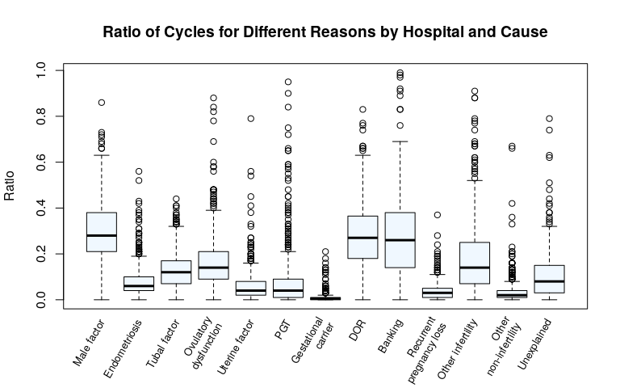

# README to the 2017 Assisted Reproduction Clinics Dataset Analysis. What is this?

This work is based in an exercise from the course 'Software para el análisis de datos' in UOC's degree 'Bioinformática y Bioestadística'.

I am using this to learn the use of the language R, and the tools RStudio, Git and GitHub. This is not a professional level study of assisted reproduction data from clinics in the USA. If you want to have access to such studies, or even the raw data, you can get them from CDC's webpage [ART's Success Rate Data](https://www.cdc.gov/art/artdata/index.html).

You can access this exercise in two formats:

[Code in R Markdown](https://github.com/jorgevallejo/clinic-tables-data/blob/master/PEC3.Rmd)

[Markdown report](https://github.com/jorgevallejo/clinic-tables-data/blob/master/PEC3.md)

[PDF report](https://github.com/jorgevallejo/clinic-tables-data/blob/master/PEC3.pdf)

I am not accepting pull requests, because this is just practise and not aimed to be of any use outside of my own. That said, comments and criticism are welcome.
